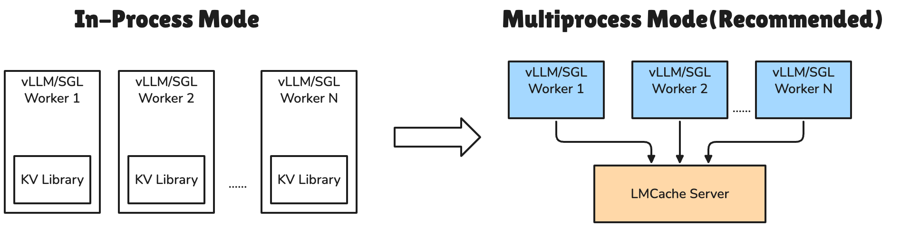
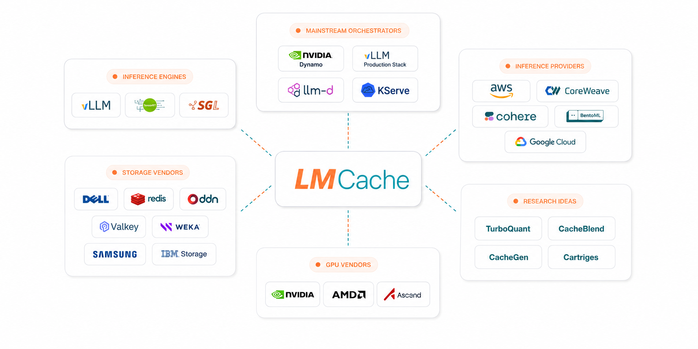

<div align="center">
  <p align="center">
    <picture>
      <source media="(prefers-color-scheme: dark)" srcset="asset/logo_transparent.png">
      <source media="(prefers-color-scheme: light)" srcset="asset/logo_transparent.png">
      
    </picture>
  </p>
  <h2 align="center">
      A KV Cache Management Layer for Scalable LLM Inference
  </h2>

  [](https://pypi.org/project/lmcache/)
  [](https://pypi.org/project/lmcache/)
  [](https://github.com/LMCache/LMCache/graphs/commit-activity)
  [](https://deepwiki.com/LMCache/LMCache/)

</div>

<p align="center">
    | <a href="https://blog.lmcache.ai/"><strong>Blog</strong></a>
    | <a href="https://docs.lmcache.ai/"><strong>Documentation</strong></a>
    | <a href="https://join.slack.com/t/lmcacheworkspace/shared_invite/zt-3g8e6xzz8-KzS_HI8bPERGFK5PTBMYg"><strong>Join Slack</strong></a>
    | <a href="https://docs.lmcache.ai/community/meetings.html"><strong>Community Meeting</strong></a>
    | <a href="https://github.com/LMCache/LMCache/issues/2923"><strong>Roadmap</strong></a> |
</p>

## Updates
- [2026/05] Agentic workload benchmark on AMD MI300X ([blog](https://blog.lmcache.ai/en/2026/05/12/benchmarking-lmcache-for-multi-turn-agentic-workloads-on-amd-mi300x/)).
- [2026/04] 🔥 LMCache's new multiprocess(MP) architecture release ([blog](https://blog.lmcache.ai/en/2026/04/03/lmcaches-new-architecture-boosts-moe-inference-performance-by-10x/)).
- [2026/03] LMCache at GTC 2026 ([post](https://www.linkedin.com/posts/lmcache-lab_llm-opensource-nvidiagtc-activity-7442721875664826369-pMAu?utm_source=share&utm_medium=member_desktop&rcm=ACoAADkIIvQBTyG53kXXX70OZdE5rhpllYQqmIA)).
- [2026/01] LMCache multi-node P2P CPU memory sharing, from experimental feature to production ([blog](https://blog.lmcache.ai/en/2026/01/21/p2p-1/)).

<details>
<summary>More</summary>

- [2025/11] LMCache x Ascend: accelerating LLM inference on Ascend NPUs ([blog](https://blog.lmcache.ai/en/2025/11/04/lmcache-x-ascend-accelerating-llm-inference-on-ascend-npus/)).
- [2025/10] Tensormesh unveiled and LMCache joins the PyTorch Foundation ([blog](https://blog.lmcache.ai/en/2025/10/31/tensormesh-unveiled-and-lmcache-joins-the-pytorch-foundation/), [PyTorch](https://pytorch.org/blog/lmcache-joins-pytorch-ecosystem/)).
- [2025/09] NVIDIA Dynamo integrates LMCache, accelerating LLM inference ([blog](https://blog.lmcache.ai/en/2025/09/18/nvidia-dynamo-integrates-lmcache-accelerating-llm-inference/)).
- [2025/08] 🎉 LMCache hits 5,000+ GitHub stars ([blog](https://blog.lmcache.ai/en/2025/08/28/%f0%9f%8e%89-lmcache-hits-5000-github-stars-thank-you-community/)).
- [2025/08] LMCache supports gpt-oss (20B/120B) on day 1 ([blog](https://blog.lmcache.ai/en/2025/08/05/lmcache-supports-gpt-oss-20b-120b-on-day-1/)).
- [2025/07] Get faster LLM inference and cheaper responses with LMCache and Redis ([Redis blog](https://redis.io/blog/get-faster-llm-inference-and-cheaper-responses-with-lmcache-and-redis/)).
- [2025/07] LMCache extends its turbo-boost to multimodal models in vLLM V1 ([blog](https://blog.lmcache.ai/en/2025/07/03/lmcache-extends-its-turbo-boost-to-multimodal-models-in-vllm-v1/)).
- [2025/06] LLM Production Stack goes cross-hardware: Ascend, Arm, and AMD ([blog](https://blog.lmcache.ai/en/2025/06/20/llm-production-stack-goes-cross-hardware-ascend-arm-and-amd-support-incoming/)).

</details>

## About

LMCache is a **KV cache management layer** for LLM inference. It turns KV cache from temporary state into reusable AI-native knowledge that can be stored, moved, transformed, and reused across different servings. LMCache is designed to work with existing inference engines to **reduce TTFT** and **improve throughput**, especially for long-context, multi-turn, and RAG workloads.

LMCache supports two deployment modes:

- **Multi-process mode** *(recommended mode to implement)*: LMCache runs as a standalone server and inference engines connect to it through connectors over ZMQ. A single LMCache server can serve multiple engine instances, share cache across them, and expose management and observability endpoints.

- **In-process mode**: LMCache runs inside the inference engine process through connectors this mode is limited by python GILs.

<p align="center">
  <picture>
    <source media="(prefers-color-scheme: dark)" srcset="asset/deployment_modes.png">
    <source media="(prefers-color-scheme: light)" srcset="asset/deployment_modes.png">
    
  </picture>
</p>

### Key capabilities

- **KV cache reuse across requests, sessions, and engine instances**: reuse cached KV for repeated prompts, conversations, and shared context to reduce repeated prefill work and improve TTFT.

- **Non-prefix KV reuse**: go beyond prefix caching by reusing cached KV blocks for repeated text that may appear anywhere in the prompt, not only at the beginning.

- **Shared and multi-tier KV cache management**: manage KV cache across GPU memory, CPU memory, local storage, and remote backends, enabling reuse across inference engine instances and larger serving deployments.

- **PD disaggregation and KV transfer**: move KV cache from prefill workers to decode workers over NVLink, RDMA, or TCP through transport layers such as NIXL, so decoding can continue without recomputing prompt KV.

- **Pluggable KV transformation**: apply compression, token dropping, and custom serialization/deserialization through LMCache’s SERDE interface without forking LMCache.

- **Pluggable storage and transport backends**: connect LMCache with storage and transfer backends such as local CPU memory, local disk, NIXL, GDS, Redis/Valkey, Mooncake, InfiniStore, and S3-compatible object storage.

LMCache is becoming a shared infrastructure layer across the LLM inference ecosystem, connecting serving platforms, hardware vendors, storage systems, infrastructure providers, and open-source projects:

<p align="center">
  <picture>
    <source media="(prefers-color-scheme: dark)" srcset="asset/ecosystem_dark.png">
    <source media="(prefers-color-scheme: light)" srcset="asset/ecosystem_light.png">
    
  </picture>
</p>

## Getting Started

To use LMCache, simply install `lmcache` from your package manager, e.g. pip:
```bash
pip install lmcache
```

For more setup options and examples, see:
- [Installation](https://docs.lmcache.ai/getting_started/installation.html)
- [Quickstart](https://docs.lmcache.ai/getting_started/quickstart.html)
- [LMCache Recipes](https://docs.lmcache.ai/recipes/index.html)
- [CLI Reference](https://docs.lmcache.ai/cli/index.html)
- [Benchmarking Guide](https://docs.lmcache.ai/getting_started/benchmarking.html)
- [Production Deployment](https://docs.lmcache.ai/production/docker_deployment.html)

## Contributing
We welcome and value any contributions and collaborations. Join us in improving LMCache. Check out the [Contributing Guide](https://docs.lmcache.ai/developer_guide/contributing.html) to get started.

## Adoption and Partnerships
LMCache is developed with a growing community of developers, researchers, industry adopters, and partners building the next generation of efficient LLM inference systems.

<p align="center">
  <picture>
    <source media="(prefers-color-scheme: dark)" srcset="asset/adoption_dark.png">
    <source media="(prefers-color-scheme: light)" srcset="asset/adoption_light.png">
    
  </picture>
</p>

As an independent open-source project, LMCache is becoming the de facto standard for KV Cache management in LLM inference and its continued development and community work are supported in part by [Tensormesh](https://www.tensormesh.ai/).

## Citation

LMCache builds on research in KV cache management, including cache reuse, offloading, compression, and serving optimization. If you use LMCache in your research, please cite the LMCache paper and related work.

~~~bibtex
@article{cheng2025lmcache,
  title={LMCache: An Efficient KV Cache Layer for Enterprise-Scale LLM Inference},
  author={Cheng, Yihua and Liu, Yuhan and Yao, Jiayi and An, Yuwei and Chen, Xiaokun and Feng, Shaoting and Huang, Yuyang and Shen, Samuel and Du, Kuntai and Jiang, Junchen},
  journal={arXiv preprint arXiv:2510.09665},
  year={2025}
}
~~~

<details>
<summary>Related papers</summary>

~~~bibtex
@inproceedings{liu2024cachegen,
  title={Cachegen: Kv cache compression and streaming for fast large language model serving},
  author={Liu, Yuhan and Li, Hanchen and Cheng, Yihua and Ray, Siddhant and Huang, Yuyang and Zhang, Qizheng and Du, Kuntai and Yao, Jiayi and Lu, Shan and Ananthanarayanan, Ganesh and others},
  booktitle={Proceedings of the ACM SIGCOMM 2024 Conference},
  pages={38--56},
  year={2024}
}

@inproceedings{yao2025cacheblend,
  title={Cacheblend: Fast large language model serving for rag with cached knowledge fusion},
  author={Yao, Jiayi and Li, Hanchen and Liu, Yuhan and Ray, Siddhant and Cheng, Yihua and Zhang, Qizheng and Du, Kuntai and Lu, Shan and Jiang, Junchen},
  booktitle={Proceedings of the twentieth European conference on computer systems},
  pages={94--109},
  year={2025}
}
~~~

</details>

## License

The LMCache codebase is licensed under Apache License 2.0. See the [LICENSE](LICENSE) file for details.
