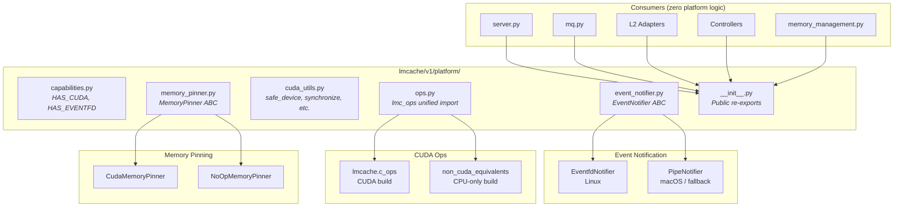

# Cross-Platform Compatibility Design for LMCache Multiprocess Mode

## Background

LMCache's MP server was originally Linux-only due to dependencies on
Linux-specific APIs (`os.eventfd`), NVIDIA CUDA, and CUDA C++ extensions.

Supporting macOS (CPU-only mode) enables developers to run the full MP
server locally for development, testing, and debugging without a GPU.

## Scope of Cross-Platform Issues

| # | Subsystem | Linux API | macOS Fallback | Severity |
|---|-----------|-----------|----------------|----------|
| 1 | Event notification | `os.eventfd` | `os.pipe` | **Critical** |
| 2 | CUDA extensions | `lmcache.c_ops` | `non_cuda_equivalents` | **Critical** |
| 3 | CUDA IPC | `_share_cuda_()` | N/A (CPU tensors) | **High** |
| 4 | GPU context | `cupy`, CUDA Stream | Skip init | **High** |
| 5 | Pinned memory | `cudaHostRegister` | No-op | **Medium** |
| 6 | Build system | CUDA nvcc | `NO_CUDA_EXT=1` | **Medium** |

## Design Principles

1. **Guard at the boundary, not in the core logic.** Platform checks
   happen **once** at module load or construction time.

2. **Strategy pattern over if/else chains.** Each platform-specific
   subsystem has an abstract interface with platform-specific
   implementations selected by a factory function.

3. **Single source of truth.** All platform detection and conditional
   imports are centralized in `lmcache/v1/platform/`.

4. **Graceful degradation.** On non-CUDA platforms, GPU features are
   unavailable but the server still starts for CPU-path operations.

5. **Zero caller changes for new platforms.** Adding ROCm/XPU/Windows
   only requires new implementations and factory branches.

## Architecture Overview

## Subsystem Design

### 1. Event Notification

`EventNotifier` ABC with `EventfdNotifier` (Linux) and `PipeNotifier`
(macOS/fallback). Binary signal model: `notify()` is idempotent,
`consume()` drains all pending signals.

### 2. CUDA Extensions

Single `platform/ops.py` performs the conditional import **once** and
re-exports `lmc_ops`. All callers use
`from lmcache.v1.platform import lmc_ops`.

### 3. CUDA IPC

**No abstraction needed.** `CudaIPCWrapper` is only instantiated when
GPU tensors are passed through ZMQ, which cannot happen on CPU-only
platforms. Safe by construction.

### 4. GPU Context

**No abstraction needed.** `GPUCacheContext` and `PlainGPUCacheContext`
are inherently GPU-only. They are only instantiated from GPU-path
handlers. The `lmc_ops` import is centralized via platform package.

### 5. Pinned Memory

`MemoryPinner` ABC with `CudaMemoryPinner` and `NoOpMemoryPinner`.
Factory function `create_memory_pinner()` selects the right
implementation based on platform.

### 6. Platform Utilities (`platform/cuda_utils.py`)

Utility functions that encapsulate common CUDA-or-fallback patterns,
eliminating scattered `if HAS_CUDA` checks in business code:

- `current_device_id()` — returns CUDA device ID or `0`
- `safe_device(requested)` — degrades to `"cpu"` when CUDA unavailable
- `synchronize()` — calls `torch.cuda.synchronize()` or no-op
- `cuda_init()` — calls `torch.cuda.init()` or no-op

### 7. Build System

Already properly structured with `NO_CUDA_EXT=1` for CPU-only builds.
No further abstraction needed.
