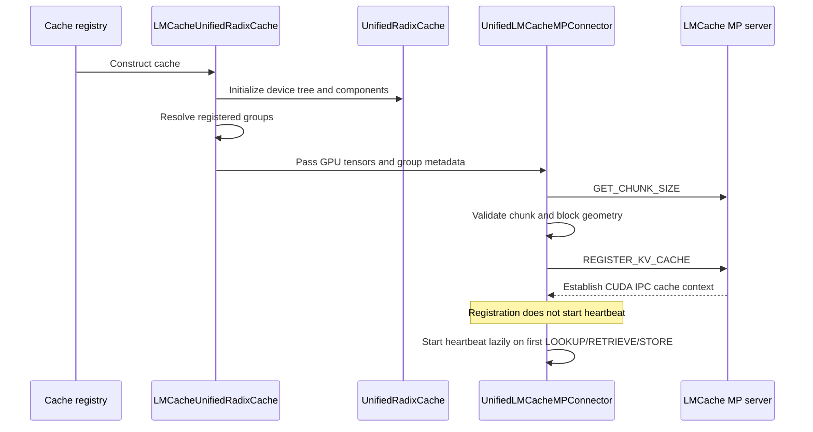
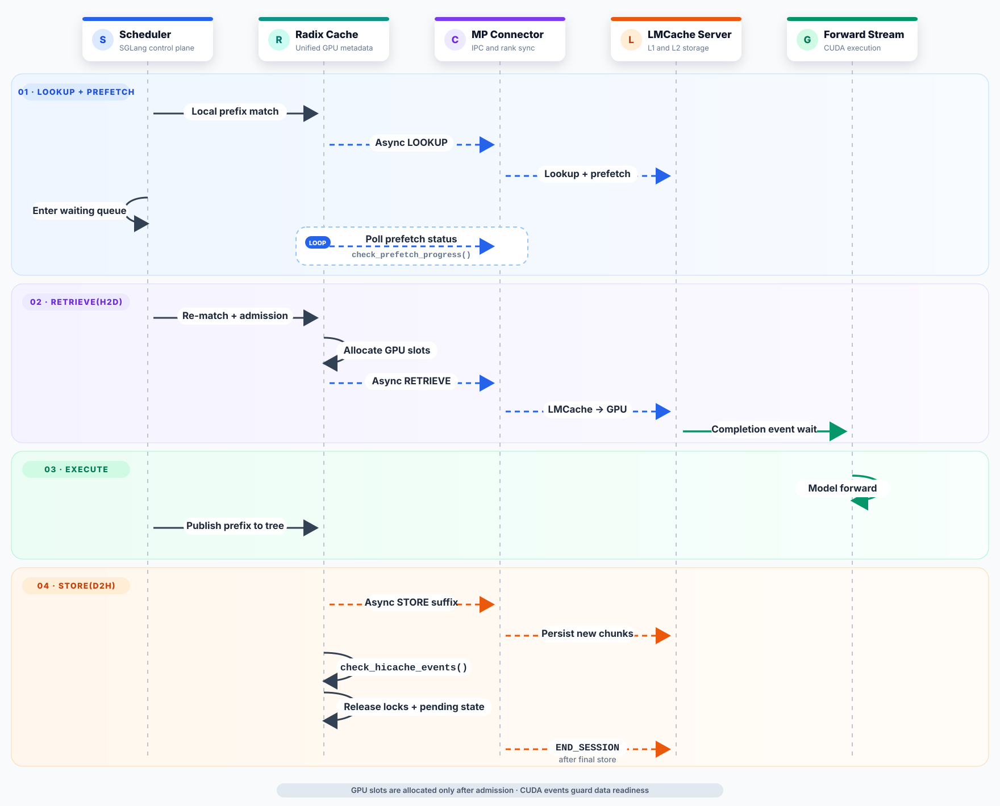
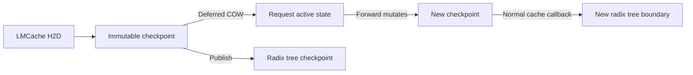
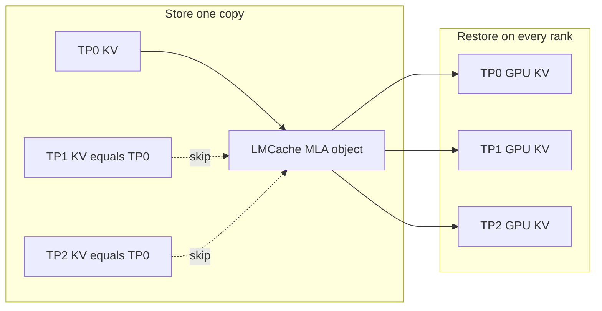

# SGLang Unified Radix Cache Integration

## Summary

The SGLang unified radix cache integration connects SGLang's
`UnifiedRadixCache` to a standalone LMCache multiprocess (MP) server. It keeps
SGLang responsible for GPU-resident prefix metadata and GPU page allocation,
while LMCache independently manages CPU and remote cache tiers.

The integration consists of two cooperating components:

- SGLang's `LMCacheUnifiedRadixCache`, which integrates asynchronous external
  lookup, retrieve, and store operations with the scheduler and radix tree;
- LMCache's `UnifiedLMCacheMPConnector`, which registers SGLang GPU tensors,
  translates SGLang cache groups into LMCache groups, communicates with the MP
  server, and synchronizes results across tensor-parallel (TP) and
  pipeline-parallel (PP) ranks.

The corresponding LMCache implementation is tracked by
[LMCache PR #4828](https://github.com/LMCache/LMCache/pull/4828).

## Goals and non-goals

### Goals

The design has the following goals:

1. Preserve `UnifiedRadixCache` support for multiple KV components.
2. Connect to an independent LMCache MP server without creating an in-process
   LMCache engine.
3. Keep LMCache-managed CPU and remote memory outside SGLang.
4. Register GPU KV tensors once at startup. Runtime operations send only token
   IDs, block IDs, and CUDA event handles.
5. Keep lookup, prefetch, retrieve, and store asynchronous without synchronizing
   CUDA work on the CPU.
6. Make every scheduler rank reach the same admission or fallback decision when
   any TP or PP rank fails.
7. Confine layout adaptation to `LMCacheUnifiedRadixCache` and
   `UnifiedLMCacheMPConnector`, minimizing changes to general KV pools and
   attention implementations.

### Non-goals

The initial implementation does not:

- represent LMCache CPU or remote tiers in SGLang's radix tree;
- reuse the legacy `LMCRadixCache` or legacy SGLang LMCache connector;
- use HiCache's host pool or `HybridCacheController`;
- overlap individual layer loads with model execution.

## Ownership boundary

The primary difference from SGLang's other cache implementations is where
non-GPU state lives:

| Implementation | Local radix tree | SGLang-managed L2 | External storage | GPU population |
| --- | --- | --- | --- | --- |
| `RadixCache` | GPU prefix tree | None | None | Data is already resident |
| HiCache / `UnifiedRadixCache` | GPU and host metadata | SGLang host pool | Optional L3 | L2 to L1, with per-layer overlap |
| Legacy `LMCRadixCache` | Independent legacy implementation | Integration-dependent | LMCache | Outside this design |
| `LMCacheUnifiedRadixCache` | SGLang GPU-resident data only | None | LMCache-managed CPU or remote tiers | LMCache MP writes directly to SGLang GPU tensors |

For `LMCacheUnifiedRadixCache`, every LMCache tier is external to SGLang's
tree. SGLang treats retrieved data as locally available only after the transfer
has succeeded and the destination GPU slots are about to become owned by the
request or radix tree.

The SGLang class hierarchy is:

```text
BasePrefixCache
      |
      `-- UnifiedRadixCache
                |
                `-- LMCacheUnifiedRadixCache
```

The subclass reuses the device tree, FULL/SWA/MAMBA components, GPU allocator,
and node locks. It does not initialize a HiCache host pool.

## Code map

### SGLang

| Area | File |
| --- | --- |
| LMCache operations and unified radix cache integration | `python/sglang/srt/mem_cache/lmcache_unified_radix_cache.py` |
| Device tree, components, allocators, and node locks | `python/sglang/srt/mem_cache/unified_radix_cache.py` |
| Request admission and prefetch polling | `python/sglang/srt/managers/scheduler.py` |
| Deferred Mamba copy-on-write | `python/sglang/srt/managers/schedule_batch.py`, `python/sglang/srt/model_executor/model_runner.py` |

### LMCache

| Area | File |
| --- | --- |
| SGLang group mapping, MP RPC, event IPC, and rank synchronization | `lmcache/integration/sglang/unified_lmcache_mp_connector.py` |
| Server lookup and prefetch | `lmcache/v1/multiprocess/modules/lookup.py` |
| Registration, store, and retrieve | `lmcache/v1/multiprocess/modules/lmcache_driven_transfer.py` |
| Engine-group registration contract | `lmcache/v1/multiprocess/group_view.py` |
| Server-side transfer grouping | `lmcache/v1/kv_layer_groups.py` |

## Configuration and initialization

SGLang enables the integration with:

```text
--enable-unified-lmcache
--lmcache-config-file <path-to-lmcache-config>
```

The legacy `--enable-lmcache` option continues to select `LMCRadixCache`. The
two LMCache modes are mutually exclusive. Unified LMCache is also incompatible
with `--enable-hierarchical-cache` and
`--enable-unified-cache-external-linker`, and requires radix caching to remain
enabled.

Initialization follows this sequence:



Lazy heartbeat startup avoids liveness timeouts during long model warmup. The
MP server's registration grace period protects registered instances that have
not yet emitted a heartbeat.

## Data model and registration

### Token, page, and chunk granularity

The integration operates at three granularities:

- **Token:** radix key and prefix-length unit.
- **SGLang page:** GPU allocator and block-ID unit.
- **LMCache chunk:** hash, lookup, store, and retrieve unit.

An LMCache chunk must be divisible by the block granularity of every component:

```text
chunk_size % group.tokens_per_block == 0
```

For ordinary attention, one block normally covers `page_size` tokens. A Mamba
block is a complete recurrent-state checkpoint and may represent a different
number of tokens. The connector communicates these values explicitly in group
metadata instead of inferring logical block size from tensor shape.

### Components and LMCache groups

Each `UnifiedRadixCache` component maps to a separate LMCache engine group:

| SGLang component | LMCache meaning |
| --- | --- |
| FULL | Complete prefix KV |
| SWA | Sliding-window KV near the hit boundary |
| MAMBA | Recurrent-state checkpoint at a sequence boundary |

Tensors with different shapes or dtypes inside one engine group may be split
into separate copy-kernel groups while retaining the same block-ID space. For
example, a DSA indexer and FULL KV may use different kernels but refer to the
same FULL pages.

When SWA or recurrent-state groups are present, the LMCache MP server must use
`--separate-object-groups`. Without it, the distinct retention requirements are
collapsed into full-attention semantics.

### One-time GPU tensor registration

At startup, the connector sends tensor CUDA IPC handles, group metadata, and
layout information to the MP server. Runtime operations do not resend tensor
addresses:

```text
REGISTER: tensor handles + group metadata
REQUEST:  token IDs + list[list[block_id]] + CUDA event handle
```

Each outer block-ID list represents one FULL, SWA, or MAMBA address space. The
connector expands those engine groups into the copy-kernel groups expected by
LMCache's transfer implementation.

## Runtime flow

### Overview



Lookup/prefetch and retrieve are deliberately separate. A request waiting for
an external lookup consumes no destination GPU slots. Slots are allocated only
after the request passes admission and is ready to enter a prefill batch.

### Asynchronous lookup and prefetch

Before a request enters the waiting queue, SGLang performs a local radix match
and calls `prefetch_from_storage()` to submit the LMCache lookup. Only the global
leader sends the control-plane request; its outcome is synchronized across all
TP and PP scheduler ranks.

A lookup operation contains two futures:

- a **submission future**, indicating that the server accepted the LOOKUP RPC;
- a **completion future**, representing one `QUERY_PREFETCH_STATUS` request.

`check_prefetch_progress()` polls without issuing a duplicate status query
while a previous query is still outstanding. When prefetch finishes, SGLang
repeats its local match because another request may have inserted or evicted the
same prefix during the wait. Retrieve begins at the shortest locally available
boundary shared by all ranks.

There is no LMCache host radix tree inside SGLang. The implementation exposes a
completed external hit temporarily as `host_hit_length` so that the scheduler
can reuse its existing GPU-memory admission logic.

### Asynchronous retrieve

During admission, the cache locks the local prefix anchor, allocates destination
GPU slots, and calls `submit_load()`. Allocation or submission failure can still
clear the external hit and fall back to ordinary prefill.

LMCache performs H2D on its CUDA stream. The SGLang forward stream waits on the
completion event without blocking the CPU:

```text
SGLang stream: record producer event ----------------> wait completion -> forward
                        |                                      ^
LMCache stream:         `-> wait -> H2D all groups -> record --'
```

Multiple retrieves in one batch each enqueue their own event dependency; model
forward begins after all required data is ready. This integration does not yet
overlap individual layer H2D copies with layer execution.

`check_prefetch_progress()` handles lookup and prefetch only. Retrieve and store
futures are finalized by `check_hicache_events()`. CUDA events enforce the data
dependency, while event polling handles cross-rank agreement and CPU-side
resource cleanup.

### Slot and lock ownership

| Resource | During asynchronous transfer | After publication or completion |
| --- | --- | --- |
| LMCache read lock | Protects a prefetched object | Consumed by retrieve or explicitly released for unused ranges |
| Retrieve GPU slots | Owned by the request flow | Transferred to the radix tree after insertion |
| Retrieve anchor lock | Owned by the request flow | Released when the flow retires |
| Store source-node lock | Owned by the pending store | Released after D2H/store completion |

The locally matched portion of an external lookup is released exactly once as
a monotonic `[start, end)` range. Read locks covering the actual retrieve are
released by the MP server after H2D; SGLang must not release them again.

If another request inserts a longer prefix while a retrieve waits, private
slots superseded by the new canonical prefix are released after transfer. The
remaining slots continue into the request or radix tree.

### Cross-rank completion ordering

CUDA events can become ready at different times on different TP and PP ranks.
Both `complete_load()` and `complete_store()` use collectives, so allowing ranks
to enter them based only on local readiness could deadlock.

Only `check_hicache_events()` may complete retrieve and store operations. It
computes a TP-by-PP `MIN` over the number of consecutively ready operations,
then has all ranks complete that common prefix in identical order. Request
callbacks only mark operations ready to retire; they do not enter
readiness-gated collectives themselves.

### Publishing into the radix tree

FULL and SWA KV are immutable during later forwards. Retrieved slots initially
belong to the request and are transferred to the radix tree by
`cache_unfinished_req()` or `cache_finished_req()`. The request then adopts the
canonical slots returned by the tree.

For SWA, only the final sliding window of an external suffix receives GPU slots.
Earlier positions are represented by tombstones during tree insertion, rather
than treating a dummy page as valid SWA KV. This works whether or not SGLang is
configured to release out-of-window SWA slots immediately.

## Mamba copy-on-write

Mamba recurrent state is modified in place during prefill and decode. A cached
checkpoint therefore cannot share its slot with the request's active state:



LMCache retrieves into an independent checkpoint slot. After the forward stream
waits for H2D, SGLang's existing deferred Mamba copy-on-write path copies the
checkpoint into the request's active slot. The model mutates only the active
slot, so the original checkpoint remains safe to publish.

Mamba publication occurs in two phases. If LMCache hits at token 1024 and the
request computes through token 2048, the integration first publishes the
retrieved checkpoint at 1024. The parent cache callback later publishes the new
checkpoint at 2048. Collapsing these into one insertion would discard or
contaminate the externally retrieved boundary.

## Asynchronous store

Both `cache_unfinished_req()` and `cache_finished_req()` may initiate a store.
The connector records the chunk boundary already submitted for each request and
stores only a newly available suffix. A range already reported as an LMCache hit
is not stored again.

Before D2H starts, the cache locks the corresponding radix node. The lock is
held until the store future completes so eviction cannot recycle the GPU page
while LMCache's stream is reading it.

In SWA branching or concurrent insertion, a callback may find only part of the
target prefix resident on every rank. It stores the largest safe,
chunk-aligned prefix instead of skipping the entire operation:

```text
Common resident radix prefix: [0, 512)
Current STORE:                [0, 512)
Later STORE:                  [512, 2048)
```

One request may have several incremental stores. `cache_finished_req()` marks
the session as ready to end, but the leader sends `END_SESSION` only after all
pending stores for that request finish. This preserves the ordering requirement
that every STORE completes before session cleanup.

## Request cancellation and cleanup

The cache reports pending work while any load flow or store is outstanding. This
prevents the scheduler from treating the cache as idle or flushing it while an
asynchronous transfer still owns tree locks.

Cancellation, load failure, and shutdown distinguish unpublished resources from
published resources:

- the flow releases destination slots that have not been published;
- the radix tree owns published slots, which must not be freed by the flow;
- submitted CUDA work must complete or be drained before its source or
  destination addresses are recycled.

These ownership rules prevent both slot leaks and double-free errors during
fallback paths.

## MLA object deduplication

Ordinary multi-head attention KV differs across TP ranks, so every rank stores a
separate LMCache object. MLA latent KV is replicated across TP ranks. The
connector collapses the TP dimension of LMCache object identity for an MLA-only
cache, avoiding redundant storage:



The resulting behavior is:

- only `tp_rank == 0` submits STORE; other ranks retain a completed placeholder
  to preserve identical asynchronous operation ordering;
- LOOKUP queries the one shared object;
- every TP rank performs RETRIEVE into its own registered GPU tensor;
- lookup reserves `tp_size` read locks on the shared object, one consumed by
  each rank's retrieve.

PP identity remains distinct, so each pipeline stage still owns its own object.
This optimization is valid only when data is identical across TP ranks and no
independent recurrent state is present.

## Invariants

- LMCache CPU and remote tiers are never represented as SGLang radix-tree
  nodes.
- Every runtime range is measured in tokens until it is converted using a
  group's explicit `tokens_per_block`.
- Destination GPU slots are allocated only after external lookup completes and
  admission succeeds.
- A slot has exactly one owner at a time: request flow, request, or radix tree.
- Every asynchronous source or destination remains protected until its CUDA
  operation is complete.
- All ranks complete collective-bearing operations in the same order.
- `END_SESSION` follows every store associated with the session.
- SWA and recurrent-state deployments use separate LMCache object groups.
