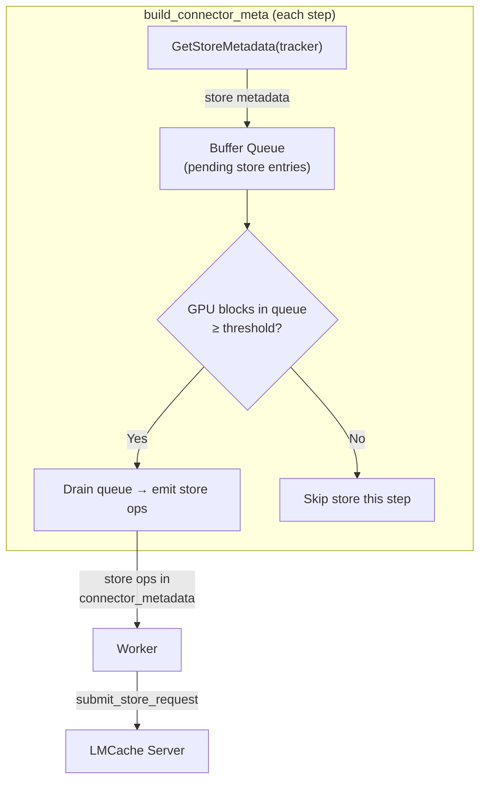

# Lazy Offload in LMCache MP Connector

## 1. vLLM SimpleCPUOffloadConnector Lazy Mode

### 1.1 Overview

vLLM implements a `SimpleCPUOffloadConnector` at
`vllm/distributed/kv_transfer/kv_connector/v1/simple_cpu_offload_connector.py`
that supports two modes: **eager** and **lazy**.

In **eager mode**, every newly computed KV block is stored to CPU
immediately after it is confirmed. In **lazy mode**, stores are deferred
until GPU memory pressure is detected — the connector walks the GPU
BlockPool's free queue (LRU order) and offloads blocks that are about to
be evicted.

### 1.2 Architecture

The connector is split into three components:

| Component | Role |
|-----------|------|
| `SimpleCPUOffloadConnector` | Entry point; routes to scheduler or worker based on `KVConnectorRole` |
| `SimpleCPUOffloadScheduler` | Scheduler-side: decides *which* blocks to offload and *when* |
| `SimpleCPUOffloadWorker` | Worker-side: executes GPU↔CPU DMA copies on low-priority CUDA streams |

Data flows via `SimpleCPUOffloadMetadata` (scheduler → worker) and
`SimpleCPUOffloadWorkerMetadata` (worker → scheduler).

### 1.3 Lazy Mode: Core Algorithm

The lazy mode is implemented in `SimpleCPUOffloadScheduler._prepare_lazy_store_specs()`:

```python
def _prepare_lazy_store_specs(self) -> tuple[list[int], list[int], list[str]]:
    """Single-pass cursor walk: offload cached GPU blocks near eviction."""
    free_queue = gpu_pool.free_block_queue

    for covered, node in enumerate(free_queue.iter_blocks_after(self._cursor)):
        if covered >= self._target_free or len(gpu_ids) >= num_cpu_free:
            break

        self._cursor = node

        # Skip if: no hash, null, or already cached in CPU
        if (bhash is not None
            and not node.is_null
            and cpu_pool.cached_block_hash_to_block.get_one_block(bhash) is None):
            gpu_ids.append(node.block_id)
            block_hashes.append(bhash)

    # Batch-allocate CPU blocks and stamp hashes
    if gpu_ids:
        cpu_blocks = cpu_pool.get_new_blocks(len(gpu_ids))
        cpu_ids = [blk.block_id for blk in cpu_blocks]
        for cpu_blk, bhash in zip(cpu_blocks, block_hashes):
            cpu_blk._block_hash = bhash

    return gpu_ids, cpu_ids, []
```

Key points:
- A **cursor** tracks the last scanned position in the GPU free queue.
- `target_free` is estimated from `max_num_batched_tokens` to ensure
  enough free blocks remain for new requests.
- GPU blocks are **touched** (moved to MRU end) during in-flight copies
  to prevent eviction.
- The CPU side maintains its own `KVCacheCoordinator` with a `BlockPool`
  for prefix-cache matching.

### 1.3.1 GPU Block Protection: Touch and Free

The `SimpleCPUOffloadConnector` uses a simple but effective strategy:
`request_finished()` **always returns `False`**, meaning vLLM immediately
frees the request's blocks. In-flight DMA copies are protected by
**explicit `touch()`/`free_blocks()` ref_cnt pairs** managed by the
connector itself.

#### 1.3.1.1 `request_finished` Always Returns `False`

```python
# vllm/v1/simple_kv_offload/manager.py — SimpleCPUOffloadScheduler
def request_finished(self, request, block_ids) -> tuple[bool, dict | None]:
    """Always returns (False, None). GPU blocks are protected by ref_cnt,
    so the scheduler can free blocks immediately."""
    # ... cleanup pending CPU hits and load/store state ...
    return False, None
```

This means vLLM's scheduler immediately decrements `ref_cnt` on all the
request's blocks when it finishes. The connector does **not** hold blocks
hostage — it relies on its own `touch()` calls to keep in-flight blocks
alive.

#### 1.3.1.2 How `touch()` and `free_blocks()` Work

The `BlockPool` uses `ref_cnt` to track block liveness:

```python
# vllm/v1/core/block_pool.py
def touch(self, blocks: Sequence[KVCacheBlock]) -> None:
    """Increment ref_cnt; remove from free queue if it was there."""
    for block in blocks:
        if block.ref_cnt == 0 and not block.is_null:
            self.free_block_queue.remove(block)
        block.ref_cnt += 1

def free_blocks(self, ordered_blocks: Iterable[KVCacheBlock]) -> None:
    """Decrement ref_cnt; return to free queue when it reaches 0."""
    for block in ordered_blocks:
        block.ref_cnt -= 1
        if block.ref_cnt == 0 and not block.is_null:
            # Blocks with hash go to MRU end (prefix cache candidates)
            # Blocks without hash go to LRU end (evict first)
            ...
    free_block_queue.prepend_n(blocks_without_hash)
    free_block_queue.append_n(blocks_with_hash)
```

Key invariant: **A block with `ref_cnt > 0` is never in the free queue
and cannot be allocated to other requests.**

#### 1.3.1.3 Store Path: Touch on Submit, Free on Completion

When blocks are selected for offloading (both lazy and eager modes),
the connector **touches** them to prevent eviction during the async DMA:

```python
# Lazy mode — _prepare_lazy_store_specs()
if gpu_ids:
    # Touch GPU blocks to prevent eviction during async copy
    gpu_pool.touch([gpu_pool.blocks[bid] for bid in gpu_ids])

# Eager mode — _prepare_eager_store_specs()
if cpu_block_ids:
    # Touch GPU blocks to prevent freeing during async copy
    gpu_block_pool.touch([gpu_block_pool.blocks[bid] for bid in gpu_block_ids])
```

When the DMA completes (reported by worker via `update_connector_output`),
the connector **frees** the touched blocks:

```python
# _process_store_completion() — called when store event is fully done
def _process_store_completion(self, gpu_block_ids, cpu_block_ids):
    # Register CPU blocks in prefix cache
    for cpu_block in cpu_blocks:
        cpu_block_pool.cached_block_hash_to_block.insert(bhash, cpu_block)

    # Free CPU blocks' ref_cnt (they become prefix cache entries)
    self.cpu_block_pool.free_blocks(cpu_blocks)
    # Free GPU blocks' ref_cnt (the extra touch ref from submit time)
    self._gpu_block_pool.free_blocks(
        self._gpu_block_pool.blocks[bid] for bid in gpu_block_ids
    )
```

This creates a **balanced ref_cnt lifecycle**:

```
[Submit store]  gpu_pool.touch(blocks)     → ref_cnt += 1
[Request ends]  vLLM scheduler frees       → ref_cnt -= 1  (from request ownership)
[DMA completes] gpu_pool.free_blocks(...)  → ref_cnt -= 1  (from touch)
                                             ref_cnt == 0 → block enters free queue
```

Even if the request finishes before the DMA completes, the block stays
protected because the connector's `touch()` added an extra ref_cnt.


#### 1.3.1.4 Summary: ref_cnt Lifecycle

```
                    Store (GPU→CPU)                    
                    ───────────────                    
Submit:             gpu.touch() [+1]                  
                    (ESSENTIAL: only protection)       

Request finishes:   vLLM frees request blocks [-1]    
                    (block still alive: touch ref)    
                                                       

DMA completes:      gpu.free_blocks() [-1]            
                    cpu registered in prefix cache    
                    → block enters free queue          
```

### 1.4 Worker-Side: DMA Copy

The worker uses a `DmaCopyBackend` that runs a background thread:

1. Stores wait for a **compute-done event** (ensures KV data is written).
2. Copies are launched via `cuMemcpyBatchAsync` on dedicated low-priority
   CUDA streams.
3. Completion is tracked via `torch.Event` with monotonic event indices.

### 1.5 Key Design: 1:1 GPU/CPU Block Correspondence

vLLM's block hash is a prefix-chained hash — block N's hash depends on
all preceding blocks:

```python
# vllm/v1/core/kv_cache_utils.py
def hash_block_tokens(hash_function, parent_block_hash, curr_block_token_ids, ...):
    """Hash depends on parent block hash + current block tokens."""
    if not parent_block_hash:
        parent_block_hash = NONE_HASH
    return BlockHash(
        hash_function((parent_block_hash, tuple(curr_block_token_ids), extra_keys))
    )
```

So vLLM's block hash is **NOT independent** — it uses rolling prefix
hashing just like LMCache. However, the critical property that makes
lazy offload work is:

> **GPU blocks and CPU blocks have a 1:1 correspondence.** Each CPU
> block maps directly to one GPU block, so the CPU `BlockPool` can
> directly reuse the `block_hash` already stamped on each GPU block
> without any recomputation.

When a GPU block enters the free queue, its `block_hash` is already
computed and stored on the `KVCacheBlock` object. The lazy offload
scheduler simply:
1. Reads `node.block_hash` from the GPU free queue block.
2. Checks if the CPU `BlockPool` already has a block with the same hash.
3. If not, allocates a CPU block and stamps the **same hash** on it.
4. Copies the KV data GPU→CPU.

No hash recomputation is needed. No token IDs are needed. The hash is
just carried over from GPU block to CPU block as-is, because they are
1:1 corresponding units.

### 1.6 Why This Approach Is Incompatible with LMCache MP Connector

LMCache's store granularity (**chunk**) differs from vLLM's block
granularity, and this mismatch is the root cause of incompatibility.

#### 1.6.1 Granularity Mismatch

| Property | vLLM SimpleCPUOffload | LMCache MP Connector |
|----------|----------------------|---------------------|
| GPU unit | vLLM block (e.g. 16 tokens) | vLLM block (same) |
| CPU/store unit | CPU block (**same size** as GPU block) | LMCache chunk (e.g. 256 tokens = **16 vLLM blocks**) |
| Hash reuse | ✅ CPU block directly reuses GPU block's hash | ❌ Chunk hash must be computed from token_ids over chunk_size tokens |
| Free queue unit | 1 block → 1 CPU block (1:1 mapping) | 1 block ≠ 1 chunk (need 16 blocks to form 1 chunk) |

Example with `vllm_block_size=16`, `lmcache_chunk_size=256`:
- One LMCache chunk = 16 vLLM blocks.
- When one GPU block enters the free queue, it is only 1/16 of a chunk.
- The other 15 blocks of the same chunk may still be in use by active
  requests, or may have entered the free queue at different times.

#### 1.6.2 Hash Cannot Be Reused

Even if all 16 blocks of a chunk happen to be in the free queue
simultaneously, LMCache **cannot reuse their vLLM block hashes**:

- vLLM block hash: `hash(parent_block_hash, tokens[0:16])`
- LMCache chunk hash: `rolling_hash(prev_chunk_hash, tokens[0:256])`

These are completely different hash functions operating at different
granularities. LMCache must recompute its own chunk hash from the raw
token IDs, which requires:
1. The full token sequence (to compute the rolling prefix hash).
2. Knowledge of chunk boundaries (which 256-token range this chunk
   covers).

Both are only available while the request is still active.

#### 1.6.3 Chunk Assembly Problem

Even ignoring the hash issue, assembling a complete chunk from free-queue
blocks is problematic:

```
Request A: [block0][block1]...[block15] [block16]...[block31] ...
                    chunk 0                     chunk 1

Free queue (LRU order): block3, block17, block0, block22, block1, ...
```

- Blocks from the same chunk may be scattered across the free queue.
- Some blocks of a chunk may still be referenced (ref_cnt > 0) by other
  requests sharing the same prefix (APC).
- There is no efficient way to detect "all blocks of chunk N are now
  free" from the free queue's LRU iteration.

#### 1.6.4 Additional Architectural Differences

| Aspect | vLLM SimpleCPUOffload | LMCache MP Connector |
|--------|------------------|-------------------|
| CPU storage | Local pinned tensors (same process) | Remote LMCache server (separate process via ZMQ + CUDA IPC) |
| Copy mechanism | `cuMemcpyBatchAsync` (direct DMA) | Server-side `transfer_kv_per_object_group` (IPC + kernel + D2H) |
| Latency | same-process | cross-process IPC |
| Block pool access | Direct (scheduler owns it) | Indirect (scheduler has access, but worker/server do not) |
| Dedup | Local CPU `BlockPool` hash map | Server-side `StorageManager` (cross-process query needed) |

#### 1.6.5 Summary

vLLM's lazy offload works because **CPU and GPU use the same block size**,
allowing direct hash reuse without recomputation or token ID access. In
LMCache, the chunk size is larger than the vLLM block size, so:

1. **Hash cannot be reused** — LMCache's chunk hash operates at a
   different granularity and uses a different hash function.
2. **Hash must be recomputed** — which requires the full token sequence
   (only available while the request is active).
3. **Free queue granularity mismatch** — one free-queue block ≠ one
   LMCache chunk; assembling complete chunks from scattered free blocks
   is impractical.

This makes a direct port of vLLM's lazy offload approach infeasible for
the LMCache MP connector.

## 2. LMCache MP Connector: Threshold-Triggered Lazy Offload

### 2.1 Design Overview

Since LMCache cannot reuse vLLM block hashes and requires token IDs for
key construction, the lazy offload strategy must **buffer store metadata
while the request is still active**, and defer the actual store
submission until GPU memory pressure is detected.

The core idea:
1. In `build_connector_meta`, instead of immediately submitting stores,
   buffer the store metadata (token_ids, block_ids, start/end, etc.)
   into a **pending store queue** in the scheduler adapter.
2. Track the total number of GPU blocks consumed by pending (buffered)
   stores.
3. When the accumulated GPU blocks reach a configurable **threshold**
   (percentage of total GPU blocks), trigger offload by draining entries
   from the buffer queue into the actual store submission path.



### 2.2 Buffer Queue Design

```python
@dataclass
class PendingStoreEntry:
    request_id: str
    token_ids: list[int]
    block_ids: list[list[int]]   # per engine group
    start: int
    end: int
    cache_salt: str
    num_gpu_blocks: int          # total GPU blocks this entry occupies

class PendingStoreQueue:
    def __init__(self, threshold_ratio: float, total_gpu_blocks: int):
        self._queue: deque[PendingStoreEntry] = deque()
        self._total_buffered_blocks: int = 0
        self._threshold_blocks: int = int(total_gpu_blocks * threshold_ratio)

    def enqueue(self, entry: PendingStoreEntry) -> None:
        self._queue.append(entry)
        self._total_buffered_blocks += entry.num_gpu_blocks

    @property
    def should_offload(self) -> bool:
        return self._total_buffered_blocks >= self._threshold_blocks

    def drain(self, max_entries: int | None = None) -> list[PendingStoreEntry]:
        """Drain entries from the queue for store submission."""
        ...
```

### 2.3 Integration with `build_connector_meta`

The modification is in the scheduler-side `build_connector_meta` logic:

```python
# Current eager behavior (simplified):
for tracker in active_trackers:
    meta = GetStoreMetadata(tracker, ...)
    if meta:
        store_metas.append(meta)  # immediately emit

# New lazy behavior:
for tracker in active_trackers:
    meta = GetStoreMetadata(tracker, ...)
    if meta:
        entry = PendingStoreEntry(
            request_id=meta.request_id,
            token_ids=meta.op.token_ids,
            block_ids=meta.op.block_ids,
            start=meta.op.start,
            end=meta.op.end,
            cache_salt=meta.cache_salt,
            num_gpu_blocks=sum(len(g) for g in meta.op.block_ids),
        )
        self._pending_store_queue.enqueue(entry)

# Check threshold and drain
if self._pending_store_queue.should_offload:
    entries = self._pending_store_queue.drain()
    for entry in entries:
        store_metas.append(to_request_metadata(entry))
```

### 2.4 Threshold Trigger Mechanism

The threshold determines when buffered stores are flushed:

```
threshold_ratio = configured percentage (e.g. 0.8)
threshold_blocks = total_gpu_blocks * threshold_ratio

Trigger condition:
    sum(num_gpu_blocks for all entries in queue) >= threshold_blocks
```

When triggered, the queue is drained (partially or fully) and the
resulting store ops are emitted in the connector metadata for the worker
to execute.

Configuration:
```
lmcache.mp.lazy_offload = true/false          (default: false)
lmcache.mp.lazy_offload_threshold = 0.8       (trigger when 80% of GPU blocks are buffered)
lmcache.mp.lazy_offload_drain_ratio = 0.5     (drain 50% of queue when triggered)
```

### 2.5 Drain Strategy

When the threshold is reached, not all entries need to be drained at
once. Options:

- **FIFO drain**: Drain the oldest entries first (they hold the oldest
  GPU blocks, most likely to be evicted soon).
- **Partial drain**: Drain a fixed ratio (e.g. 50%) of the queue to
  bring the buffered block count below the threshold.
- **Priority drain**: Drain entries with the longest prefix first (higher
  reuse probability).

FIFO with partial drain is the simplest and most predictable:

```python
def drain(self, target_ratio: float = 0.5) -> list[PendingStoreEntry]:
    target_blocks = int(self._total_buffered_blocks * target_ratio)
    drained = []
    drained_blocks = 0
    while self._queue and drained_blocks < target_blocks:
        entry = self._queue.popleft()
        drained.append(entry)
        drained_blocks += entry.num_gpu_blocks
    self._total_buffered_blocks -= drained_blocks
    return drained
```

### 2.6 GPU Block Protection: Touch and Free

Following the same pattern as vLLM's `SimpleCPUOffloadConnector`
(Section 1.3.1), LMCache lazy offload uses **explicit touch/free
ref_cnt pairs** to protect GPU blocks during in-flight D2H transfers,
rather than holding blocks via `request_finished`.

#### 2.6.1 `request_finished` Always Returns `False`

```python
# Scheduler-side request_finished (both eager and lazy modes)
def request_finished(self, request_id: str, block_ids) -> tuple[bool, dict | None]:
    """Always returns (False, None). GPU blocks for in-flight stores are
    protected by explicit touch()/free_blocks() ref_cnt pairs, so vLLM can
    free the request's blocks immediately."""
    
    # Clean up request-level tracking (metadata, pending entries, etc.)
    self._cleanup_request_tracking(request_id)
    
    return False, None
```

This means vLLM's scheduler immediately decrements `ref_cnt` on all the
request's blocks when it finishes. The connector does **not** hold
blocks hostage via the return value — it relies on its own `touch()`
calls to keep in-flight blocks alive.

#### 2.6.2 Lazy Offload: Touch on Drain, Free on Completion

When the pending store queue reaches the threshold and entries are
drained for submission, the scheduler **touches** the GPU blocks to
prevent eviction during the async D2H transfer:

```python
# In build_connector_meta, when threshold is reached:
if self._pending_store_queue.should_offload:
    entries = self._pending_store_queue.drain()
    
    for entry in entries:
        # Get GPU blocks for this entry
        gpu_blocks = []
        for block_ids_group in entry.block_ids:
            gpu_blocks.extend([
                self._gpu_block_pool.blocks[bid] for bid in block_ids_group
            ])
        
        # Touch GPU blocks to prevent eviction during async D2H copy
        self._gpu_block_pool.touch(gpu_blocks)
        
        # Create store op and emit to worker
        store_op = self._create_store_op(entry)
        store_ops.append(store_op)
        
        # Track touched blocks for this store (for later free)
        self._touched_blocks[store_op.store_id] = gpu_blocks
```

When the D2H transfer completes (reported by worker via connector output
or completion callback), the scheduler **frees** the touched blocks:

```python
# When worker reports store completion for store_id:
def _on_store_completion(self, store_id: str):
    # Retrieve the touched GPU blocks for this store
    gpu_blocks = self._touched_blocks.pop(store_id)
    
    # Free the ref_cnt added by touch()
    self._gpu_block_pool.free_blocks(gpu_blocks)
```

#### 2.6.3 ref_cnt Lifecycle

This creates the same **balanced ref_cnt lifecycle** as
SimpleCPUOffloadConnector:

```
                    Lazy Store (GPU->LMCache Server)
                    ---------------------------------

Request active:     vLLM holds blocks [ref_cnt >= 1]

Request finishes:   request_finished() returns False
                    vLLM frees request blocks [ref_cnt -= 1]
                    -> blocks enter free queue (ref_cnt = 0)

Buffer phase:       entries sit in PendingStoreQueue
                    blocks remain in free queue (ref_cnt = 0)
                    (MAY be allocated to other requests)

Threshold reached:  drain() triggered
                    gpu_pool.touch(blocks) [ref_cnt += 1]
                    -> blocks removed from free queue
                    -> protected from eviction/reuse

D2H in-flight:      blocks held by touch ref [ref_cnt >= 1]

D2H completes:      gpu_pool.free_blocks(blocks) [ref_cnt -= 1]
                    -> if ref_cnt = 0, back to free queue
```

Key insight: **Blocks may be reallocated to other requests during the
buffer phase** (between request finish and threshold trigger). When
`touch()` is called at drain time:

- If the block was **not reallocated**: `touch()` bumps `ref_cnt` from
  0 to 1, protecting it during D2H.
- If the block was **reallocated**: `touch()` bumps `ref_cnt` from N to
  N+1 (where N >= 1 from the new request). The block now has multiple
  owners.

After D2H completes, `free_blocks()` decrements `ref_cnt`. If the block
was reallocated, it stays alive because the new request still holds it.

#### 2.6.4 Handling Block Reallocation: Read-Before-Overwrite Risk

The above ref_cnt lifecycle is correct from a memory management
perspective, but there is a **data corruption risk**: if a block is
reallocated to a new request and **overwritten** before the deferred
D2H transfer reads it, the store will copy stale or wrong KV data.

**Example Timeline:**

```
Step 10:  Request A finishes. Blocks [0,1,2] freed (ref_cnt = 0).
          Blocks enter free queue.
          Entry buffered: (req_A, blocks=[0,1,2], tokens=[...])

Step 15:  Request B starts. vLLM allocates block 0 from free queue.
          Request B writes new KV data to block 0.

Step 20:  Threshold reached. drain() touches blocks [0,1,2].
          touch(block 0): ref_cnt 1 -> 2 (req_B + touch)
          Submit D2H for blocks [0,1,2].

Step 21:  D2H reads block 0 -> WRONG DATA (req_B's data, not req_A's)
```

**Mitigation Options:**

**Option A: Check block hash before D2H**

When draining, verify that each GPU block's `block_hash` still matches
the hash recorded in the `PendingStoreEntry` at buffer time:

```python
for entry in drained_entries:
    gpu_blocks = self._get_gpu_blocks_for_entry(entry)
    
    # Verify blocks have not been overwritten
    valid = True
    for i, gpu_block in enumerate(gpu_blocks):
        if gpu_block.block_hash != entry.expected_block_hashes[i]:
            # Block was reallocated and overwritten. Skip this store.
            logger.warning(
                f"Block {gpu_block.block_id} was reallocated "
                f"(expected hash {entry.expected_block_hashes[i]}, "
                f"got {gpu_block.block_hash}), skipping store"
            )
            valid = False
            break
    
    if not valid:
        continue  # Skip this entry, do not touch or submit
    
    # Blocks still valid - proceed with touch and store
    self._gpu_block_pool.touch(gpu_blocks)
    store_ops.append(self._create_store_op(entry))
    self._touched_blocks[store_op.store_id] = gpu_blocks
```

This requires `PendingStoreEntry` to record the `block_hash` of each GPU
block at buffer time:

```python
@dataclass
class PendingStoreEntry:
    request_id: str
    token_ids: list[int]
    block_ids: list[list[int]]
    expected_block_hashes: list[BlockHash]  # NEW: snapshot at buffer time
    start: int
    end: int
    cache_salt: str
    num_gpu_blocks: int
```

**Option B: Copy-on-write during buffer phase**

Immediately copy the GPU block data to a temporary CPU pinned buffer
when buffering the entry (before the request finishes). This is
essentially eager offload with CPU-side buffering, which defeats the
purpose of lazy offload (avoiding immediate D2H cost).

**Recommendation**: Use **Option A** (hash check before D2H). It is
low-cost (just a pointer dereference per block) and prevents silent data
corruption. Blocks that were reallocated are skipped (logged as dropped
stores), which is semantically equivalent to never buffering that entry
in the first place.

#### 2.6.5 Scheduler and Worker Implementation Summary

| Phase | Action |
|-------|--------|
| **Buffer phase** | Record `PendingStoreEntry` with `expected_block_hashes` snapshot |
| **request_finished** | Always return `False` (vLLM frees blocks immediately) |
| **Threshold trigger** | Drain queue, verify hashes, `touch()` valid blocks, emit store ops |
| **Store submission** | Track `store_id -> touched_blocks` mapping |
| **D2H completion** | `free_blocks()` for the touched blocks |

### 2.7 Summary

| Aspect | Description |
|--------|-------------|
| **When to buffer** | Every step in `build_connector_meta`, when new storable chunks are detected |
| **What to buffer** | `PendingStoreEntry` containing token_ids, block_ids, start/end (all info needed for key construction) |
| **When to flush** | When total buffered GPU blocks >= threshold (configurable ratio of total GPU blocks) |
| **How to flush** | FIFO partial drain -> emit as store ops in connector metadata |
| **Worker changes** | Yes — metadata extension, `_lazy_deferred_requests` tracking, guarded `get_finished`, deferred `request_finished` cleanup |
| **Server changes** | None — receives standard STORE requests |
