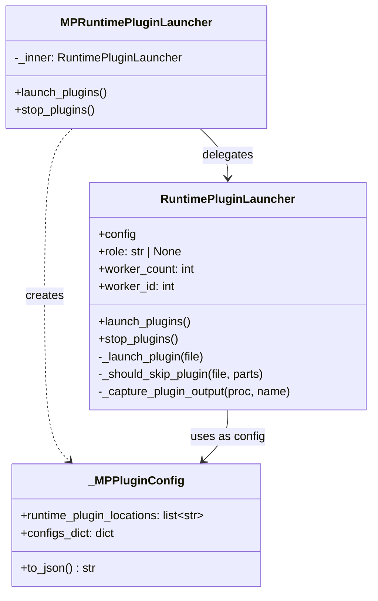
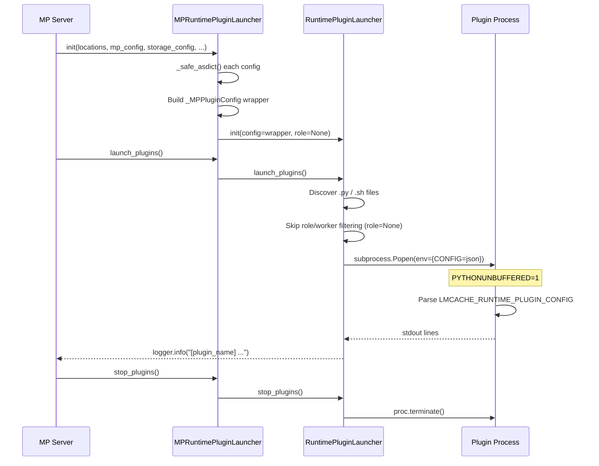

# MP Runtime Plugin Design

## Overview

The **MP Runtime Plugin** framework allows users to run custom
scripts (Python or Bash) alongside the LMCache multiprocess (MP /
ZMQ) server. Plugins receive the full server configuration via an
environment variable and run as child processes whose stdout is
captured into the LMCache logger.

Unlike the non-MP (vLLM integration) mode where plugins receive a
single `LMCacheEngineConfig`, the MP mode has multiple independent
config dataclasses (`MPServerConfig`, `StorageManagerConfig`,
`ObservabilityConfig`, etc.). The `MPRuntimePluginLauncher`
aggregates them all into a single JSON blob before delegating to
the base `RuntimePluginLauncher`.

---

## Key Components

### `MPRuntimePluginLauncher`

The MP-specific entry point. Accepts arbitrary dataclass configs
via `**kwargs`, serializes them into a single JSON dict, and
delegates all process management to `RuntimePluginLauncher`.

| Method | Description |
|---|---|
| `__init__(locations, **configs)` | Aggregate configs → JSON, create inner launcher |
| `launch_plugins()` | Delegate to `RuntimePluginLauncher.launch_plugins()` |
| `stop_plugins()` | Delegate to `RuntimePluginLauncher.stop_plugins()` |

Key design decisions:

- **`role=None`**: MP mode has no role concept (no SCHEDULER /
  WORKER split). Passing `None` disables the filename prefix-based
  role filtering in the base launcher.
- **`worker_count=1, worker_id=0`**: The MP server runs a single
  process instance; there is no TP-style worker sharding.

### `_MPPluginConfig`

A thin `@dataclass` wrapper that satisfies the duck-type contract
expected by `RuntimePluginLauncher`:

| Field / Method | Type | Description |
|---|---|---|
| `runtime_plugin_locations` | `list[str]` | Plugin file / directory paths |
| `configs_dict` | `dict` | Aggregated config sections |
| `to_json()` | `str` | Serialize `configs_dict` to JSON string |

### `_safe_asdict` / `_make_json_safe`

Helper functions that convert dataclass instances to dicts while
handling non-serializable fields (e.g. `pathlib.Path`) by falling
back to `str()`.

### `RuntimePluginLauncher` (base)

The base launcher (in `lmcache.v1.plugin`) handles:

- Discovering plugin files (`.py` / `.sh`) in configured locations
- Role-based filtering (skipped when `role=None`)
- Worker-ID-based filtering
- Interpreter detection (shebang → fallback)
- Subprocess management (`Popen` with piped stdout)
- Real-time log capture via background threads
- Graceful shutdown via `atexit`

---

## Architecture



---

## Data Flow



---

## Environment Variables

The base launcher sets the following environment variables for
each plugin subprocess:

| Variable | Value in MP mode | Description |
|---|---|---|
| `LMCACHE_RUNTIME_PLUGIN_CONFIG` | Aggregated JSON | Full server config |
| `LMCACHE_RUNTIME_PLUGIN_ROLE` | `""` (empty) | No role in MP mode |
| `LMCACHE_RUNTIME_PLUGIN_WORKER_COUNT` | `"1"` | Single server process |
| `LMCACHE_RUNTIME_PLUGIN_WORKER_ID` | `"0"` | Always worker 0 |
| `PYTHONUNBUFFERED` | `"1"` | Force real-time stdout |

Legacy aliases (`LMCACHE_PLUGIN_*`) are also set for backwards
compatibility.

### Config JSON Structure

```json
{
  "mp_config": {
    "host": "localhost",
    "port": 5555,
    "chunk_size": 256,
    "max_workers": 1,
    "hash_algorithm": "blake3",
    "engine_type": "default",
    "runtime_plugin_locations": [
      "examples/mp_runtime_plugins/"
    ]
  },
  "storage_manager_config": {
    "l1_manager_config": {
      "memory_config": {
        "size_in_bytes": 10737418240,
        "use_lazy": true
      }
    },
    "eviction_config": {
      "eviction_policy": "LRU",
      "trigger_watermark": 0.8,
      "eviction_ratio": 0.2
    }
  },
  "obs_config": {
    "enabled": true,
    "metrics_enabled": true,
    "logging_enabled": true,
    "tracing_enabled": false
  }
}
```

The exact sections depend on which `**configs` keyword arguments
are passed to `MPRuntimePluginLauncher.__init__()`.

---

## Plugin Contract

A runtime plugin **must**:

1. Be a `.py` or `.sh` file in one of the configured
   `runtime_plugin_locations`.
2. Be executable by the detected interpreter (Python or Bash).
3. Read configuration from the `LMCACHE_RUNTIME_PLUGIN_CONFIG`
   environment variable if needed.

A runtime plugin **should**:

1. Print status / heartbeat messages to stdout (they will be
   captured by the launcher and logged via `logger.info`).
2. Handle `SIGTERM` gracefully for clean shutdown.
3. Output single-line messages (each stdout line becomes a
   separate log entry).

---

## Plugin Discovery & Filtering

```
runtime_plugin_locations: ["examples/mp_runtime_plugins/"]
         │
         ▼
    Path.rglob("*.py") + Path.rglob("*.sh")
         │
         ▼
    _should_skip_plugin(file, parts)
         │
         ├─ role is None? → skip role check (MP mode)
         │
         ├─ role is set? → parts[0].upper() must match
         │                  role or be "ALL"
         │
         └─ worker_id check → parts[1] if numeric
         │
         ▼
    _launch_plugin(file)
         │
         ├─ Detect interpreter (shebang → fallback)
         ├─ Set environment variables
         ├─ subprocess.Popen(...)
         └─ Start capture thread
```

---

## Example Plugins

See `examples/mp_runtime_plugins/` for reference implementations:

| File | Language | Description |
|---|---|---|
| `mp_plugin.py` | Python | Parses config, prints summary, runs periodic heartbeat |
| `mp_heartbeat.sh` | Bash | Extracts config via `jq`, runs heartbeat loop |

### Quick Start

```bash
python -m lmcache.v1.multiprocess.server \
    --host localhost --port 5555 \
    --l1-size-gb 10 \
    --eviction-policy LRU \
    --runtime-plugin-locations examples/mp_runtime_plugins/
```

Expected log output:

```
[mp_plugin.py] Started
[mp_plugin.py] Config: {"mp_config": {...}, ...}
[mp_heartbeat.sh] Config: {"mp_config": {...}, ...}
```

---
