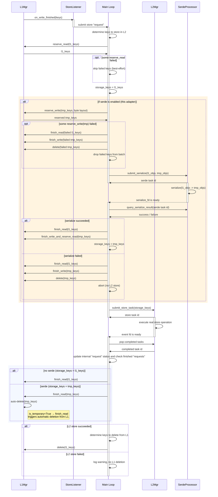
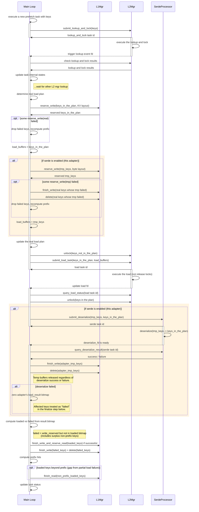

# Serde Integration for Distributed Storage Controllers

## Overview

Serialization/deserialization (serde) support for the L1-L2 data path. When enabled, all data transferred between L1 and L2 passes through a `SerdeProcessor` that compresses/decompresses using temporary byte buffers allocated from L1.

When serde is disabled (`None`), both controllers behave identically to the existing code path.

## Architecture

Two-layer interface:
- **Sync** (`Serializer`/`Deserializer`): users implement pure transform logic
- **Async** (`SerdeProcessor`): eventfd-driven interface consumed by controllers, wraps sync implementations via `AsyncSerdeProcessor`

The `SerdeProcessor` follows the same submit/eventfd/query pattern as L2 adapters, integrating naturally into the poll-based event loops.

**Serde is per-adapter:** each L2 adapter has its own optional `SerdeProcessor`. A single prefetch/store request can mix serde-enabled and serde-disabled adapters within its plan. Each adapter independently decides whether to use temp buffers and async serialize/deserialize.

## Module Layout

```
lmcache/v1/distributed/serde/
  base.py             # Serializer, Deserializer (sync ABCs)
                      # SerdeProcessor (async ABC)
  async_processor.py  # AsyncSerdeProcessor (thread pool wrapper)
  utils.py            # serialized_layout_desc, make_temp_key
```

## Store Controller Data Flow



## Prefetch Controller Data Flow



## Event Loop Integration

Both controllers register serde eventfds in their poll loop alongside L2 adapter fds:

| Controller | Polls | Handler |
|---|---|---|
| Store | `serialize_event_fd` | `_process_serialize_and_submit_l2_store` |
| Prefetch | `deserialize_event_fd` | `_process_deserialize_completions` |

## Buffer Sizing

Temp buffers are allocated at exactly `estimate_serialized_size()` bytes. The serializer is responsible for including any safety margin in its estimate (e.g., the built-in fp8 serializer returns `1.5 * num_elements`).

