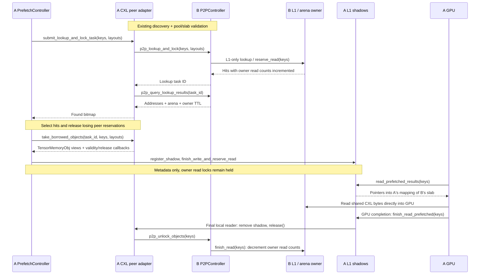

# Shared CXL KV sharing through L1 shadows

Nodes A and B map one shared CXL pool and own disjoint slabs. A borrows B's
read-locked chunk, registers a temporary L1 shadow, and reads B's bytes directly
into its GPU. Shadow creation uses metadata only: no local payload allocation,
capacity check, DRAM staging, or CXL-to-CXL copy. B remains the allocation owner.

## Modules and reuse

Paths are relative to `lmcache/v1/`. The CXL peer adapter is the only new
production module; `TensorMemoryObj` is unchanged.

| Module | Responsibility |
| --- | --- |
| **New:** `distributed/l2_adapters/cxl_peer_l2_adapter.py` | Specialize `P2PL2Adapter`: turn lookup reservations into ordinary tensor views with validity/release callbacks. |
| `distributed/l2_adapters/p2p_l2_adapter.py` | Common peer-region registration/teardown, RPC setup, lookup/polling/timeouts, and acknowledged unlock. |
| `memory_allocators/devdax_memory_allocator.py`, `distributed/memory_manager/devdax_l1_memory_manager.py` | Existing owned-slab allocation plus shared mapping helper and peer mapping. Peer views never enter local allocator/free lists. |
| `distributed/l1_manager.py`, `distributed/storage_manager.py` | Stage shadows, use existing admission/read completion, and release views before adapter teardown. |
| `distributed/l2_adapters/base.py`, `distributed/storage_controllers/prefetch_controller.py` | Optional borrowed views bypass ordinary destination reservation and copy. |
| `distributed/internal_api.py`, `distributed/transfer_channel/api.py`, request codecs | Arena identity and payload-relative addresses, carried by existing ZMQ/gRPC messages. |
| `multiprocess/modules/p2p_controller.py`, coordinator registration | Existing discovery, heartbeat, owner read counts/TTL, and adapter draining, with pool/session validation. |
| `multiprocess/modules/lmcache_driven_transfer.py`, `multiprocess/object_group_transfer.py` | Existing GPU retrieval and completion callbacks. |

## Peer identity and addressing

`CxlArenaDescriptor` contains `pool_id`, `offset` (slab-header byte offset),
`size` (payload bytes), `alignment` (also header length), and `session_id`.
The owner advertises it as JSON under coordinator metadata `lmcache.cxl.arena`
and writes its SHA-256 fingerprint into the slab header at startup.

Eligible peers share a pool ID and have disjoint slab ranges. The borrower
checks the mapped fingerprint before accepting a peer and serving its views;
this detects incorrect mappings and owner restarts, but is not authentication.
Only the primary owned CXL slab is exported. DRAM, extra arenas, and borrowed
shadows return misses; owner L1 remains the authoritative key index.

The shared `MemoryRegionAddress` carries payload-relative `offset`, `size`,
optional `cxl_arena`, and `read_ttl_seconds`. It aliases `TransferChannelAddress`
and preserves its serialized fields (including `cxl_ttl_seconds`) for existing
ZMQ/gRPC peers. B's virtual address never crosses the wire:

```text
A_local_pointer = A_mapping_of_B_slab + B.alignment + chunk.offset
```

With 4096-byte alignment and payload offset 8192, A reads at its mapping base
plus 12288. The mapping retains a `memoryview` so live tensor views prevent
unmapping; it creates no allocator or transfer channel.

## Function contracts

| Function / owner | Input | Output / ownership |
| --- | --- | --- |
| `register_peer_region()` / P2P adapter | Adapter's constructor config | Once per connection: import the registered RDMA region or map/GPU-register the CXL slab. The adapter itself scopes region-relative addresses. |
| `unregister_peer_region()` / P2P adapter | Drained adapter, called by `close()` | Release RDMA resources or unmap CXL after borrowed readers and unlocks drain; RPC stays open if draining fails. |
| `cxl_arena` / L1 and storage managers | Property | Owned `CxlArenaDescriptor`, or `None`. |
| `get_cxl_address(obj)` / L1 and storage managers | Read-reserved `MemoryObj` | Owned primary-slab address and TTL, or `None`. |
| `CxlPeerMapping(device_path, arena)` | Local pool device path, peer descriptor | GPU-registered mapping; invalid identity or failed registration raises an error. |
| `CxlPeerMapping.view(offset, size)` | Payload-relative byte range | Tensor byte view; invalid bounds/alignment/session raises `ValueError`. |
| `add_cxl_peer(arena, request_url, lookup_timeout)` / storage manager | Peer descriptor, RPC endpoint, deadline seconds | Adapter ID using existing registration/draining. |
| `take_borrowed_objects(task_id, keys, layouts)` / L2 adapter | Completed lookup, selected keys, layouts by group | `None` for copy adapters; otherwise key → `(MemoryObj, is_valid, release)`. Invalid hits remain releasable via `release_lookup`. |
| `register_shadow(key, obj, tag, is_valid=..., on_release=...)` / L1 | View, writer tag, callbacks | `L1Error`; successful staging transfers release responsibility to L1 without checking capacity. |
| `finish_write_and_reserve_read(keys, read_locks, tag)` / existing L1 | Staged keys, reader count, writer tag | Ordinary admission result; a concurrent resident wins and the redundant shadow is released. |
| `release_lookup(task_id, keys)` / L2 adapter | Lookup identity, unused keys | Return only unadopted reservations. Adopted views release independently. |
| `is_valid()` / returned callback | None | Reservation unreleased, within owner TTL, and mapped session current. |
| `release()` / returned callback | After final GPU reader | Idempotently invalidate the view and enqueue existing owner unlock RPC. No payload free or blocking RPC under L1 locks. |
| `reap_expired_shadows()` / L1 | None | Reclaim expired/session-invalid views, including abandoned prefetches. |
| `get_active_borrow_count()` / adapter | None | Live views plus pending unlock operations; removal waits for zero. |

## Remote P2P lookup and retrieval



## Lifetime and deployment limits

Registration lasts for the peer connection; read reservations last for individual
retrievals. RDMA unlock follows the copy into local DRAM, whereas CXL unlock follows
the final GPU read. Both use `peer_rpc_url` for lookup/unlock; configuration also
accepts the existing `peer_mq_server_url` name. Registration failure closes RPC
and notifier resources, and successful adapter close is idempotent.

Each lookup holds independent owner read counts, scoped locally by task ID.
Multiple local readers share one shadow reservation until their final GPU
completion. Failed admission, unused hits, and cancellation release reservations;
`weakref.finalize` also releases an unadmitted view when it is garbage-collected.
Peer removal drains lookups, shadows, and queued unlocks before unmapping.

Local expiry is lookup-submission time plus owner TTL; local reader increments
cannot extend it. Expired or restarted-owner reservations do not send unlocks.
Retrieval must complete before owner TTL, as in existing P2P. Key-only unlocks
retain existing delayed-message/TTL limitations; there is no distributed fencing
or recovery from an owner failure during DMA.

Enable `--p2p-transfer-engine cxl`, `--cxl-pool-id POOL`, and
`--cxl-pool-offset BYTES` with existing Device-DAX and coordinator settings;
see [P2P configuration](../../source/mp/p2p.rst). No P2P advertise URL is needed.
Reserve `alignment + payload_size` bytes per slab: two 2-GiB payloads with
2-MiB headers start at 0 and 2149580800 and need 4299161600 shared bytes.
Deployment assigns non-overlapping slabs and must not reinitialize them with
active readers. Device paths may differ between nodes.
The shared API does not enable concurrent RDMA/CXL discovery or multiple L1
managers; those still require the separate routing integration.

Tests cover distinct mappings of one shared file, ZMQ/gRPC, GPU copies when
available, a full borrower slab, independent borrows, duplicate admission,
expiry, and draining. Cross-host CXL coherency, DMA performance, and failure
recovery still require hardware validation.
