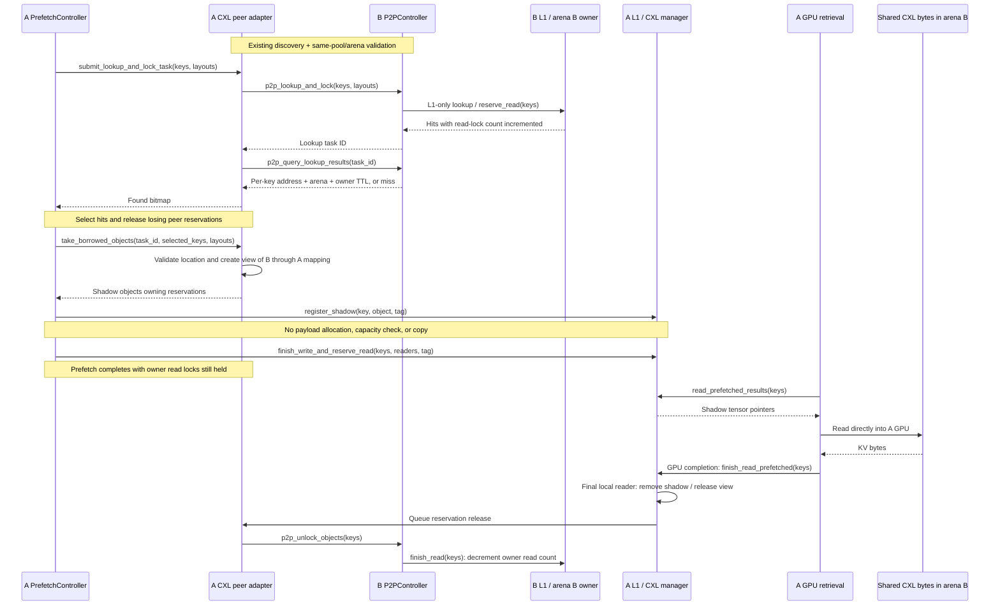

# Shared CXL KV sharing through L1 shadows

Status: initial implementation for review. This design spans `lmcache/v1/distributed/` and
`lmcache/v1/multiprocess/`.

## Scope and invariants

Nodes A and B map one shared CXL pool and each owns a slab: arena A and arena B.
A borrows a chunk in arena B by registering a temporary shadow in A's L1/CXL
manager. The shadow references B's existing bytes; A retrieves them directly
into its GPU.

- Shadow creation allocates metadata only. It bypasses local DRAM/CXL payload
  allocation and capacity checks, including when arena A is full.
- B owns the physical allocation and accounts for its capacity. A frees only
  its shadow and mapping reference, never B's pages.
- Reuse the current CXL manager's mapping, GPU registration, and visibility
  behavior, plus the existing P2P lookup and TTL read-lock semantics.
- Each successful borrow increments B's read-lock count. After GPU retrieval
  completes, A removes the shadow and notifies B to decrement that count.
  Abandoned reservations follow existing TTL expiry behavior.
- Export only owned CXL objects. Shadows are read-only and cannot be exported
  to another peer. Owner-side L1 remains the authoritative key index.

## Modules

All paths below are relative to `lmcache/v1/`.

| Module | Change | Responsibility |
| --- | --- | --- |
| `distributed/cxl_types.py` | New | Validated arena identity and registration metadata key. |
| `distributed/l2_adapters/cxl_peer_l2_adapter.py` | New `CxlPeerL2Adapter` | Represent one eligible peer; reuse P2P RPC plumbing and return borrowed views instead of copying bytes. Factor common RPC setup out of unconditional RDMA initialization. |
| `distributed/memory_manager/devdax_l1_memory_manager.py` and `memory_allocators/devdax_memory_allocator.py` | Extend | Describe owned arenas, resolve peer locations, and create/release views. Peer mappings are excluded from local allocation/free lists. |
| `memory_management.py` | Add `CXLMemoryObj` | A tensor-backed borrowed view with layout, expiry, mapping reference, and release callback; cleanup never frees owner pages. |
| `distributed/l1_manager.py` and `distributed/storage_manager.py` | Extend | Public shadow staging API, admission, and cleanup through existing read completion. |
| `distributed/storage_controllers/prefetch_controller.py` and `distributed/l2_adapters/base.py` | Extend | Optional borrow capability: skip destination reservation/copy, admit shadows, and transfer reservation ownership to them. |
| `multiprocess/modules/p2p_controller.py`, request codecs, and coordinator registration | Extend | Advertise/validate CXL peers, return typed locations, and reuse discovery, lookup, unlock, and lifecycle management. |
| `multiprocess/modules/lmcache_driven_transfer.py` and `multiprocess/object_group_transfer.py` | Reuse | Retrieve through the shadow's tensor pointer; existing GPU completion drives `finish_read_prefetched()`. |

## Descriptors and peer eligibility

| Type | Fields and meaning |
| --- | --- |
| `CxlArenaDescriptor` | `pool_id: str`, `offset: int`, `size: int`, `alignment: int`, `session_id: str`. Offset is the slab header's device-relative byte offset; size is usable payload bytes; alignment also sizes the header. |
| `TransferChannelAddress` | Existing `offset` and `size` fields, plus optional `cxl_arena` and `cxl_ttl_seconds`. CXL offsets are relative to the peer payload, in bytes. |
| Borrow bookkeeping | Adapter lookup-task ID → key → (address, conservative local expiry). A `CXLMemoryObj` owns the reservation after adoption and releases it once. |

Advertise the arena as JSON in coordinator metadata `lmcache.cxl.arena`.
Discovery uses the existing registration, heartbeat, and reconciliation flow.
Eligible peers must share the pool ID and expose disjoint slab ranges. At
startup the owner writes a SHA-256 fingerprint of its descriptor into its
header, with a fresh session ID. The borrower verifies that header through its
own device mapping before accepting the peer and before serving a shadow.
This detects mismatched mappings and owner restarts; it is not authentication.

Both ZMQ and gRPC carry the extended address. No RDMA endpoint, transfer engine,
or locally allocated destination buffer is required. Initially only the primary
configured CXL slab is exported; DRAM, extra DAX arenas, and shadows are misses.

```text
A_local_pointer = A_mapping_of_B_slab + B.alignment + chunk.offset
```

For example, with 4096-byte alignment, a chunk at payload offset 8192 resolves
to A's mapping of B's slab plus 12288. B's virtual address never crosses the wire.

## Function contracts

The following public APIs connect the components. Paths are relative to
`lmcache/v1/`; existing types include `ObjectKey`, `MemoryLayoutDesc`, `MemoryObj`,
`Bitmap`, and `L1Error`.

| Function / owner | Inputs | Output and behavior |
| --- | --- | --- |
| `cxl_arena` / Device-DAX L1 manager, L1 manager, storage manager | Property | `CxlArenaDescriptor \| None` describing the owned slab. |
| `get_cxl_address(obj)` / L1 manager and storage manager | Read-reserved `MemoryObj` | `TransferChannelAddress \| None`; returns only owned primary-slab locations and the owner's TTL. |
| `CxlPeerMapping(device_path, arena)` / Device-DAX allocator module | Local shared-pool device path and peer descriptor | Map and GPU-register peer bytes without a local allocator. Invalid headers/ranges or registration failure raise errors. |
| `CxlPeerMapping.view(offset, size)` | Payload-relative byte range | `torch.Tensor` byte view; bounds/alignment/session failure raises `ValueError`. |
| `add_cxl_peer(arena, request_url, lookup_timeout)` / storage manager | Peer descriptor, RPC endpoint, deadline seconds | Adapter ID; reuse normal adapter registration and draining. |
| `supports_borrowing()` / L2 adapter | None | Defaults to `False`; CXL returns `True`. |
| `take_borrowed_objects(task_id, keys, layouts)` / CXL adapter | Completed lookup ID, selected keys, layouts by group | `dict[ObjectKey, MemoryObj]`; creates borrowed views and transfers reservations to them. Invalid hits remain releasable through `release_lookup`. |
| `register_shadow(key, obj, tag)` / L1 manager | Key, `CXLMemoryObj`, prefetch writer tag | `L1Error`; stages metadata without payload allocation/capacity checks. Caller retains rejected views. |
| `finish_write_and_reserve_read(keys, read_locks, tag)` / L1 manager, existing | Staged keys, consumer count, writer tag | Existing admission result; keep a concurrent resident object and release the redundant shadow. |
| `release_lookup(task_id, keys)` / L2 adapter | Lookup identity and unused keys | Return unused peer reservations; CXL scopes cleanup by task, and adopted views release independently. Other adapters use existing unlock behavior. |
| `CXLMemoryObj.release()` | Called after final GPU reader | Invalidate the view once and queue owner unlock; never free owner pages or block the GPU callback on RPC. |
| `reap_expired_shadows()` / L1 manager | None | Reclaim expired/session-invalid views, including abandoned prefetches; called by the prefetch loop. |
| `get_active_borrow_count()` / CXL adapter | None | Count live views and queued unlock operations; adapter draining waits for zero. |

Reuse owner `p2p_lookup_and_lock(keys, layouts) -> task_id`,
`p2p_query_lookup_results(task_id) -> locations | None`, and
`p2p_unlock_objects(keys) -> None`. Lookup uses L1-only `reserve_read`; unlock
uses `finish_read_prefetched` / `finish_read`. Filter non-exportable hits and
release any reservations acquired for them. Retain task-scoped borrow state
so overlapping lookups for the same key balance their reservations separately.

## Remote P2P lookup and retrieval flow



## Cleanup and validation

Successful shadow admission transfers remote-lock ownership from prefetch to
the shadow; skip the ordinary post-load peer unlock for those keys. Multiple
remote borrowers acquire independent owner read counts. Multiple local readers
of one shadow retain its borrow until their final GPU completion.

Failed admission, unused lookup hits, and cancellation before GPU access
release their reservations. After GPU access is queued, cleanup waits for completion.
Lost/abandoned reservations follow the existing TTL policy. Shadow release is
idempotent locally and does not introduce a new distributed lease protocol.

A view expires at local lookup-submission time plus the advertised owner TTL,
which is conservative without clock synchronization. Local read-count increases
cannot extend that deadline. Expired or session-invalid shadows are reclaimed;
cleanup avoids sending unlocks for locally expired reservations or changed owners.
Retrieval must still complete before the owner TTL, as in the existing P2P path.
Key-only unlocks retain the existing protocol's delayed-message/TTL limitations;
this implementation adds no distributed fencing or mid-DMA failure recovery.

Peer removal stops new borrows and drains lookup tasks, active shadows, and
GPU readers before closing mapping/RPC resources. Changed owner sessions require revalidation. Physical payload accounting excludes
shadows; temporary object counts and adapter active-borrow counts expose them.

Acceptance tests: same-pool filtering; different virtual mapping bases; correct
GPU bytes; borrowing with A's slab full; no receiver payload allocation/copy;
balanced counts for concurrent borrowers; duplicate admission; cancellation;
TTL behavior; and peer draining through GPU completion.

Reference: [existing P2P L2 adapter](distributed/l2_adapters/p2p_l2_adapter.md).

## Configuration and deployment boundary

Use `--p2p-transfer-engine cxl`, `--cxl-pool-id POOL`, and
`--cxl-pool-offset BYTES` together with the existing `--l1-devdax-path`,
`--l1-size-gb`, `--l1-align-bytes`, `--no-l1-use-lazy`, `--shm-name ""`,
and coordinator flags. No `--p2p-advertise-url` is needed.

Allocate each slab as `alignment + payload_size` bytes, with device-compatible
alignment. For example, two 2-GiB payload slabs with 2-MiB headers start at byte
0 and 2149580800 and require at least 4299161600 shared bytes. The same device
may have different local paths. Slab assignment remains a deployment responsibility;
peer validation cannot prevent two owners from initially configuring the same slab.
Do not reuse/reinitialize a slab while readers are active.

Functional tests map a shared file at different virtual addresses, run both
ZMQ and gRPC, and exercise GPU copies when available. Cross-host CXL hardware
coherency, DMA performance, and failure recovery still require hardware validation.
