# Cross-Node Shared KV Cache on Secondary Memory

Status: Draft proposal
Scope: `lmcache/v1/storage_backend/dax/`, `lmcache/v1/storage_backend/maru_backend.py`,
       `lmcache/v1/distributed/l2_adapters/`

## 1. The headline

LMCache should be able to put a single KV cache pool behind multiple LMCache
servers running on different hosts, with reads served zero-copy out of
byte-addressable secondary memory.

That sentence is the entire goal. Everything else in this document is
infrastructure for making it true.

Why it matters:

- A KV cache hit on **any** model replica in a serving fleet becomes a hit
  for **every** replica. Prefix caching, system prompts, agentic context
  windows — all of these stop being per-replica costs.
- Reads are byte-addressable `mmap` loads, not network transfers. No copy
  through the NIC, no copy through the host page cache, no copy from a
  remote KV store. The cost of a cross-replica hit is the cost of a memory
  read at CXL latency, which is in the same order of magnitude as DRAM.
- Capacity is purchased once at the fabric and amortized across every
  replica that can reach it, instead of duplicated per replica in DRAM.
- **Graceful request handoff under HBM pressure.** When a host running
  long-context agents exhausts HBM, the request router can migrate the
  request to a host with headroom instead of dropping it. The target host
  recovers the entire context from the shared pool with no network transfer
  of KV bytes. §5.5 specifies the small operations that make this safe.

The hardware story is split into two phases that the design must handle in
one shape:

- **Today.** Single-host CXL Type-3 expanders and `/dev/dax`. Multiple
  LMCache server processes on the same host already share the underlying
  arena via `mmap`. This is the Maru backend's value proposition, and we
  have the hardware to ship it.
- **Soon.** CXL 3.0 pooled memory behind a CXL switch, plus equivalent
  fabric-attached shared-memory products. Multiple hosts wired to the same
  switch map the same arena. The access path is the same `mmap`; what
  changes is reachability and latency.

LMCache's secondary-memory backends today (DAX, Maru) target the
single-host case. They have no notion of a region that exists outside the
local kernel. They will not scale to a fabric without a redesign — unless
we choose the abstraction now.

This proposal chooses that abstraction. The single-host case ships first,
not as a feature but as the first concrete locator behind a generic
region API. Cross-host is then a locator swap, not a rewrite.

## 1a. Where CXL sits relative to GPUs

A clarification before the rest of the design, because it shapes what
"sharing" and "cross-node" mean here.

CXL Type-3 expanders attach to a **host CPU's** CXL root complex. They
are not a GPU-to-GPU interconnect, and no shipping GPU has a native CXL
link of its own. Two reachability pictures, one per stage:

**Stage 1 — single-host.** Every GPU on the host reaches the CXL arena
through the host CPU. A `/dev/dax` device is local to one host's CXL
root complex.



[source: `figures/cxl_topology_single_host.mmd`]

**Stage 2 — cross-host.** A CXL 3.0 switch connects multiple host CPUs
to a shared pool. The GPUs on each host still reach the pool through
their own local CPU — there is no GPU-to-GPU CXL path.



[source: `figures/cxl_topology_cross_host.mmd`]

The consequences for this design:

- **All GPUs on one host already see CXL memory uniformly.** A CXL-backed
  buffer looks like pinned host DRAM. Any GPU on the host can DMA from it
  the same way it DMAs from any pinned host buffer. Multi-GPU sharing on
  one host is not something this proposal needs to add — it falls out of
  the existing host-memory access path.
- **The cross-node axis is hosts, not GPUs.** When this document says
  "another node" or "another host", it means another machine with its own
  CPU and its own CXL root complex. A CXL 3.0 pool behind a switch
  connects those CPUs to a shared arena. The GPUs on each host reach the
  pool through their own local CPU, not through any GPU-side fabric.
- **GPU-to-GPU fabrics are a separate concern.** NVLink, NVSwitch, and
  the various RDMA/NIXL transports already used by LMCache for KV
  transfer between GPUs do not change. They live on a different layer
  and address a different problem (live, GPU-resident state movement
  during a request) than this proposal (durable, host-tier KV cache
  sharing).
- **The owner of a region is a host process, never a GPU.** When section 3
  talks about a region's owner, it means the LMCache server on the host
  that allocated the slot. GPUs are consumers of regions through their
  host, not participants in the region protocol.

The short version: this proposal is about sharing the *host-side* KV cache
tier across hosts. Per-host multi-GPU access is already free. GPU-to-GPU
fabrics are out of scope.

## 1b. Relationship to in-flight work

Several capabilities adjacent to this proposal are already shipping or in
active development:

- A multi-region DAX backend with runtime hotplug HTTP routes
  (add/drain/remove/resize/status), a generic L2 hotplug protocol, and
  migration safety checks.
- A DAX primary-mode path where the mapped arena is used as both
  allocator and storage backend, removing the CPU staging copy.
- Per-key pin/unpin correctness fixes on the asynchronous retrieve path,
  closing a class of refcount-accumulation bugs.
- Zero-copy KV cache sharing across processes on a single host via CXL
  shared memory, including the metadata coordination required for
  multi-process readers.

This proposal does not duplicate any of that work. It builds on the
hotplug, multi-region, and shared-memory pieces already in flight, and
adds four things:

1. **A cross-node forward path.** A `RegionLocator` abstraction with a
   `RegionScope` enum (`PROCESS | HOST | RACK | FABRIC`). The same
   `Region` and `RegionGroup` shapes that hold single-host arenas today
   extend to fabric-attached shared pools tomorrow without changes to the
   L2 contract, the controllers, or the placement policy interface.
2. **Request-handoff operations.** Two new `StorageManager` methods
   (`commit_for_handoff`, `is_persisted`) that let a request router
   migrate a long-context request to a host with HBM headroom without
   losing or recopying the context. See §5.5.
3. **A unified `Region` abstraction across DAX and Maru.** The same
   `RegionGroup`, tombstone queue, placement-policy registry, and
   resilience contract apply to both backends, preventing the two from
   drifting on the pieces they have in common.
4. **A written-down resilience contract.** The six rules in §7 codify the
   partial-failure semantics every secondary-memory adapter must honor,
   backed by a leak-detector test that gates merges. The pieces exist
   today across several PRs; this proposal makes them an explicit,
   testable contract.

Items 1 and 2 are new capabilities. Items 3 and 4 are coherence and
maintainability gains on top of work that already exists.

## 2. The abstraction: Region and Locator

A region is one byte-addressable arena that can be `mmap`ed by everyone
who can reach it. The thing that defines "who can reach it" is the
**locator**.

```
Region = (name, locator, capacity_slots, state, scope)

  name           stable string identifier
  locator        how this region is reached on this host (see table below)
  capacity_slots fixed-size slot count owned by the region
  state          ACTIVE | DEGRADED | REMOVED (see §6)
  scope          PROCESS | HOST | RACK | FABRIC — the reach of this region.
                 Consumed by `is_persisted(scope=...)` in §5.5 and by
                 placement policies that want to filter on reach.

Locator: name → (mmap_ptr, capacity_bytes)  on hosts that can reach this region
                                              raises NotReachable elsewhere
```

The locator is the entire topology story. Every interesting property of
"where the memory lives" reduces to which locator you plug in.

| Locator                    | Reach                                   | Status |
|----------------------------|-----------------------------------------|--------|
| `LocalMmapLocator(path)`   | one host, every process on the host     | Stage 1 |
| `PooledMemoryLocator(...)` | every host wired to one CXL 3.0 switch  | Stage 2 |
| `FabricMemoryLocator(...)` | every host on a memory fabric           | Future |

The rest of the system — placement policy, slot allocator, lookup index,
hotplug API, eviction, resilience — does not know which locator is in use.
It only sees a `Region` with a mapping.

The single most important property of this design is:

> Adding cross-host support later requires implementing one new locator. It
> does not require touching the L2 adapter contract, the controllers, the
> CLI, or the slot allocator.

That property is what justifies doing stage 1 even before the fabric
hardware is widely available. We are not gambling on the timing of CXL 3.0
— we are choosing an abstraction that is correct for the single-host case
we have today and that does not need to be rebuilt for the cross-host case
we will have tomorrow.

## 3. What sharing means, concretely

The contract for a multi-reader region:

- Every non-owner host that can reach the region maps the same arena
  read-only. The owner maps it read-write.
- Each region has exactly one **owner**: the LMCache server that allocates
  and commits slots. Non-owners are readers.
- Ownership is per-region, not per-pool. A pool can hold many regions, with
  ownership spread across hosts. The placement policy picks which region a
  given store goes to, and therefore which host owns it.
- Readers learn about new committed slots through the same metadata channel
  that already coordinates intra-host sharing in the Maru backend. We lift
  that channel from "shared-memory broadcast on one host" to "metadata
  sync among hosts that share a region."
- **Lookup is always local.** Each host maintains a read replica of the
  key→slot index for every region it can reach. The metadata channel
  streams add/evict events from each region's owner to all readers; the
  replica is updated in place. A reader's `lookup_and_lock` never queries
  a remote host — it consults the local replica. This makes lookup
  latency independent of cluster size and makes the metadata channel a
  fan-out publish-subscribe stream, not a request-response RPC. The cost
  is one per-region index replica's worth of memory on every host that
  joins the region, which scales with the number of slots in the region
  (not with cluster size).
- The slot allocator is owner-local. Readers never allocate.

For the single-host case (`LocalMmapLocator`), every server on the host is
both an owner of its own regions and a reader of regions owned by other
servers on the host. The metadata channel is shared memory, which is what
Maru does today.

For the cross-host case (`PooledMemoryLocator`), the metadata channel
becomes a small RPC. The bytes of the KV cache itself still travel over
CXL `mmap`, never over the RPC. The RPC carries only key → slot mappings
and slot lifecycle events.

This is the asymmetry that makes the design worth it: **the heavyweight
path (KV cache bytes) is always zero-copy through shared memory; only the
lightweight path (metadata) traverses the network.**

## 4. The multi-region pieces are foundation, not features

A single region — single locator, single arena, single owner — is not a
useful shared system. The cross-node design only works once a host can
hold many regions, drain one without losing the others, and admit a new
one at runtime as fabric topology changes.

That gives the three single-host pieces a clear role:

1. **Multi-region (`RegionGroup`).** A host carries N regions, each its own
   slot allocator and its own index slice. Single-region deployments are
   the N=1 case of the same code. This is the prerequisite for letting a
   host be part of a pool at all — a pool always implies more than one
   region per host.
2. **Resilience contract.** When a region disappears — locally because of
   a hardware fault, remotely because a peer left the fabric or the switch
   reported a path failure — the adapter must degrade that one region and
   keep serving the rest. The L2 contract already expresses partial
   per-key results as bitmaps; we extend it with the rules that make sure
   region-level faults always reduce to bitmap bits, never exceptions.
3. **Hotplug.** Operators add and remove regions at runtime. Locally this
   is "I added a `/dev/dax` device." On a fabric this is "this host just
   joined the switch" or "the pool was resized." The HTTP surface is the
   same; the locator is what differs.

None of these three are interesting on their own. They are interesting
because together they make a host into a fabric-ready participant.

## 5. Design overview



[source: `figures/design_overview.mmd`]

The L2 adapter contract from `docs/design/v1/distributed/l2_adapters/overall.md`
does not change. `StoreController` and `PrefetchController` continue to
call `submit_store_task`, `submit_lookup_and_lock_task`, `submit_load_task`,
and `submit_unlock` exactly as today. The adapter routes each call into
the `RegionGroup`, which fans out across regions.

What is new sits entirely inside `RegionGroup`:

- A `regions: dict[str, Region]` table, guarded by a read-write lock.
- A placement policy on the **store** path. The default is
  `LowestUtilizationOwnedRegion` — only consider regions this server owns
  with the most free slots. The lookup and load paths never consult the
  policy; they use the metadata channel to find the owning region of a
  key.
- A tombstone queue per region for unlocks that arrived after the region
  was removed.
- The metadata channel. Single-host: shared memory; cross-host: a thin
  RPC. Same interface either way.

## 5.5. Operations for request handoff

A common driver for cross-replica shared cache is **graceful request
migration**. A host running long-context agents exhausts HBM. The request
router wants to move that request to a host with headroom instead of
dropping it. The new host needs the full context to resume — and the
whole point of sharing the pool is that the context bytes do not have to
travel over the network.

The shared pool gives us the bytes; two small additions to `StorageManager`
give the router the *control plane* it needs to migrate safely. Neither
changes the L2 contract; both extend the existing `StorageManager` surface
that the serving engine already uses.

### `commit_for_handoff`

```
commit_for_handoff(keys: list[ObjectKey]) -> CommitHandle
```

Forces the StoreController to flush these keys to L2 ahead of its normal
cadence. Returns a handle the caller polls or awaits. Completion means
every adapter selected by the current store policy has confirmed the
store. Implementation: a priority lane in `StoreController` plus a
per-handle completion notify. The default async commit path is unchanged.

### `is_persisted`

```
is_persisted(keys: list[ObjectKey], scope: RegionScope) -> Bitmap
```

Returns a bit per key, set if at least one region with the requested reach
holds the key. `scope=HOST` for same-host migration; `scope=FABRIC` for
cross-host. Implementation: intersection of per-region indexes filtered by
scope. The same scope values appear on `Region.scope` (§4.1 of this proposal).

### Worked example

```
router decides to migrate request R from host A to host B:

  on host A (source):
    handle = sm.commit_for_handoff(keys_of_R)
    await handle                                    # KV bytes are in the pool
    assert sm.is_persisted(keys_of_R, FABRIC).all() # verify before handoff
    router.route_request_to(R, host=B)              # router's API
    # host A is now free to drop R from HBM

  on host B (target):
    serving engine receives R with the same prompt
    handle = sm.submit_prefetch_task(keys_of_R, layout_desc)
    # prefetch hits the shared pool, loads full context into HBM
    # via the existing GPU connector path — no network transfer
```

### What this does not solve

- **The migration decision.** "Move R from A to B" is the request router's
  job. LMCache exposes the operations that make it safe; it does not pick
  policy.
- **Serving engine handoff.** How host B picks up the request stream
  (tokens generated so far, sampling state, KV layout) is the serving
  engine's responsibility. LMCache covers the cache side only.
- **Mid-decode handoff.** True mid-generation migration requires the
  StoreController commit cadence to keep up with token generation. LMCache
  can only guarantee what has been committed; anything generated on A but
  not yet committed is lost when A drops.

### The promise

When `commit_for_handoff` completes and `is_persisted(scope=FABRIC)` returns
all-true for a request's keys, the target host's prefetch will succeed
without any network transfer of KV bytes.

## 6. Region lifecycle

Three states only.

| State      | Reads        | Writes (owner) | How entered                                        |
|------------|--------------|----------------|----------------------------------------------------|
| `ACTIVE`   | served       | accepted       | startup, hot-add, recovery from `DEGRADED`         |
| `DEGRADED` | served       | rejected       | health probe failed, or error-rate threshold hit   |
| `REMOVED`  | not served   | rejected       | operator removed it, or unrecoverable health fault |

`REMOVED` has a grace period for in-flight reads and unlocks. No separate
"draining" state is needed; "draining" is just `REMOVED` with
in-flight work still completing.

For an owned region, state transitions are local. For a reader's view of a
remote region, transitions arrive over the metadata channel. Both follow
the same machine.

## 7. Resilience contract

Six rules. They extend, not replace, the assumptions in
`docs/design/v1/distributed/l2_adapters/overall.md`.

1. **A region fault never escapes the adapter as an exception.** Per-region
   I/O failures, locator reachability failures, and metadata-channel
   failures are caught at the region boundary. Store returns `False` for
   affected keys; lookup and load return cleared bits. The existing
   controllers already handle both.
2. **`submit_unlock` is durable across region removal.** If a region
   disappears between a successful `lookup_and_lock` and the matching
   `submit_unlock`, the unlock is recorded in the region's tombstone queue.
   The queue is bounded in two ways so it cannot grow indefinitely:
   - **By time.** The queue is tied to the region's `REMOVED` grace period
     (§6). Within the grace period it drains either by region re-add or by
     adapter close, whichever comes first. After the grace period expires,
     the queue is freed. Any outstanding unlock is satisfied vacuously —
     the region's refcount table no longer has a consumer, so there is
     nothing to leak.
   - **By size.** A per-region cap (default 64 K entries) bounds the queue
     under pathological churn. On overflow the oldest entries are dropped,
     again by the same vacuous-satisfaction argument.
   The framework's "eventual success" requirement (`overall.md`, assumption
   4) is met either way: no caller ever waits on the unlock.
3. **No counter leaks under fault.** Every external-lock and slot-borrow
   path has a matching decrement on success, failure, and shutdown. A
   leak detector test drives mid-flight region removal and asserts every
   per-key and per-slot counter returns to zero.
4. **Health probes run independent of traffic.** A region that has not
   served requests in N seconds is still probed, so faults surface before
   live traffic hits them.
5. **`get_usage()` reports only `ACTIVE` capacity.** Capacity in
   `DEGRADED` or `REMOVED` regions does not count, even when their data
   is still readable. This keeps the eviction controller's pressure
   signal honest.
6. **Metrics are per-region.** `report_l2_metrics()` emits one labeled
   sample per region for slot usage, state, last-error timestamp, and —
   in the cross-host case — metadata-channel round-trip time.

## 8. Hotplug control plane

A small HTTP surface on the existing MP server, scoped under
`/secondary-memory/`. Adapter-private; no L2 contract change.

| Endpoint                              | Action                                       |
|---------------------------------------|----------------------------------------------|
| `GET  /secondary-memory/status`       | list regions, state, usage, last-error       |
| `POST /secondary-memory/add`          | add a region by name + locator parameters    |
| `POST /secondary-memory/remove`       | remove a region; mode = `evict` or `migrate` |
| `POST /secondary-memory/resize`       | adjust `capacity_slots` for an owned region  |
| `POST /secondary-memory/probe`        | force a health probe (debug)                 |

The handler holds the region-table write lock only for metadata transitions.
Long-running work (migration copies, unmap, fabric detach) runs after the
lock is released, with the source region already in `REMOVED`.

`remove` modes:

- `evict`: drop all keys in the region. Used when capacity is intentionally
  reduced or the region is already known-bad.
- `migrate`: copy each live, unlocked key into another `ACTIVE` region
  owned by this server before unmapping. Uses `DaxCore.put_many` on the
  destination — no new transfer code. The index transitions atomically:
  index write happens after destination commit, before the source slot is
  released, so a key is never present in two regions at once.

**Crash semantics for `migrate`.** Each migration batch writes a small
per-adapter journal entry *before* it starts: `(src_region, dst_region,
key, dst_slot_id, phase)` where `phase` is one of `COPIED`,
`INDEX_FLIPPED`, `SRC_RELEASED`. On adapter open the journal is replayed
and unfinished entries are reconciled:

- `COPIED` (destination written but index not flipped): drop the dst slot,
  leave the src slot live. The key stays in the source region.
- `INDEX_FLIPPED` (index points at dst, src not yet released): release the
  src slot. The key is in the destination region; the source slot is freed.
- `SRC_RELEASED`: clean entry, no action.

The atomic transition point is the index flip. Before it, the source is
authoritative; after it, the destination is. A crash can leave a stray
unreferenced slot in either region, but never a key visible in both. The
journal is truncated after reconciliation.

The hotplug surface is the **same** in stage 1 (single host) and stage 2
(cross host). The locator handles the topology difference; the API does
not.

## 9. Files touched

The implementation surface is intentionally small.

| File                                                              | Change                                                                                                |
|-------------------------------------------------------------------|-------------------------------------------------------------------------------------------------------|
| `lmcache/v1/storage_backend/dax/region_group.py` (new)            | `Region`, `RegionGroup`, `RegionLocator`, `LocalMmapLocator`, placement policy registry, tombstone queue. |
| `lmcache/v1/storage_backend/dax/metadata_channel.py` (new)        | The same-host shared-memory channel for stage 1, with a clean interface that stage 2 implements with RPC. |
| `lmcache/v1/storage_backend/dax/core.py`                          | No interface change. The adapter now holds N cores via `RegionGroup` instead of one core directly.    |
| `lmcache/v1/distributed/l2_adapters/dax_l2_adapter.py`            | Delegate index lookups, writes, and metrics to `RegionGroup`. Add per-region metric labels.           |
| `lmcache/v1/storage_backend/maru_backend.py`                      | Same delegation. The shared-memory unlock path uses the tombstone queue.                              |
| `lmcache/v1/mp/http_server.py` (or equivalent)                    | Register the five `/secondary-memory/...` routes as thin shims.                                       |
| `lmcache/v1/distributed/storage_manager.py`                       | Add `commit_for_handoff()` and `is_persisted()` (see §5.5). No change to existing methods.            |
| `lmcache/v1/distributed/storage_controllers/store_controller.py`  | Add a priority lane and per-handle completion notify to support `commit_for_handoff` (§5.5).          |
| `docs/design/v1/distributed/l2_adapters/dax.md`                   | Update "Current Limits" once stage 1 lands.                                                           |

No change to `L2AdapterInterface`, `PrefetchController`, the CLI, or any
other adapter. The two new `StorageManager` methods extend the surface the
serving engine already consumes.

## 10. Test plan

All tests use file-backed DAX simulation. No real CXL or fabric hardware
required.

1. **Single-region equivalence.** Run the existing DAX and Maru test
   suites with `RegionGroup(N=1)`. All must pass unchanged. This is the
   safety net that proves the refactor is a no-op for current deployments.
2. **Single-host, multi-region.** Many regions, one server. Add, remove
   (`migrate` and `evict`), and resize at runtime. Verify correctness and
   capacity accounting.
3. **Single-host, multi-process share.** Two LMCache processes on the
   same host configured with an identical set of regions backed by the
   same `/dev/dax` device. Process A is the owner of each region (it
   allocates and commits slots); process B is a read-only peer (it joins
   the same regions through the metadata channel). Verify zero-copy reads
   from B, correct metadata propagation when A commits or evicts, and
   correct behavior when A removes the region while B has live read
   borrows.
4. **Cross-host simulation.** A test harness that runs two LMCache
   processes against the *same* file-backed arena, communicating via an
   in-process metadata channel that simulates RPC. This is not real
   hardware but exercises every piece of the cross-host code path:
   ownership, metadata sync, reader-side load, tombstone handling under
   simulated network loss.
5. **Region fault, store and load.** Inject I/O errors at one region's
   boundary. Verify store returns `False`, load returns cleared bits, the
   region transitions to `DEGRADED`, and the controllers continue.
6. **Unlock after remove.** Lookup-and-lock a key, remove the region with
   `evict`, then call `submit_unlock`. Verify no exception, no refcount
   leak, and that `status` reports the tombstone count returning to zero.
7. **Leak detector.** 1000 cycles of lookup, partial load failure, region
   remove, and unlock. Assert every counter in every region returns to
   zero.
8. **Request handoff.** With the cross-host simulation harness, drive a
   sequence: write a long prefix on host A, call `commit_for_handoff`,
   `await` it, assert `is_persisted(scope=FABRIC)` is all-true, then
   prefetch the same prefix on host B and verify zero network transfer of
   KV bytes and full load into B's L1. Negative test: drop the request on
   A *before* `commit_for_handoff` completes; verify B's prefetch hits the
   committed prefix correctly and B's serving engine sees only the truly
   persisted suffix.

## 11. Rollout in three stages

Each stage is independently mergeable, independently testable, and ships
value on its own. The stages are ordered by headline value, not by
difficulty: stage 2 is the payoff this document is built around, and
stage 3 is the operational hardening that can legitimately run in parallel
with stage 2 or wait for real production demand.

**Stage 1: foundation.** Land `RegionGroup`, the resilience contract, the
`LocalMmapLocator`, and the `StorageManager` handoff APIs from §5.5
(`commit_for_handoff`, `is_persisted`). Existing single-region DAX and
Maru deployments keep working as the N=1 case. The metadata-channel
interface exists with the same-host shared-memory implementation. Hotplug
HTTP routes are implemented but not yet documented as stable. The
equivalence test gates the merge.

Value at end of stage 1: multi-region capacity on one host with partial-
fault tolerance and runtime add/remove. Same-host request handoff via the
new `StorageManager` ops. No cross-host yet.

**Stage 2: cross-host (the headline).** Add `PooledMemoryLocator` for
fabric-attached shared pools and the RPC implementation of the metadata
channel. No changes to `RegionGroup`, the resilience contract, the
placement policy interface, or the hotplug API. The `StorageManager`
handoff APIs extend automatically — `is_persisted(scope=FABRIC)` now
resolves real cross-host pools.

Value at end of stage 2: the headline goal of this document — a single
KV cache pool shared across a serving fleet, with safe request handoff
between hosts.

**Stage 3: operational hardening.** Document and stabilize the
`/secondary-memory/...` HTTP routes as a public API. Add per-region
observability dashboard templates. Land the leak detector and
fault-injection tests in CI. Add chaos tests around request handoff under
fabric failure and metadata-channel partition.

Value at end of stage 3: operators can run cross-host shared KV cache in
production with confidence.

### Minimum viable shape

The proposal as written is a three-stage vision. The architecture is also
deliberately decomposable, so a maintainer who wants to commit to less
can pick one of two smaller floors:

- **Level A (~1 PR, ~200 lines).** Ship only
  `StorageManager.commit_for_handoff` and `StorageManager.is_persisted`
  (§5.5), implemented over existing L2 adapters. No `Region` / `Locator`
  work. Gives same-host request handoff today; no cross-host story yet.
- **Level B (~3 PRs, ~400 lines).** Level A plus the `RegionScope` enum
  and a stub `RegionLocator` interface with `LocalMmapLocator` as the
  only implementation. Adds the architectural extension point for
  cross-node without building any cross-node code.
- **Full proposal.** Three stages as described above.

Levels A and B do not conflict with any in-flight DAX or Maru work and
can land independently. Either still benefits from later cross-host work
without redesign: at level A, the `is_persisted` signature is forward-
compatible with adding a `scope` argument; at level B, the `RegionLocator`
interface is exactly the integration point that a future
`PooledMemoryLocator` plugs into.

## 12. What this proposal is not

- **A specific fabric.** We do not commit LMCache to one CXL vendor or one
  switch product. The locator interface is the integration point; any
  shared-memory fabric that exposes `mmap` semantics and a slot-update
  channel can plug in.
- **A cache coherence protocol.** We do not invent a coherence layer. The
  hardware fabric provides shared-memory semantics; we provide ownership
  rules on top so writes have one source of truth.
- **A change to the L2 contract.** The interface that `StoreController`
  and `PrefetchController` consume does not change. This is a backend
  refactor with a forward extension point, not a framework change.

## 13. Open questions

1. **Metadata-channel format.** A simple length-prefixed binary log will
   work for stage 1. For stage 2 we should decide between an existing
   transport (the same RPC layer the rest of LMCache uses) and a
   dedicated, lower-overhead one.
2. **Reader-side eviction visibility.** When the owner of a region evicts
   a slot, when must readers learn? Synchronously over the metadata
   channel is simple but expensive at high churn. Lazy invalidation on
   next access is cheap but exposes brief windows of stale lookups.
   Proposal: lazy with a generation counter, and a fast `is_stale(key)`
   check before returning a load.
3. **Default cross-host placement policy.** Stage 2 ships two built-in
   `PlacementPolicy` implementations through the existing registry, both
   pluggable so users can pick or write their own without touching the
   abstraction:
   - **`OwnerOnly`** (default): each server writes only to regions it
     owns. No write-RPC path, no new failure mode beyond what the owner
     already has. Underutilizes cross-host capacity when one host's owned
     regions are full while peers have space.
   - **`OwnerThenForwarding`**: a server falls back to RPC-forwarding the
     write to the owner of a less-full peer region. Better utilization.
     Requires a write-RPC path and ownership-aware retry on owner failure.

   Both ship together in stage 2; the choice is a config knob, not an
   architectural commitment. `OwnerOnly` is the default because it has no
   new failure mode. The open question is *when* (and based on what
   evidence) to flip the default — likely after we have utilization data
   from real cross-host deployments.
4. **Partition tolerance.** If the metadata channel partitions, readers
   may have stale ownership views. We need to decide whether to fence
   stale owners (strict, may reduce availability) or accept stale reads
   for a bounded window (loose, may return data the owner already
   evicted). Proposal: bounded window with a per-region generation
   counter, configurable.
