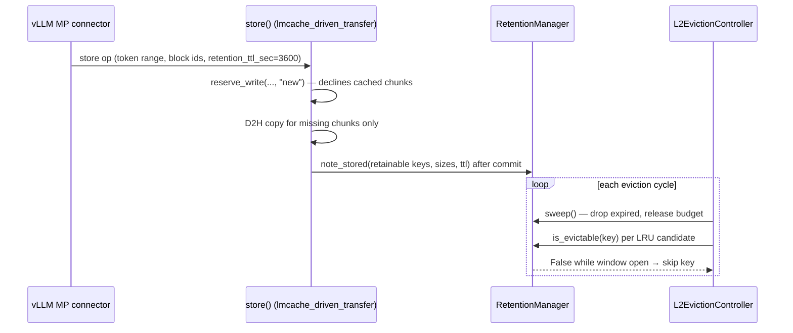

# Explicit retention: TTL-shielded chunks in the L2 eviction loop

A per-request capability that lets a store carry a retention ttl: the chunks
it covers are **shielded from L2 eviction** until the ttl expires, then
**rejoin the normal LRU pool** — expiry never deletes data. It is **opt-in**
(``retention_max_fraction`` defaults to ``0``, which rejects every
registration) and **additive** (with no ttl-carrying requests the eviction
loop behaves exactly as before).

Code: `lmcache/v1/distributed/retention_manager.py` (the ledger),
`lmcache/v1/distributed/storage_manager.py` (budget wiring),
`lmcache/v1/distributed/storage_controllers/eviction_controller.py`
(enforcement), `lmcache/v1/multiprocess/modules/lmcache_driven_transfer.py`
(store-time stamping), `lmcache/v1/multiprocess/custom_types.py` (wire
field), `lmcache/integration/vllm/` (per-request plumbing).

## Why

Serving platforms want to promise "this prompt's KV survives the next hour"
(paid or pinned prompt caching). A plain LRU tier cannot make that promise —
one traffic burst evicts the prefix — and a separate pinned storage path
would duplicate the tier, the transfer path, and the accounting. Retention
adds the promise to the existing tier as a per-key eviction veto with a
bounded footprint.

## Architecture

The connector reads ``lmcache_retention_ttl_sec`` from the request's
``kv_transfer_params`` and attaches it to every store op of the request.
Expired keys leave the ledger and age out of L2 like any other key.

## RetentionManager (`retention_manager.py`)

Thread-safe map of ``ObjectKey -> (deadline, size)``. Deadlines are
**extend-only** (``max(existing, now + ttl)``), so a shorter later ttl never
shrinks a granted window. Deadlines are mirrored in a ``SortedKeyList``
ordered by deadline and kept in lockstep with the map: stamps and
deadline-moving extends update it in O(log n), ``sweep()`` pops expired keys
off the front, and the no-expiry case is a single comparison.

## Store-time stamping (`modules/lmcache_driven_transfer.py`)

The stamp collects the chunks that are **freshly reserved or already
present in L1** (``StorageManager.has_l1_object``): a ttl store must also
extend chunks that earlier requests stored, which is what makes re-warming
a window work, while a chunk whose reservation failed holds no data and is
never stamped. Present chunks have no memory object to measure, so sizes
come from the group layout. The ledger call happens only after every
object group's transfer succeeded — a failed store registers nothing.

A fully-cached ttl re-store therefore costs no I/O: the connector skips its
stored-tokens marker for retention requests so the store op covers the
whole prefix, reserve mode ``"new"`` declines every chunk, no bytes move,
and the deadlines are pushed out.

## Eviction integration (`storage_controllers/eviction_controller.py`)

Both L2 eviction branches pass ``RetentionManager.is_evictable`` as the
``key_eligible_filter``. ``is_evictable`` compares the
deadline against the clock at ask time, so an expired key is eligible even
before the next sweep. The loop calls ``sweep()`` once per cycle to release
expired budget; keys deleted outside the loop are dropped via ``forget``.

## Configuration

- ``retention_max_fraction`` (``StorageManagerConfig``; server CLI
  ``--retention-max-fraction``, default ``0`` = disabled): fraction of
  the eviction-enabled adapter's capacity retention may shield. Capacity
  is taken at boot; adapters added at runtime do not grow the budget.
- While retention is enabled, config validation requires at most one
  eviction-enabled adapter (the default store policy replicates chunks
  to every adapter, so one budget cannot keep several adapters below
  their watermarks), rejects the per-tenant ``IsolatedLRU`` policy (the
  budget has no per-salt dimension, so one tenant could capture it
  all), and rejects a fraction at or above that adapter's
  ``trigger_watermark``.
- ``report_status()`` on the eviction controller gains a ``retention``
  section: live keys/bytes, budget, and the lifetime ``stamps`` /
  ``extends`` / ``expirations`` / ``budget_rejections`` counters.

## Invariants

> **Eviction can always make progress.** Retained bytes stay within
> ``retention_max_fraction × capacity`` and the fraction is validated below
> the trigger watermark, so an eviction pass always finds unshielded mass.
> Keys past the budget are simply not registered — the store itself
> proceeds, and the data stays subject to normal LRU eviction.

> **Expiry never deletes.** ``sweep()`` drops ledger entries, not data.

> A store that raises registers nothing; a chunk is stamped only when
> freshly written or present in L1 at store time. The rare stamp that
> outlives its data (a stream failure after submit, a concurrent writer
> that fails) is inert and lapses at its ttl.
