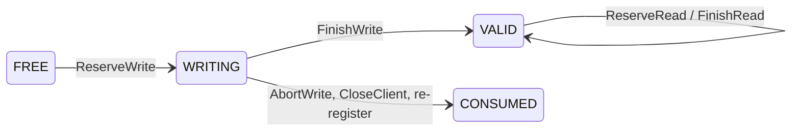

# Memory orchestrator

## Scope

Experimental, opt-in, MP mode only. Continues the multi-L1 series
([#5416](https://github.com/LMCache/LMCache/pull/5416) ordered overflow and
owner tags, [#5461](https://github.com/LMCache/LMCache/pull/5461) multi-L1
serving, [#5528](https://github.com/LMCache/LMCache/pull/5528)
`L1ManagerInterface`) and implements the shared-pool profile of
[#4307](https://github.com/LMCache/LMCache/issues/4307) and
[#5030](https://github.com/LMCache/LMCache/issues/5030).

`lmcache memory` is one process per shared memory region. It owns the
region's keys, extents, epoch, write tokens and read leases behind nine
gRPC calls, the five on the data path batched. It never touches KV bytes and never learns what backs the
region: a Device-DAX device several hosts attach, or a file several servers
on one host map. Its clients are L1 bindings inside MP servers that map the
region on their own host.

Limits of this milestone: one region per orchestrator, monotonic allocation
(no extent reuse), state in memory. Not here: reclamation or eviction, lease
TTL and client fencing, HA or durability.

## Why a separate owner

- The pool outlives every server, so its allocator cannot live in one.
- CXL 2.0 multi-host memory has no coherent cross-host atomics, so locks or
  a free list inside the shared bytes cannot arbitrate.
- "This extent is committed" needs one global order, and a writer whose RPC
  timed out cannot fence itself.
- Reclaiming later needs every host's outstanding readers in one place.

| Alternative | Why not |
| --- | --- |
| Index, allocator and locks inside the region ([#5494](https://github.com/LMCache/LMCache/pull/5494)) | Needs cache-coherent mappings; across CXL 2.0 hosts a crashed host can leave locks nobody can safely break |
| One MP server leads | Leader lifetime is not pool lifetime; election is the orchestrator with extra steps |
| Allocation inside the MP coordinator (#4307's proposal) | Its directory is hint-only and eventual by contract; an authority on the per-request path needs its own lifetime and failure domain |

The cost is one process per region and two metadata round trips per batch.
Private L1s pay nothing; the MP coordinator stays a hint directory.

## Protocol

`protos/memory_orchestrator.proto`, package `lmcache.memory_orchestrator.v1`.
Every request carries an envelope (`region_id`, `expected_region_epoch`,
`client_id`, `client_incarnation`, `request_id`); a stale region, epoch or
incarnation is refused without a state change, and a repeated `request_id`
from the same incarnation gets the recorded reply while it is among that
incarnation's newest 1024 (a `CloseClient` reply is not recorded). Batches are capped by
`max_batch_entries`; the client splits larger ones and rolls back a split
batch that fails.

| RPC | Does |
| --- | --- |
| `DescribeRegion` | region id, epoch, capacity, alignment, visibility mode, layout fingerprint, batch limit, `reset_required` |
| `RegisterClient` | registers `client_id` with a new incarnation; checks layout fingerprint, mapped bytes and visibility mode; retires the previous incarnation's writes and leases |
| `ReserveWrite` | per key: `WRITE_GRANTED` (handle + token) for a new key, `EXISTS_VALID` or `BUSY_WRITING` for a known one; if the batch's new keys do not all fit, every one of them gets `OUT_OF_SPACE` and nothing is allocated |
| `FinishWrite` / `AbortWrite` | tokens: `WRITING` to `VALID` / to `CONSUMED` (the extent is never reused) |
| `ReserveRead` / `FinishRead` | per key: `READ_GRANTED` (handle, layout, leases), `MISS`, `BUSY_WRITING`; release leases |
| `Usage`, `CloseClient` | counters; retire this incarnation |



A client sends `FinishWrite` only once its copies into the extent are complete
and visible to other hosts; reads are granted on `VALID` only, and `VALID` is
terminal here. A writer that vanished stays `WRITING` until its client
registers again under the same `client_id` or the region is reset; others see
`BUSY_WRITING` and recompute.

## Failure semantics

Everything fails closed and no extent is reused, so no failure corrupts a
reader.

| Failure | Behaviour |
| --- | --- |
| Client dies mid-write or holding leases | Its writes stay `WRITING` and its leases stay counted until it re-registers under its `client_id` or a reset |
| `FinishWrite` reply lost | The client reports its store failed; if the commit landed, a later `ReserveWrite` sees `EXISTS_VALID` |
| Orchestrator restarts | The startup marker survives, so it comes up `RESET_REQUIRED` with a new epoch and refuses every request until an offline reset |
| Second orchestrator for a region | Refused while the marker names a live process |
| Layout, size or visibility mismatch | `RegisterClient` fails |

No lease TTL, automatic abort or client fencing yet: an expired token cannot
prove a remote DMA stopped, so expiry-driven reuse would reintroduce the
corruption the orchestrator exists to prevent. Reset is offline: stop every
client, stop the orchestrator, remove `<state-dir>/<region-id>.marker`, start
both again. A clean stop with no clients deletes the marker itself.

```bash
lmcache memory --region-id pool-a --capacity-gb 512 --alignment 2M \
    --visibility-mode software_fenced --listen 0.0.0.0:7700 \
    --state-dir /var/lib/lmcache/memory/pool-a
```

`--visibility-mode` (`software_fenced` for memory several hosts share without
cache coherence, `coherent` for one host) is advertised to clients and must
match theirs; `--max-batch-entries` caps one RPC (default 4096).

## Code map and tests

`state.py` holds `RegionState`, the pure-Python state machine; `service.py`
the gRPC servicer and reply window; `server.py` the CLI arguments, startup
marker and `serve` (exposed as `lmcache memory` by
`lmcache/cli/commands/memory.py`); `client.py` the client with deadlines,
retries and batch splitting; `api.py` and `_codec.py` the dataclasses and
their protobuf mapping. The bindings under `_proto_gen/` are generated at
build time like the MP protos; only `memory_orchestrator_pb2.pyi` is tracked.

`tests/v1/memory_orchestrator/test_state.py` covers the state machine (one
writer per key, reads on `VALID` only, all-or-nothing `OUT_OF_SPACE`, monotonic
allocation, idempotency, stale epoch and incarnation, retirement,
`RESET_REQUIRED`); `test_server.py` drives the real process over gRPC (full
flow, replay, startup marker, batch splitting and rollback).

## Follow-ups

Lease TTL and client fencing (`Renew`, quarantine of orphaned extents);
reclamation and eviction (`RequestEvict`, `VALID -> EVICTING -> FREE`,
generation bump on reuse); several regions per orchestrator (a region table,
no wire change); region-scoped fleet cache events.
