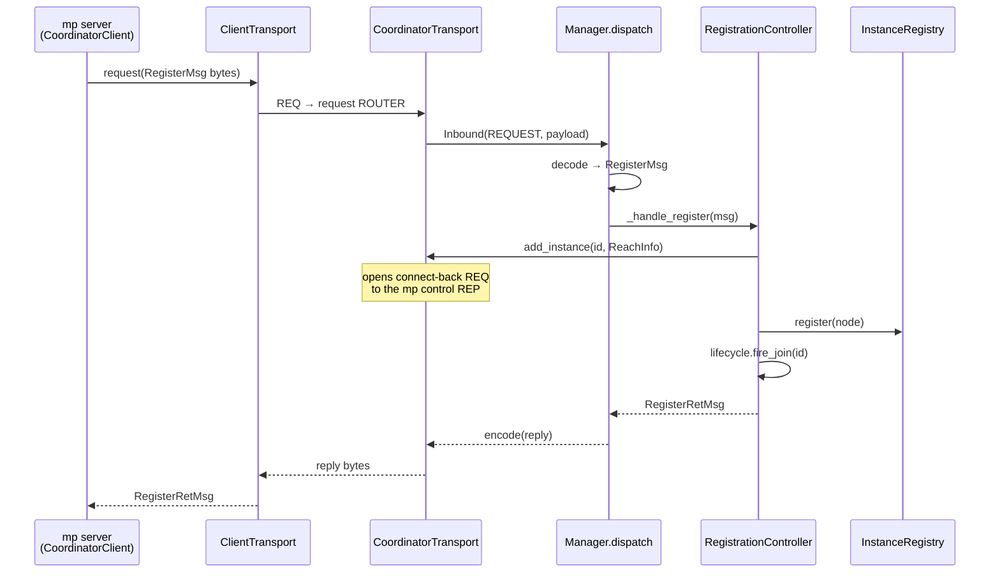
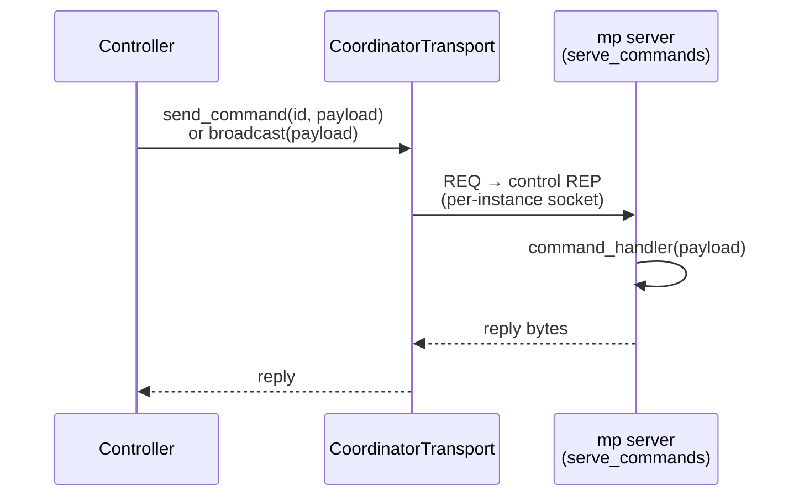

# MP Coordinator

The mp coordinator is a standalone process that coordinates LMCache
multi-process (mp) cache servers running across nodes as a fleet. This document
describes the backbone: transport, the pluggable controller seam, the instance
registry, lifecycle hooks, and the concurrency contract. Domain capabilities
(quota reconcile, blend-lookup routing, KV-op fan-out) are not implemented yet;
they are added as new controllers that plug into the same seam.

Code: `lmcache/v1/mp_coordinator/`.

## Why

mp servers are independent today: quota is per-instance and in-memory, there is
no cross-node token-match routing for model replicas, and KV operations are
local. The coordinator is the fleet-level component those features will hang
off. This PR ships only the framework plus registration so future work plugs in
without re-architecting.

## Transport boundary

The core (dispatch, controllers, registry) speaks logical operations on opaque
`bytes`; the wire mechanism lives behind a `Transport` interface
(`transport.py`), so ZMQ can be swapped for gRPC or NATS without touching the
core. ZMQ is the only implementation today (`zmq_transport.py`, reusing
`lmcache/v1/rpc_utils.py`).

`CoordinatorTransport` (async): `serve(handler)`, `send_command(id, payload)`,
`broadcast(payload)`, `add_instance(id, reach)`, `remove_instance(id)`, `close()`.
`ClientTransport` (sync): `request`, `push`, `serve_commands`, `close`.

The ZMQ coordinator transport binds two sockets and keeps one connect-back REQ
socket per instance for server-initiated push (quota broadcast / KV-op fan-out):

| Socket | Pattern | Purpose |
| --- | --- | --- |
| `reply_url` | ROUTER | request/reply (register, heartbeat) |
| `pull_url` | PULL | fire-and-forget (deregister) |
| per-instance | REQ | push commands to one mp server (opened at `add_instance`) |

```
            mp server (CoordinatorClient)        MP coordinator
  bind REP  control  <───────────────── REQ per-instance (push commands)
  PUSH      ──────────────────────────> PULL   (deregister)
  REQ       ──────────────────────────> ROUTER (register, heartbeat)
```

The connect-back REQ socket is the ZMQ-specific cost of server push: it requires
reaching each pod directly, which is the main friction in k8s. A stream/subject
transport (gRPC/NATS) would invert this — the pod's inbound connection is the
reach, so `add_instance` becomes a no-op and the connect-back disappears. That
is the motivation for the transport seam.

ZMQ over HTTP because the control plane needs server→mp push, native in ZMQ. No
TLS/auth — run inside a trusted network or add ZMQ CURVE/ZAP (or switch
transports) for untrusted links.

## Messages (`message.py`)

msgspec tagged structs, decoded via the `CoordMsg` union, classified by channel
so the manager routes by intent (`Inbound.kind`), not by guessing:

- `PushMsg` — fire-and-forget (deregister).
- `ReqMsg` / `ReqRetMsg` — request and reply (register, heartbeat).

Backbone messages: `RegisterMsg`/`RegisterRetMsg`, `DeregisterMsg`,
`HeartbeatMsg`/`HeartbeatRetMsg`, `ErrorMsg`.

## Controller seam (`controllers/base.py`)

A `Controller` declares the message types it handles via `push_handlers()` and
`req_handlers()`. `MPCoordinatorManager` merges every controller's
declarations into two dispatch tables at startup and routes each decoded message
by `type(msg)`. There is no `isinstance` chain to edit when adding a capability.

Controllers receive a `ControllerContext` at `post_init` carrying the shared
`InstanceRegistry`, the `CoordinatorTransport` (for push + instance-reach
lifecycle), the `LifecycleHooks`, and a `get_controller(type)` accessor.
Controllers reach collaborators only through the context — they never import one
another, and no controller touches a socket.

### Adding a controller (the extension point)

1. Add message types in `message.py` (subclass `PushMsg` / `ReqMsg` /
   `ReqRetMsg`) and list them in the `CoordMsg` union.
2. Add `controllers/<name>.py` with a `Controller` subclass declaring handlers
   for those types; wire collaborators in `post_init`.
3. Append an instance to `MPCoordinatorManager.controllers`.

No change to dispatch, transport, or the registry is required.

> **Notice — never block the event loop.** Handlers and lifecycle callbacks
> (`on_join` / `on_leave`) run inline on the single event loop. If a controller
> needs to do real work in response — push to mp servers, read a store, react to
> a join — it must schedule that onto a **separate task** (e.g.
> `asyncio.get_running_loop().create_task(...)`), not do it inline. Otherwise it
> head-of-line-blocks every other message on that socket, including heartbeats,
> and can cause false evictions. For CPU-bound or blocking work, use
> `run_in_executor`.

Example future controllers: `StateController` (quota reconcile + broadcast on
join via `lifecycle.on_join`), `RouteController` (blend-lookup routing across
model replicas), `KVOpsController` (pin/prefetch via `transport.send_command` /
`broadcast`). These define their own model/replica/per-model-world_size schema as
needed — the backbone keeps membership pure (no model info), since one mp server
may serve several models with different parallel configs.

## Request flow

Registration, end to end through the seam (heartbeat takes the same path, ending
in `update_heartbeat` instead of `add_instance` + register):



Server-initiated push (the future quota-broadcast / KV-op fan-out path) reuses
the reach opened above:



## Lifecycle hooks (`lifecycle.py`)

`LifecycleHooks` is a minimal `on_join`/`on_leave` callback list (not an event
bus) fired by `RegistrationController`. It lets future controllers react to
membership changes without registration importing them. **Contract:** callbacks
run inline on the event loop and must not block — heavy work (network pushes,
storage reads) must be scheduled onto a separate task so registration replies
are not delayed.

## Registry (`registry.py`)

`InstanceRegistry` maps `instance_id` → `MPInstanceNode` (address, heartbeat
timestamps, metadata). Membership is pure — no sockets, no transport dependency,
no model or parallel-config info — so a server serving multiple models is
represented correctly; model-aware indexing belongs to a future routing
controller, and how to reach an instance for push belongs to the transport. It
is thread-safe (`threading.Lock`) and offers `stale()` for health checks. Stale
detection uses a monotonic clock so an NTP step cannot skew liveness.

## Concurrency contract

- ZMQ ROUTER multiplexes all peers; concurrent registrations queue on its
  incoming buffer and are drained by the single event loop. No per-peer thread,
  no hand-rolled register buffer.
- All sockets live inside the transport and are used only on the event loop;
  ZMQ sockets are never touched from two threads.
- The registry is the only state shared with the health-check thread and is
  lock-guarded.
- The health-check thread only *detects* stale instances; eviction (which
  releases a transport connection) is scheduled back onto the event loop via
  `run_coroutine_threadsafe`, keeping connection lifecycle single-threaded.
- Registration is idempotent: re-registering a known instance replaces its
  reach (the transport closes any stale connection) and re-fires `on_join`.

## Running

```
python -m lmcache.v1.mp_coordinator
```

Configured via `LMCACHE_MP_COORDINATOR_*` environment variables — see
`MPCoordinatorConfig` in `config.py` (`PULL_URL`, `REPLY_URL`,
`HEARTBEAT_INTERVAL`, `INSTANCE_TIMEOUT`, `HEALTH_CHECK_INTERVAL`).

An mp server joins by embedding a `CoordinatorClient` (`client.py`):
`start()` to register and begin heartbeats, `stop()` to deregister. Integration
into `run_cache_server` is gated on a coordinator URL being configured and is
off by default.
