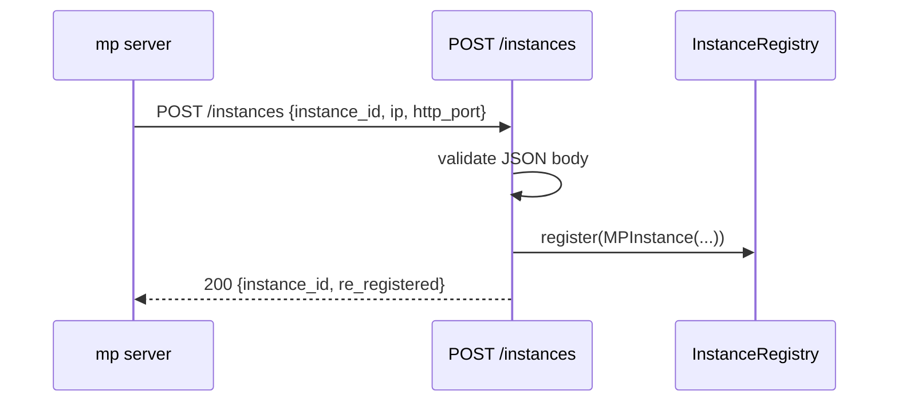
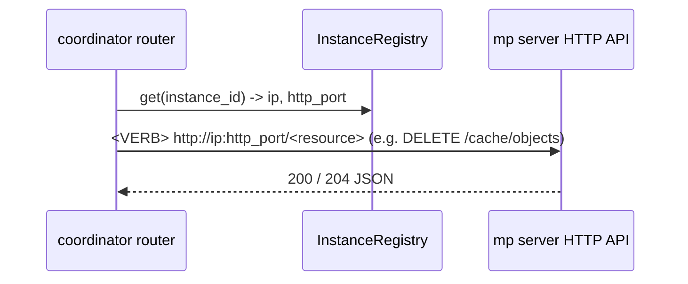

# MP Coordinator

The mp coordinator is a standalone **FastAPI / REST** process that coordinates
LMCache multi-process (mp) cache servers running across nodes as a fleet. This
document describes the backbone: the REST API, the instance registry, the
health-check and eviction loops, and the four domain capabilities that hang off
it (fleet membership, quota + fleet-wide L2 eviction, cache control including
warm prefetch / pin / delete, and fleet-wide CacheBlend fragment lookup).

Code: `lmcache/v1/mp_coordinator/`.

## Why

mp servers are independent by construction: per-instance in-memory quota, no
cross-node token-match routing for model replicas, and node-local KV
operations. The coordinator is the fleet-level component those capabilities
hang off — it holds the shared trackers (quota, LRU, key directory) and
dispatches fleet-wide work (eviction, warm prefetch) to individual mp servers
by resolving their `ip` / `http_port` from the registry.

## Transport

The coordinator is a FastAPI app served by uvicorn. mp servers register /
heartbeat / deregister over REST; they also stream cache events in the same
shape.

| Method & path | Direction | Purpose |
| --- | --- | --- |
| `POST /instances` | mp → coordinator | register (or re-register) |
| `PUT /instances/{id}/heartbeat` | mp → coordinator | heartbeat (404 ⇒ re-register) |
| `DELETE /instances/{id}` | mp → coordinator | deregister (idempotent, 204) |
| `GET /instances` | operator/tools | list the fleet |
| `GET /healthz` | k8s probe | liveness |
| `PUT/GET /quota/config` | operator | fleet-wide quota configuration |
| `PUT/GET/DELETE /quota/{cache_salt}` | operator | per-tenant byte budgets |
| `GET /quota` | operator | fleet-wide usage summary |
| `POST /events` | mp → coordinator | fleet cache-event ingest (gate → key directory + eviction fan-out) |
| `GET /directory/keys` | operator/tools | paginated key listing with tier/instance/backend filters |
| `POST /directory/blend-lookup` | mp → coordinator | fragment lookup: cached chunks contained in a request's tokens |
| `POST /cache/prefetches` | operator/scheduler | submit warm prefetch to a named server |
| `GET /cache/prefetches/{instance_id}/{request_id}` | operator/scheduler | poll a warm prefetch |
| `POST/DELETE /cache/pins` | operator | pin / unpin keys against fleet-wide eviction |
| `POST /cache/delete` | operator | delete cached objects on a named server |
| `GET /instances/usage` | operator/scheduler | fleet memory view: per-server, per-module usage vs declared capacity |
| `GET /instances/{instance_id}/usage` | operator/scheduler | one server's memory compartments |

For server-initiated work (fleet-wide eviction, warm prefetch) a coordinator
router resolves an instance's address from the registry (`ip` + `http_port`)
and POSTs / DELETEs to that mp server's **specific** existing endpoint
(e.g. `DELETE /cache/objects`, `POST /cache/prefetches`). There is no generic
command channel and no per-instance connection state — just an HTTP call to
the relevant resource.

## Layout

```
lmcache/v1/mp_coordinator/
  app.py                # create_app + lifespan + router discovery + health/eviction loops
  __main__.py           # uvicorn entrypoint (`python -m lmcache.v1.mp_coordinator`)
  config.py             # MPCoordinatorConfig (CLI flags only, no env vars)
  registry.py           # InstanceRegistry + MPInstance (pure membership)
  schemas.py            # Pydantic request/response models (shared wire contract)
  registrar.py          # mp-server-side register/heartbeat/deregister helpers
  blend_index.py      # BlendIndex: fragment (blend) lookup over those bindings
  blend_client.py       # mp-server-side fragment-lookup query client
  server_config.py      # ServerConfigRegistry: per-server module capacities (from registration)
  ingest/
    __init__.py
    event_gate.py       # EventGate: incarnation fencing, seq dedup, gap detection
    event_broadcaster.py  # fans admitted events to the registered consumers
  discovery.py          # Registry + package scan, shared by views and controllers
  views/                # read models of the fleet: what is cached, and how much
    __init__.py         # build_views: scans this package
    base.py             # View: the marker; may depend on other views only
    key_directory.py    # KeyDirectory: placements + token bindings (a consumer)
    usage_manager.py    # per-tier usage view, by salt and by instance (a consumer)
  controllers/          # policy: loops and request handling, reading the views
    __init__.py         # build_controllers: scans this package
    base.py             # Controller: the marker; may depend on views and peers
    eviction_controller.py  # the fleet L2 control loop: quota + usage + LRU + pins
    prefetch_manager.py # dispatches warm prefetch to a named MP server
  http_apis/
    __init__.py
    dependencies.py     # shared FastAPI dependencies (registry, key directory, ...)
    instances_api.py    # /instances REST resource
    health_api.py       # /healthz
    quota_api.py        # /quota/config, /quota/{cache_salt}, /quota
    cache_api.py        # /cache/prefetches, /cache/pins, /cache/delete
    events_api.py       # /events (fleet cache-event ingest)
    directory_api.py    # /directory/lookup, /directory/blend-lookup, /directory/keys, ...
    instances_usage_api.py  # /instances/usage, /instances/{id}/usage
```

## Request flow

Registration, end to end:



Heartbeat is `PUT /instances/{id}/heartbeat` → `registry.update_heartbeat`; a
404 tells the client to re-register. The health loop (in `app.py`, started by
the lifespan) evicts instances whose heartbeat lapsed. Server push resolves
the address (`ip` + `http_port`) from the registry and calls the mp server's
specific endpoint directly:



## Extension seam (adding a capability)

`app.state` carries the **shared collaborators** every capability composes
from: `config`, `registry`, the ingest `event_gate`, and two registries --
`views` (the key directory and the usage view) and `controllers` (the
eviction loop, which owns the quota registry, and the prefetch proxy).
Adding either is one file in `views/` or `controllers/`: discovery builds
it, subscribes it to the event stream if it consumes, and routes whatever
durable state it advertises. Endpoints use them directly — membership is thin
enough to have no service layer (the `/instances` router calls the registry
straight, matching the mp server's own `http_apis` convention).

To add a capability (e.g. a new domain resource):

1. `http_apis/<domain>_api.py` — a module-level `router` (FastAPI
   `APIRouter`). `create_app` auto-discovers it (via
   `lmcache/v1/utils/router_discovery.py`, the same convention as the mp
   server's HTTP API). No edits elsewhere for the route to appear; the router
   reads what it needs from `app.state`, and to push it resolves an instance's
   `ip`/`http_port` and calls that mp server's endpoint.
2. Only if the domain has real logic/state of its own (persistence,
   broadcast-on-join, background reconciliation, …) add a manager under
   `controllers/` (or a peer package) and stash it on `app.state` in
   `create_app`. Thin domains skip this — `quota` was added this way (it
   is a read/write surface over the eviction manager's own state).
3. A domain that must react to the fleet cache-event stream implements
   `CacheEventConsumer` (`consume` + `fence_instance`) and registers on
   the broadcaster in `create_app` — no change to the gate or the
   `/directory` router. See [ingest.md](ingest.md).

A capability that must react to instance join/leave can hook into the
registration endpoint (a small observer can be reintroduced then — it was
dropped from the backbone as it had no consumer yet).

> **Notice — keep request handlers non-blocking.** Endpoints run on the event
> loop. Heavy work (pushing to mp servers, store reads) must be `await`ed on
> async clients or scheduled as a task (`asyncio.create_task`), and CPU-bound
> work sent to a thread (`run_in_executor`), so request latency and the health
> loop are not blocked.

## Registry (`registry.py`)

`InstanceRegistry` maps `instance_id` → `MPInstance` (ip, http_port,
heartbeat timestamps, metadata). Membership is pure — no sockets, no model or
parallel-config info — so a server hosting several models is represented
correctly; model-aware indexing belongs to a future routing router. Thread-safe
(`threading.Lock`); `stale()` uses a monotonic clock so an NTP step cannot skew
liveness.

## Cache-event ingest (`ingest/`)

Every fact the coordinator holds about fleet cache contents arrives
through this layer, which decides **what** is admitted and **who** sees
it. It holds no cache state itself. See [ingest.md](ingest.md).

- `event_gate.py` — the admission point for every source. Owns the
  per-emitter stream cursor: incarnation fencing (a restart voids the
  emitter's L1 facts), `seq` dedup, gap detection. `ingest()` for a live
  emitter stream, `reconcile()` for a scan that has no stream position.
- `event_broadcaster.py` — fans admitted batches (and fence
  notifications) to its registered `CacheEventConsumer`s: the key
  directory and the eviction manager. Adding a consumer is a wiring
  change in `app.py`, not a router or gate change.

## Controllers (`controllers/`)

Where the coordinator's fleet-level *doing* lives — the counterpart to
`distributed/storage_controllers/` one scope down.

- `eviction_controller.py` — `FleetEvictionController`, the fleet L2
  control loop: it holds the target (`QuotaManager` budgets), observes
  the value (`CacheUsageManager` byte totals, on the `l2` tier), and
  acts to close the gap.
  Its `run()` wakes every `EVICTION_CHECK_INTERVAL` seconds, walks salts
  over their trigger watermark, and dispatches `DELETE /cache/objects`
  requests (chunked at `MAX_DELETE_BATCH`) to a uniformly random registered
  mp server (all servers share the backing L2, so one dispatch evicts the
  fleet). Also tracks the pins taken via `POST /cache/pins` so pinned keys
  are excluded from eviction and delete. Reachable as
  `ctx.eviction_controller`, with `.quota` for the `/quota` endpoints.
- `views/usage_manager.py` — `CacheUsageManager`, byte totals per tier rolled
  up per `cache_salt` (the tenant axis the eviction controller enforces
  against) and per `(instance_id, backend)` (the capacity axis: how full
  one node's L1 is). A consumer in its own right rather than supporting
  state of the controller above, because it spans both tiers while the
  controller reads only the L2 half. Registered before the controller,
  which reads a key's remaining size for the batch it is consuming. See
  [usage_and_eviction.md](usage_and_eviction.md).
- `prefetch_manager.py` — implements `POST /cache/prefetches` dispatch to a
  named mp server and proxies status polls. A request-scoped proxy with no
  loop and no state of its own, so it stays a *manager*, not a controller.

Eviction is a sibling of cache control, not part of it: `/cache/*` is
imperative and externally directed (prefetch this, pin this, delete
this), while eviction is autonomous and policy-driven — nobody asks for
it. The one coupling is pins, and it runs the way you'd want: a pin's
entire meaning is "exempt from eviction", so the pin set is eviction
state that the cache-control endpoints write, not the reverse.


## Fleet memory pressure (`server_config.py`)

`GET /instances/usage` answers how full each server's memory compartments
are, by joining two halves that ride the same channel at very different
rates: **usage** from `CacheUsageManager.get_bytes_by_instance`, already
maintained off the admitted cache-event stream, and **capacity** from
`capacity_reports` on `POST /events`. Capacity is configuration — it changes
at boot and at reconfiguration, not per event — so a server reports it once
at startup and again on each change, each report a whole declaration fenced
by `(incarnation, revision)`.

The endpoint adds no usage tracking of its own: the per-instance,
per-backend rollup it needs is exactly what the usage manager publishes.

`ServerConfigRegistry` holds the declarations. It lives outside
`registry.py` because that file is membership only; a capacity is not a way
to reach a server.

Two properties the endpoint depends on. Shared backends (one S3 bucket
mounted by N servers) are counted **once** for the fleet, never summed —
the same empty-owner convention the key directory uses. And `usage_ratio` is
`null`, not a sentinel, whenever no capacity was declared: that is the
common case for `fs` / `mooncake` / `p2p` / `sagemaker`, which expose no
capacity knob at all.

Read-only — it never evicts, throttles, or pushes. See
[memory_pressure.md](memory_pressure.md).

## Fleet CacheBlend lookup (`blend_index.py`)

Cross-request, cross-instance blend reuse is served by the **blend index**,
a derived view of the key directory's token bindings: no separate publish
path, matches verified token-exact, and eviction exact because it follows
binding lifecycle. Blend servers query it with `POST
/directory/blend-lookup` and get `(chunk_hash, old_st, cur_st)` per match,
which they expand into per-rank object keys with their own model and salt.
The match window is the fleet chunk size (`CHUNK_SIZE`), probed at
`BLEND_PROBE_STRIDE`. See [blend_index.md](blend_index.md).

The previous design — `blend_directory.py` (`GlobalBlendMatcher`) with its own
`/blend/fingerprints` publish RPC on every blend store — has been removed; see
[blend_index.md](blend_index.md) for what changed and why.

## Concurrency & lifecycle

- Everything runs on the uvicorn event loop; the registry lock guards
  membership, other managers own their own locks. The ingest gate's lock
  is held across the consumer fan-out so an emitter's batches are applied
  in admission order — consumers must not call back into the gate.
- The health-check loop is an asyncio task started in the app lifespan; it
  evicts instances whose heartbeat lapsed (`instance_timeout`) and is cancelled
  on shutdown. `HEALTH_CHECK_INTERVAL = 0` disables the stale-instance loop
  (it does not affect the L2 eviction loop, which is gated separately by
  `EVICTION_CHECK_INTERVAL`).
- The L2 eviction loop is a second asyncio task started in the lifespan,
  running `FleetEvictionController.run` (the controller owns its own
  cadence); it is cancelled on shutdown. `EVICTION_CHECK_INTERVAL = 0`
  disables it.
- Registration is idempotent: re-registering replaces the entry. The registry
  is ephemeral — rebuilt from heartbeats after a coordinator restart. Durable
  state (registered quotas) belongs in an external store, not here. The
  directory, usage view, and LRU are rebuilt only from the cache-event
  stream, so after a coordinator restart they start empty and refill as
  events arrive — quotas under-report until they do.

## Running

```
lmcache coordinator [--host HOST] [--port PORT] \
    [--instance-timeout SECS] [--health-check-interval SECS] \
    [--eviction-check-interval SECS] [--eviction-ratio RATIO] \
    [--trigger-watermark FRACTION] \
    [--chunk-size TOKENS] [--hash-algorithm ALGO] \
    [--blend-probe-stride POSITIONS] \
    [--timeout-keep-alive SECS]
```

(or, equivalently, `python -m lmcache.v1.mp_coordinator`).

Configured via CLI flags only — see `MPCoordinatorConfig` in `config.py`, whose
field defaults are the single source of truth. An unset flag keeps its default;
there are no coordinator environment variables. Both entrypoints share one flag
set and one config path: `__main__.main()` builds a parser from
`CoordinatorCommand.add_arguments` and hands the parsed args to
`CoordinatorCommand.execute`. See the
user-facing [`docs/source/mp/coordinator.rst`](../../../source/mp/coordinator.rst)
for descriptions and defaults.

An mp server joins via the `registrar.py` helpers — no dedicated client
object, mirroring how the coordinator just calls mp endpoints. The mp
server's FastAPI lifespan creates a generic `httpx.AsyncClient` and launches
`keep_registered()` as a task: it `POST`s `/instances`, `PUT`s
`/instances/{id}/heartbeat` on a timer, and `DELETE`s on cancellation — on
the mp server's own event loop, using the shared `schemas` models. It is
wired into `lmcache/v1/multiprocess/http_server.py`'s lifespan and configured
by a `CoordinatorConfig` (`lmcache/v1/multiprocess/config.py`), built from
`--coordinator-*` flags that fall back to `LMCACHE_COORDINATOR_*` env vars.
It is **opt-in**: with no coordinator URL, the mp server is unaffected. It is
best-effort — failures are logged and retried (a down coordinator never blocks
the server), while a malformed config is rejected at startup. The server
advertises its own HTTP address (`ip` + `http_port`, e.g. the pod IP via the
k8s downward API) so the coordinator can reach it.
