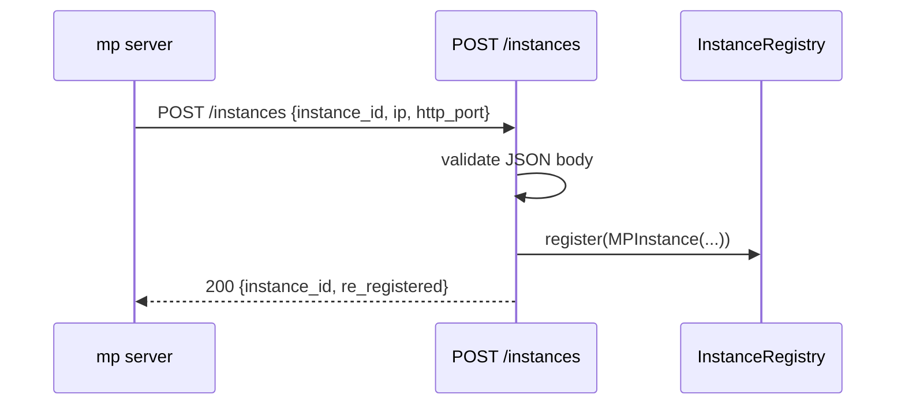
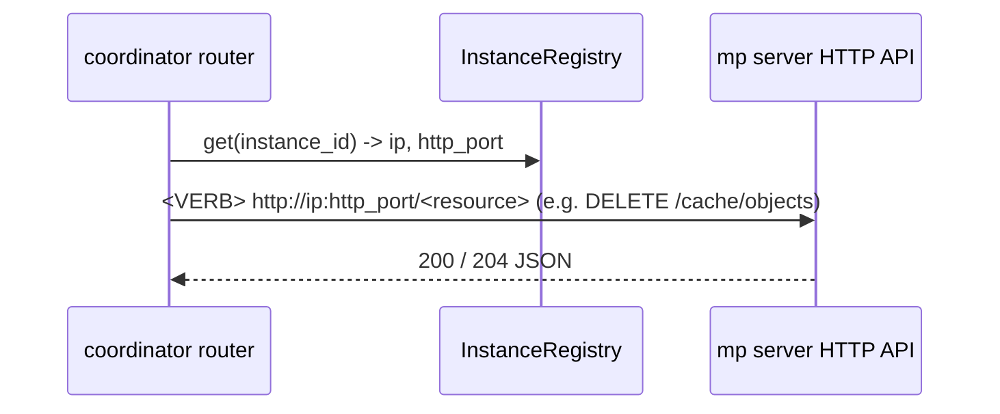

# MP Coordinator

The mp coordinator is a standalone **FastAPI / REST** process that coordinates
LMCache multi-process (mp) cache servers running across nodes as a fleet. This
document describes the backbone: the REST API, the instance registry, the
health-check and eviction loops, and the four domain capabilities that hang off
it (fleet membership, quota + fleet-wide L2 eviction, cache control including
warm prefetch / pin / delete, and fleet-wide CacheBlend fragment lookup).

Code: `lmcache/v1/mp_coordinator/`.

## Why

mp servers are independent by construction: per-instance in-memory quota, no
cross-node token-match routing for model replicas, and node-local KV
operations. The coordinator is the fleet-level component those capabilities
hang off — it holds the shared trackers (quota, LRU, key directory) and
dispatches fleet-wide work (eviction, warm prefetch) to individual mp servers
by resolving their `ip` / `http_port` from the registry.

## Transport

The coordinator is a FastAPI app served by uvicorn. mp servers register /
heartbeat / deregister over REST; they also stream cache events in the same
shape.

| Method & path | Direction | Purpose |
| --- | --- | --- |
| `POST /instances` | mp → coordinator | register (or re-register) |
| `PUT /instances/{id}/heartbeat` | mp → coordinator | heartbeat (404 ⇒ re-register) |
| `DELETE /instances/{id}` | mp → coordinator | deregister (idempotent, 204) |
| `GET /instances` | operator/tools | list the fleet |
| `GET /healthz` | k8s probe | liveness |
| `PUT/GET /quota/config` | operator | fleet-wide quota configuration |
| `PUT/GET/DELETE /quota/{cache_salt}` | operator | per-tenant byte budgets |
| `GET /quota` | operator | fleet-wide usage summary |
| `POST /directory/events` | mp → coordinator | fleet cache-event ingest (key directory + usage/eviction fan-out) |
| `GET /directory/keys` | operator/tools | paginated key listing with tier/instance/backend filters |
| `POST /directory/blend-lookup` | mp → coordinator | fragment lookup: cached chunks contained in a request's tokens |
| `POST /cache/prefetches` | operator/scheduler | submit warm prefetch to a named server |
| `GET /cache/prefetches/{instance_id}/{request_id}` | operator/scheduler | poll a warm prefetch |
| `POST/DELETE /cache/pins` | operator | pin / unpin keys against fleet-wide eviction |
| `POST /cache/delete` | operator | delete cached objects on a named server |

For server-initiated work (fleet-wide eviction, warm prefetch) a coordinator
router resolves an instance's address from the registry (`ip` + `http_port`)
and POSTs / DELETEs to that mp server's **specific** existing endpoint
(e.g. `DELETE /cache/objects`, `POST /cache/prefetches`). There is no generic
command channel and no per-instance connection state — just an HTTP call to
the relevant resource.

## Layout

```
lmcache/v1/mp_coordinator/
  app.py                # create_app + lifespan + router discovery + health/eviction loops
  __main__.py           # uvicorn entrypoint (`python -m lmcache.v1.mp_coordinator`)
  config.py             # MPCoordinatorConfig (LMCACHE_MP_COORDINATOR_*)
  registry.py           # InstanceRegistry + MPInstance (pure membership)
  schemas.py            # Pydantic request/response models (shared wire contract)
  registrar.py          # mp-server-side register/heartbeat/deregister helpers
  key_directory.py      # KeyDirectory: placements + token bindings from cache events
  blend_index.py      # BlendIndex: fragment (blend) lookup over those bindings
  blend_client.py       # mp-server-side fragment-lookup query client
  cache_control/
    __init__.py
    event_broadcaster.py     # fans directory-applied events to registered consumers
    usage_manager.py    # per-salt L2 usage view (a router consumer)
    eviction_manager.py # LRU + trigger-watermark driven eviction loop, pin tracking
    prefetch_manager.py # dispatches warm prefetch to a named MP server
    resync_manager.py   # startup backfill of directory + views from GET /cache/objects
  http_apis/
    __init__.py
    dependencies.py     # shared FastAPI dependencies (registry, key directory, ...)
    instances_api.py    # /instances REST resource
    health_api.py       # /healthz
    quota_api.py        # /quota/config, /quota/{cache_salt}, /quota
    cache_api.py        # /cache/prefetches, /cache/pins, /cache/delete
    directory_api.py    # /directory/events, /directory/lookup, /directory/blend-lookup, ...
```

## Request flow

Registration, end to end:



Heartbeat is `PUT /instances/{id}/heartbeat` → `registry.update_heartbeat`; a
404 tells the client to re-register. The health loop (in `app.py`, started by
the lifespan) evicts instances whose heartbeat lapsed. Server push resolves
the address (`ip` + `http_port`) from the registry and calls the mp server's
specific endpoint directly:



## Extension seam (adding a capability)

`app.state` carries the **shared collaborators** every capability composes
from: `config`, `registry`, `key_directory`, and the `cache_control`
managers. Endpoints use them directly — membership is thin enough to have no
service layer (the `/instances` router calls the registry straight, matching
the mp server's own `http_apis` convention).

To add a capability (e.g. a new domain resource):

1. `http_apis/<domain>_api.py` — a module-level `router` (FastAPI
   `APIRouter`). `create_app` auto-discovers it (via
   `lmcache/v1/utils/router_discovery.py`, the same convention as the mp
   server's HTTP API). No edits elsewhere for the route to appear; the router
   reads what it needs from `app.state`, and to push it resolves an instance's
   `ip`/`http_port` and calls that mp server's endpoint.
2. Only if the domain has real logic/state of its own (persistence,
   broadcast-on-join, background reconciliation, …) add a manager under
   `cache_control/` (or a peer package) and stash it on `app.state` in
   `create_app`. Thin domains skip this — `quota` was added this way.

A capability that must react to instance join/leave can hook into the
registration endpoint (a small observer can be reintroduced then — it was
dropped from the backbone as it had no consumer yet).

> **Notice — keep request handlers non-blocking.** Endpoints run on the event
> loop. Heavy work (pushing to mp servers, store reads) must be `await`ed on
> async clients or scheduled as a task (`asyncio.create_task`), and CPU-bound
> work sent to a thread (`run_in_executor`), so request latency and the health
> loop are not blocked.

## Registry (`registry.py`)

`InstanceRegistry` maps `instance_id` → `MPInstance` (ip, http_port,
heartbeat timestamps, metadata). Membership is pure — no sockets, no model or
parallel-config info — so a server hosting several models is represented
correctly; model-aware indexing belongs to a future routing router. Thread-safe
(`threading.Lock`); `stale()` uses a monotonic clock so an NTP step cannot skew
liveness.

## Cache control (`cache_control/`)

The `cache_control/` package owns everything downstream of the fleet-wide L2
usage stream:

- `event_broadcaster.py` — fans directory-applied cache events (from
  `POST /directory/events`) to its registered `CacheEventConsumer`s.
  Adding a consumer is a wiring change in `app.py`, not a router change.
- `usage_manager.py` — the per-`cache_salt` L2 byte totals, maintained
  as a derived **view** of the key directory by consuming the same
  applied event stream (a router consumer).
- `eviction_manager.py` — every `EVICTION_CHECK_INTERVAL` seconds, walks
  salts over their trigger watermark and dispatches `DELETE /cache/objects`
  requests (chunked at `MAX_DELETE_BATCH`) to a uniformly random registered
  mp server (all servers share the backing L2, so one dispatch evicts the
  fleet). Also tracks the pins taken via `POST /cache/pins` so pinned keys
  are excluded from eviction and delete.
- `resync_manager.py` — one-shot startup pass that paginates one mp
  server's `GET /cache/objects` and backfills the key directory's L2
  placements plus the router's consumers (usage view, eviction LRU), so
  a fresh coordinator does not start from zero.
- `prefetch_manager.py` — implements `POST /cache/prefetches` dispatch to a
  named mp server and proxies status polls.


## Fleet CacheBlend lookup (`blend_index.py`)

Cross-request, cross-instance blend reuse is served by the **blend index**,
a derived view of the key directory's token bindings: no separate publish
path, matches verified token-exact, and eviction exact because it follows
binding lifecycle. Blend servers query it with `POST
/directory/blend-lookup` and get `(chunk_hash, old_st, cur_st)` per match,
which they expand into per-rank object keys with their own model and salt.
The match window is the fleet chunk size (`CHUNK_SIZE`), probed at
`BLEND_PROBE_STRIDE`. See [blend_index.md](blend_index.md).

The previous design — `blend_directory.py` (`GlobalBlendMatcher`) with its own
`/blend/fingerprints` publish RPC on every blend store — has been removed; see
[blend_index.md](blend_index.md) for what changed and why.

## Concurrency & lifecycle

- Everything runs on the uvicorn event loop; the registry lock guards
  membership, other managers own their own locks (see `cache_control/`).
- The health-check loop is an asyncio task started in the app lifespan; it
  evicts instances whose heartbeat lapsed (`instance_timeout`) and is cancelled
  on shutdown. `HEALTH_CHECK_INTERVAL = 0` disables the stale-instance loop
  (it does not affect the L2 eviction loop, which is gated separately by
  `EVICTION_CHECK_INTERVAL`).
- The L2 eviction loop is a second asyncio task started in the lifespan; it
  is cancelled on shutdown. `EVICTION_CHECK_INTERVAL = 0` disables it.
- Registration is idempotent: re-registering replaces the entry. The registry
  is ephemeral — rebuilt from heartbeats after a coordinator restart. Durable
  state (registered quotas) belongs in an external store, not here; the
  startup resync pass backfills the key directory's L2 view (placements
  and usage) plus the LRU from an mp server's `GET /cache/objects` on boot.

## Running

```
lmcache coordinator [--host HOST] [--port PORT] \
    [--instance-timeout SECS] [--health-check-interval SECS] \
    [--eviction-check-interval SECS] [--eviction-ratio RATIO] \
    [--trigger-watermark FRACTION] \
    [--chunk-size TOKENS] [--hash-algorithm ALGO] \
    [--blend-probe-stride POSITIONS] \
    [--timeout-keep-alive SECS]
```

(or, equivalently, `python -m lmcache.v1.mp_coordinator`).

Configured via `LMCACHE_MP_COORDINATOR_*` environment variables — see
`MPCoordinatorConfig` in `config.py`. The full env-var surface today is
`HOST`, `PORT`, `INSTANCE_TIMEOUT`, `HEALTH_CHECK_INTERVAL`,
`EVICTION_CHECK_INTERVAL`, `EVICTION_RATIO`, `TRIGGER_WATERMARK`,
`CHUNK_SIZE`, `HASH_ALGORITHM`, `BLEND_PROBE_STRIDE`,
`ENABLE_STARTUP_RESYNC`, `RESYNC_POLL_INTERVAL`, `RESYNC_MAX_WAIT`,
`RESYNC_PAGE_SIZE`, and `TIMEOUT_KEEP_ALIVE`. The `lmcache coordinator` CLI
flags override the matching env-derived field (the resync knobs are env-only);
unset flags fall back to the env vars and then the config defaults. See the
user-facing [`docs/source/mp/coordinator.rst`](../../../source/mp/coordinator.rst)
for descriptions and defaults.

An mp server joins via the `registrar.py` helpers — no dedicated client
object, mirroring how the coordinator just calls mp endpoints. The mp
server's FastAPI lifespan creates a generic `httpx.AsyncClient` and launches
`keep_registered()` as a task: it `POST`s `/instances`, `PUT`s
`/instances/{id}/heartbeat` on a timer, and `DELETE`s on cancellation — on
the mp server's own event loop, using the shared `schemas` models. It is
wired into `lmcache/v1/multiprocess/http_server.py`'s lifespan and configured
by a `CoordinatorConfig` (`lmcache/v1/multiprocess/config.py`), built from
`--coordinator-*` flags that fall back to `LMCACHE_COORDINATOR_*` env vars.
It is **opt-in**: with no coordinator URL, the mp server is unaffected. It is
best-effort — failures are logged and retried (a down coordinator never blocks
the server), while a malformed config is rejected at startup. The server
advertises its own HTTP address (`ip` + `http_port`, e.g. the pod IP via the
k8s downward API) so the coordinator can reach it.
