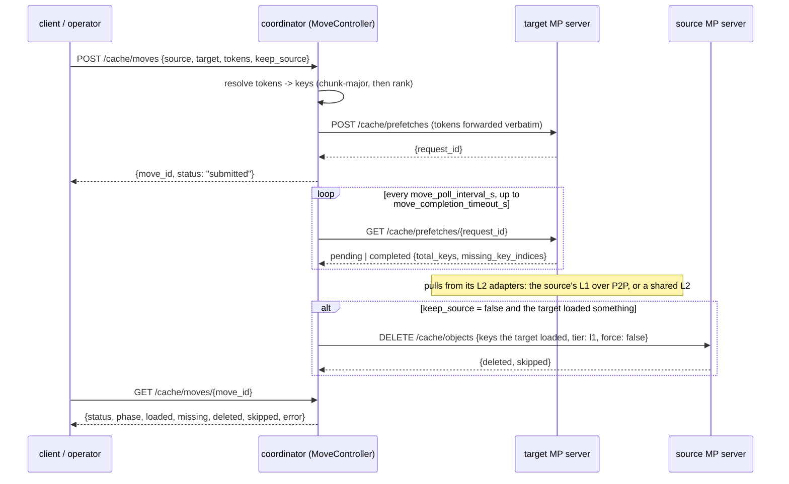

# Coordinator-Driven Cache Move (server → server)

## Why

Shifting a hot prefix to the server about to serve it can reuse cached KV
instead of recomputing it. This API composes the existing warm-prefetch and
source-delete operations into a best-effort relocation. The coordinator uses
the target's per-key load report to select source keys for non-forced deletion.
It is not a node-drain protocol: prior target hits and locked source keys may
remain on the source, and no lease protects the target copy during deletion.

Roadmap item "Pin, delete, and move KV caches"
([#4025](https://github.com/LMCache/LMCache/issues/4025)); pin and delete
landed first. The in-process (legacy) `move` had the same shape —
`(instance, location) → (instance, location)`, a `copy` flag, cross-node
only — but **pushed** from the source over P2P. MP P2P is pull-only and
read-only (a node never writes into a peer's memory), so the MP move is
driven from the **target**.

## Flow

## Contract

- **What moves.** The complete chunks of `token_ids`, expanded to one key
  per rank by `resolve_object_keys` — the resolver pin and delete use, so
  the coordinator's `chunk_size` / `hash_algorithm` must match the
  servers' exactly as for those. Only `l1 → l1`; the request carries
  `source_tier` / `target_tier` so the wire contract survives other
  directions landing later.
- **Key identity is a deployment prerequisite.** Count and index checks
  validate the shape of the target report, not the identities of its keys.
  Equal counts can still describe different keys if hashing, chunking, or
  object-group configuration differs. Matching key resolution and model
  layouts across the coordinator and servers must be ensured by deployment;
  this API does not negotiate or verify them. A mismatched deployment is
  not guaranteed to fail without source deletion.
- **Overlapping operations require caller coordination.** Moves are not
  serialized by key or instance. Callers must coordinate overlapping moves
  and explicit deletes on the same keys and instances; one operation can
  remove a copy another just loaded. This includes reverse moves. Limiting
  the number of concurrent requests alone would not establish ordering.
- **Where the bytes come from.** Wherever the target's L2 adapters find
  them. With P2P, the source's L1 is one of them; with a shared L2 the same
  chunk may come from there instead. The move requests an **end state**
  — delete from the source the keys the target reported loading — and
  does not constrain the path; the target's read path is the adapters'.
- **What is deleted.** From the source's L1, exactly the keys the target
  reported loading: `resolved keys − missing_key_indices`. Never forced,
  so a key a worker is reading is skipped and counted. A key the target did
  not load is never deleted — and by the warm prefetch's counting rule a
  key the target *already held* is reported missing too (an already-present
  entry may be another lookup's temporary), so it is left alone as well.
  The move is conservative by construction: no report from the target, no
  delete on the source.
- **Where the delete goes.** The source is named by `instance_id` and its
  address is read from the `InstanceRegistry` when each delete batch is
  sent, not at submit: a source that re-registered while the target was
  loading is reached at its new address, and one that deregistered fails
  the move (`phase` `delete`) without a delete going anywhere. The
  target is polled at the address it had at submit — its prefetch job
  belongs to that incarnation, and a restarted target no longer knows it.
- **Not atomic.** There is no lock spanning two servers. Between the
  target's report and the source's delete the target may evict what it
  loaded, and nothing holds the target's L1 for a move — the coordinator's
  pins cover L2 eviction only. L1 headroom lowers eviction pressure but
  provides no retention guarantee. `keep_source` lets an operator verify
  target use before deciding whether to delete the source explicitly;
  serving the prefix once does not guarantee it remains resident at delete
  time. This sequence is not a lossless drain protocol either. The
  key directory is not consulted and not edited: the target's `STORE`
  events and the source's `DELETE` events update it, like any other store
  or delete.
- **Pins.** An L1 move never touches L2 pins — the two are orthogonal,
  exactly as `delete tier=l1` does not consult them.

## Components

- **`api.py`** — `MoveStatus` (`pending` / `completed` / `failed`) and
  `MovePhase` (`load` / `delete`): the vocabulary the controller reports
  in and the HTTP schema exposes, defined once.
- **`schemas.py`** — `MoveRequest {source_instance_id, target_instance_id,
  model_name, world_size, token_ids, cache_salt, source_tier=l1,
  target_tier=l1, keep_source=false}`, `MoveResponse {move_id,
  source_instance_id, target_instance_id, requested, status}` and
  `MoveStatusResponse {…, status, phase, requested, loaded, missing,
  deleted, skipped, error}`, built straight from a `MoveOutcome`.
- **`controllers/move_controller.py`** — `MoveController`, a `Controller`
  because a move has state the coordinator owns (the in-flight table)
  and work that outlives the request. `MoveSettings`, a strict pydantic
  model, declares the four `extra_config` keys and their defaults.
  `submit_move` resolves the target from the registry, posts its prefetch
  and validates the reply -- not a JSON object, no `request_id`, or a
  `noop` (the target chunked the sequence to nothing) is a
  `MoveSubmitError`, no move recorded -- then records the job and starts
  a task. A job is its `MoveSpec` (the resolved keys; the token ids are
  not kept past the submit), the target as registered at submit, and the
  live `MoveOutcome` it reports; `get_status` returns that outcome for a
  running move and the retained one for a settled move. Every terminal
  path -- completed, failed, cancelled -- goes through one `_finish`: the
  job is dropped and only the outcome is kept, for `move_result_ttl_s`
  (reads do not extend it) and at most `move_result_limit` outcomes,
  oldest evicted first; a running move is never evicted. The task polls
  the target under an `asyncio.wait_for` sized to the completion timeout
  -- a cancellable bound on the coordinator's wait (status requests, their
  replies and the sleeps between them), where a per-request HTTP timeout
  would only bound the gap between two pieces of a reply; it does not
  cancel the load the target already started. A `completed` first seen
  after the deadline is refused even when `wait_for` let it through: on
  Python 3.10 and 3.11 a result landing in the same loop iteration as the
  timeout wins, and a loop stalled by other work makes that iteration
  arbitrarily late. Replies are read through
  strict pydantic models, so a count that is a bool or a float is
  refused, then checked for sense: the target's `total_keys` must equal
  the resolved count (a chunk-size mismatch otherwise),
  `missing_key_indices` must be present (a server too old to report per
  key), in range, without repeats, and agree with `found_keys`; the
  source's `deleted + skipped` must not exceed the batch and `ok` must not
  be `false`. The delete goes out in `MAX_DELETE_BATCH` chunks, each
  addressed to the source's current registration, and each acknowledged
  count is added only after its reply checked out. `run` sweeps expired
  outcomes on a timer and, at shutdown, cancels whatever is in flight,
  each cancelled move ending `failed` in the phase it was in.
- **`http_apis/cache_api.py`** — `POST /cache/moves` (400 same instance /
  bad direction / bad key field, 404 unknown instance, 422 unknown or
  invalid field -- `MoveRequest` forbids extras so a misspelt
  `keep_source` cannot silently become a move, 502 target rejected the
  submit or gave it nothing to drive, `noop` for a sub-chunk sequence)
  and `GET /cache/moves/{move_id}` (404 unknown, expired or evicted).
- **MP server** — `missing_key_indices` on the completed warm-prefetch
  status (`lmcache/v1/multiprocess/warm_prefetch.py`): the positions, in
  the request's resolved key order, the load did not bring into L1.

## Why the coordinator polls

Warm prefetch has the *client* drive completion, and its design says so:
the submit and status calls are quick, nothing on either side polls. A
move cannot inherit that. Its second half — the source delete — is the
coordinator's own action, and tying it to whether a client ever asks
again would make an unpolled move a silent copy. So the manager runs
each move as a task on the event loop (the README's sanctioned way to do
work a handler must not block on), and the client's poll only observes.

## Wiring

Nothing in `app.py` names the controller: `controllers/` is scanned, so
the file is the wiring. Its four settings live in `extra_config`, the
home the config gives a controller's own knobs, and are declared by
`MoveSettings`: `move_poll_interval_s` (default `0.5`),
`move_completion_timeout_s` (default `600`) and `move_result_ttl_s`
(default `600`), each a finite positive number, and `move_result_limit`
(default `1000`), a positive integer -- validated strictly, so a string
or a bool is rejected rather than coerced.

## Failure modes

| Failure | Where it surfaces | Source touched? |
|---|---|---|
| Unknown instance, same instance, bad direction, bad key field | `POST` → 404 / 400 | no |
| Target unreachable, rejects the prefetch submit, or gives it nothing to drive (an unusable reply, or a `noop`: the two disagree on chunking) | `POST` → 502, no move recorded | no |
| Target drops the prefetch job (404 on poll) or answers non-2xx | `failed` (`load`) | no |
| Target unreachable on a status poll | retried each interval until the deadline, then `failed` (`load`) | no |
| Target's `total_keys` ≠ resolved count, or no `missing_key_indices` | `failed` (`load`) | no |
| Target never completes within the timeout, or its completion is first seen after it | `failed` (`load`) | no |
| Target's counts or positions disagree with each other | `failed` (`load`) | no |
| Source no longer registered when a delete batch is due | `failed` (`delete`); `deleted` counts the earlier batches | only the earlier batches |
| Source unreachable, rejects a delete batch, or answers it unusably | `failed` (`delete`); `deleted` counts the acknowledged batches | partially -- the failed batch may or may not have been applied |
| Source applied a delete but its reply was lost | `failed` (`delete`); `deleted` does not count that batch | more than `deleted` says |
| Source refuses locked keys | `completed` with `skipped > 0` | partially — locked keys stay |
| Target reports a status other than `pending` or `completed` | `failed` (`load`), protocol error | no |
| Coordinator shuts down mid-move | `failed` ("cancelled"), in the phase it was in | only if the delete had begun |

The word in parentheses is the outcome's `phase`: `load` means the source
was never addressed; `delete` means the target had reported, and a delete
may have been sent.

A move that fails **after** the target loaded is not rolled back. Failed
in the `load` phase, this move has not requested source deletion; failed in the
`delete` phase, `deleted` counts what the source acknowledged, and the
batch whose reply never came may have been applied -- treat the source's
state as unknown, not intact. Re-submitting the move does not finish the
job: the target now already holds the keys, which the warm prefetch
reports as missing, so nothing is deleted. Remove what is left on the
source explicitly with `POST /cache/delete` (`tier=l1`) when it must go.
Nothing holds the target's copy in the meantime: the eviction window
above applies to a failed move as much as to a completed one.

## Scope and follow-ups

- **Single node per instance**, as for prefetch: one `instance_id` is one
  node's shards. A model sharded across nodes is moved one instance at a
  time.
- **Target-side L1 retention.** A per-instance L1 pin, or a retention flag
  on the warm prefetch, would close the eviction window between the
  target's report and the source delete. Neither exists today.
- **Source-affine loading.** The target's prefetch policy decides which
  adapter serves a key; a hint preferring the source's P2P adapter would
  make "move from A" also mean "read from A". That is a
  `PrefetchRequestSpec` extension, out of scope here.
- **Other directions.** `l2 → l1` is the existing warm prefetch; `l1 → l2`
  (flush) needs a store-side primitive the MP server does not expose yet.
  The tier fields are on the wire so neither needs a new endpoint.
- **CLI.** No `lmcache kvcache` sub-command yet, matching pin / delete /
  prefetch.
- **In-flight cap.** Running moves are bounded only by
  `move_completion_timeout_s` (plus the source delete); each holds its
  resolved keys, not its token ids. A cap on concurrent moves is a
  follow-up if a deployment needs one.
- **Listing and cancelling.** `GET /cache/moves` and
  `DELETE /cache/moves/{move_id}` would be thin over the in-flight table
  and the task cancellation `run` already performs; today a move stuck in
  the `load` phase can only be waited out.
- **Per-request timeout.** `move_completion_timeout_s` is fleet-wide; a
  million-token move and a one-chunk move do not need the same wait. An
  optional `completion_timeout_s` on the request, capped by the setting,
  is the natural extension.
- **Response conventions.** `requested` counts chunks while the other
  counts are keys, and the submit answers `200` rather than `202` -- both
  inherited from prefetch and delete, so a change should land for all
  three together.
