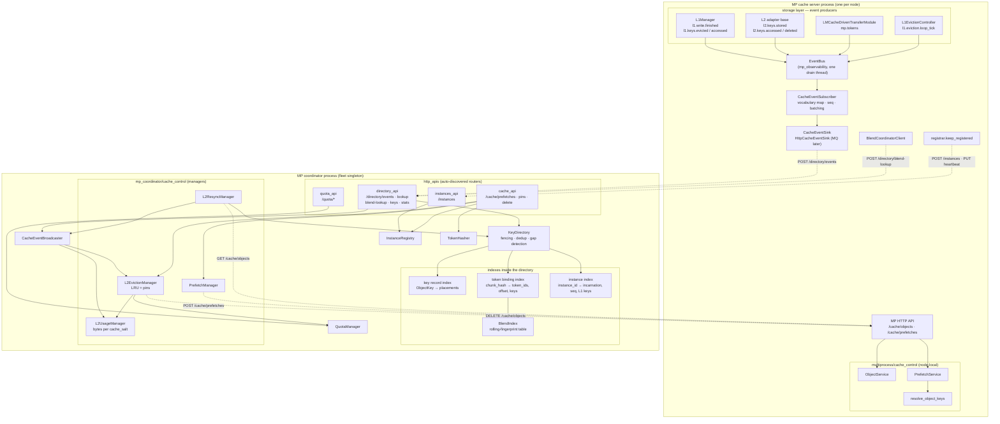
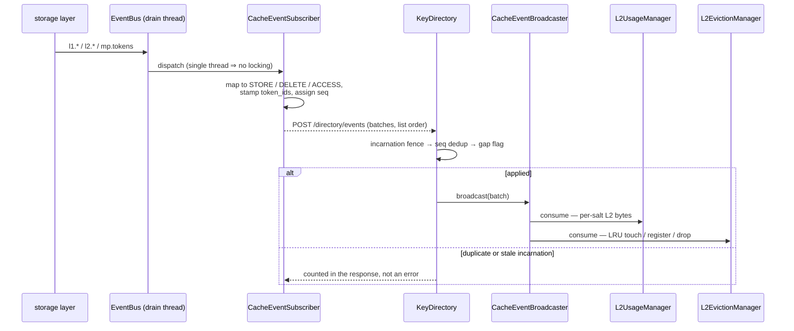
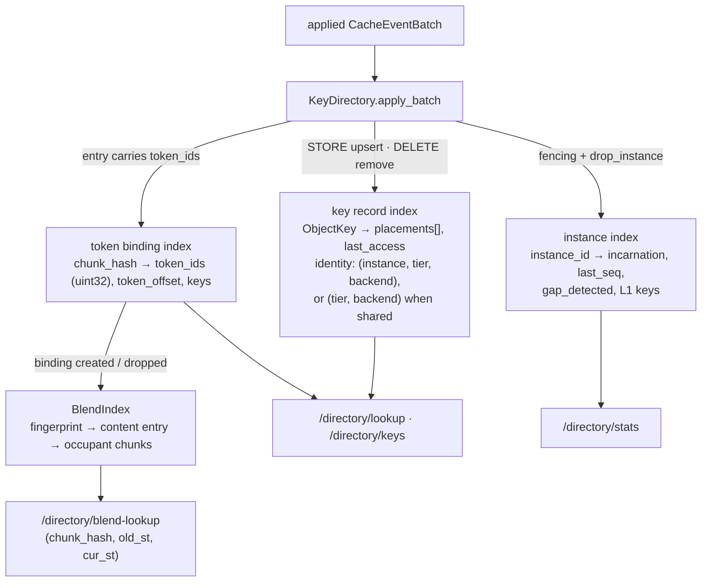
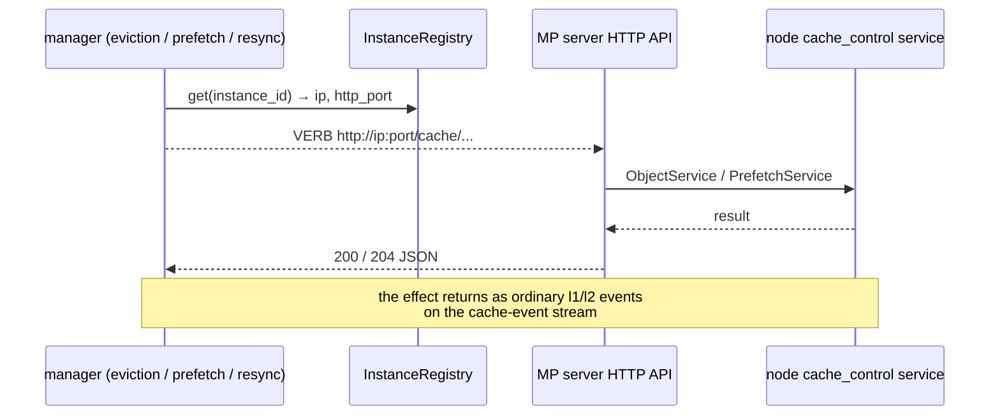

# Control-plane module architecture

Modules: `lmcache/v1/mp_coordinator/` (coordinator process + the MP-server-side
emitter/client halves that live with their wire contract) and
`lmcache/v1/multiprocess/cache_control/` (node-local cache-control services).

This is the map: how the MP server, the cache-event stream, the coordinator,
the key directory and its indexes, the `cache_control` package, and the
managers fit together. Each box below has its own doc or docstring for the
details — this one is only about the edges between them.

The whole picture rests on one asymmetry:

- **Facts flow up** the cache-event stream: each MP server is the sole writer
  of its own placements, and the coordinator only ever *derives* state from
  that stream (directory → indexes → views). Nothing on this path is on the
  serving hot path, and every answer is a hint to be validated at the owner.
- **Commands flow down** as plain HTTP calls to a named MP server's existing
  endpoint (`DELETE /cache/objects`, `POST /cache/prefetches`). There is no
  generic command channel and no per-instance connection state; the effect of
  a command comes back up as ordinary cache events.

## Module map

Solid arrows are in-process calls; dashed arrows are HTTP between processes.

## Who owns what

| Module | Owns | Talks to |
| --- | --- | --- |
| `cache_events.py` (MP side) | The emitter: event → directory vocabulary, `seq`, `incarnation`, order-preserving batching, the sink seam | Subscribes to `EventBus`; publishes through `CacheEventSink` |
| `registrar.py` (MP side) | Register / heartbeat / deregister as an asyncio task on the MP server's own loop | `instances_api` |
| `blend_client.py` (MP side) | Query-only fragment lookup from sync blend handler threads | `directory_api` |
| `multiprocess/cache_control/` | Node-local execution: adapter listing, key-addressed delete, warm-prefetch submit/status, token → key resolution | The node's storage manager; called by the MP HTTP API |
| `key_directory.py` | The ingest gate (fencing, dedup, gap detection) and every index derived from placements and token bindings | Read by `directory_api`, `resync_manager` |
| `blend_index.py` | Fingerprint discovery + token-exact verification over the directory's bindings | Driven by binding lifecycle; never calls back into the directory |
| `event_broadcaster.py` | Fan-out of *applied* batches to registered consumers | `directory_api`, `resync_manager` → the managers |
| `cache_control/` (coordinator) | Everything downstream of the applied event stream: usage view, eviction, prefetch dispatch, startup backfill | The registry (to resolve addresses) and MP server endpoints |
| `registry.py` | Fleet membership only — `instance_id` → ip / http_port / heartbeat | Everything that needs to reach an MP server |

## The event path

One stream carries every fact. It is per-instance FIFO and nothing more —
each instance is the sole writer of its own placements, so there is no global
order to maintain and no cross-instance arbitration.

Two ordering constraints hold this together:

- **Batch order within the subscriber.** Consecutive records sharing an
  identity `(event_type, tier, backend, shared)` merge into one pending batch;
  an identity change starts a new one and never merges backwards. A store
  followed by a delete of the same key therefore cannot be reordered.
- **Consumer registration order.** `create_app` registers the usage view
  *before* the eviction manager, because the eviction manager's delete
  handling asks the usage view whether the key still has L2 bytes anywhere
  before dropping it from the LRU.

`mp.tokens` produces no batch of its own: the subscriber caches
`chunk_hash → (token_ids, offset)` and stamps those onto subsequent `STORE`
entries, so token bindings ride the store events themselves.

## Indexes inside the directory

All four are derived from the same applied entries, and all four are bounded
by record lifecycle rather than by configuration — a key's last placement
going away takes its row with it.

- The **key record index** is the directory proper. Placement identity is
  fleet-scoped for shared pools, so N instances storing one key into one S3
  bucket upsert a single placement instead of N.
- The **token binding index** is keyed by the `chunk_hash` every entry already
  carries, so the coordinator never hashes content. One binding per chunk,
  shared by every rank's key.
- The **instance index** is the reverse index that makes incarnation fencing
  and `drop_instance` proportional to one instance's keys rather than a full
  scan. It is also where `gap_detected` lives.
- The **blend index** is a derived view of the bindings, enabled only when
  blend lookup is configured. Discovery is a strided rolling-hash probe;
  every candidate is then verified token-exact, which is why a fingerprint
  collision can cost a wasted comparison but never a wrong match. Lock order
  is directory → index, one way only.

## The managers

Two families, distinguished by which direction they face.

**Coordinator-side (`mp_coordinator/cache_control/`)** — derive from the event
stream and dispatch to the fleet:

| Manager | Trigger | Effect |
| --- | --- | --- |
| `L2UsageManager` | Broadcast batch (L2 only) | Maintains bytes per `cache_salt`, per key, and in total. Pure view — no I/O. |
| `L2EvictionManager` | Broadcast batch, plus its own timer loop | Keeps an `IsolatedLRUEvictionPolicy` and the ref-counted pin set; over the trigger watermark it dispatches `DELETE /cache/objects` (chunked at `MAX_DELETE_BATCH`) to one uniformly random registered server — all servers share the backing L2, so one dispatch evicts the fleet. |
| `PrefetchManager` | `POST /cache/prefetches` | Forwards to a named server and proxies status polls. No background polling: the client drives completion. |
| `L2ResyncManager` | Startup, once | Paginates one server's `GET /cache/objects`, synthesizes `STORE` batches, and feeds them to `KeyDirectory.reconcile` (bypassing the stream cursor, so a backfill cannot disturb or be rejected by the live stream) plus the broadcaster's consumers. |

`QuotaManager` and `TokenHasher` are shared classes rather than coordinator
modules — the same code the node uses, instantiated here with the fleet's
`chunk_size` and `hash_algorithm` so pin requests resolve to the same keys the
servers produced.

**Node-side (`multiprocess/cache_control/`)** — execute what arrives:
`ObjectService` (adapter resolution, paginated listing, key-addressed delete),
`PrefetchService` (warm load L2 → L1, owns the `WarmPrefetchJobs` table), and
`resolve_object_keys` (the single token → per-rank-key resolver shared by node
and coordinator). All three raise transport-agnostic domain errors that the
HTTP layer maps to status codes.

## Command dispatch

Server-initiated work never opens a channel — it resolves an address and calls
an endpoint that already exists:

That last note is the loop closing: an eviction dispatched by the coordinator
updates the coordinator's own LRU only when the resulting `l2.keys.deleted`
event arrives back through the directory. Nothing on the command path writes
directory state directly.

## Threading and failure

| Boundary | Model |
| --- | --- |
| MP emitter | Everything (mapping, batching, publish) runs on the bus's single drain thread — no locks, no dedicated flush task. The sink posts synchronously with a short timeout. |
| Coordinator HTTP | One uvicorn event loop. Handlers must stay non-blocking: dispatch is `await`ed on the shared async client, CPU-bound scans go to `run_in_executor`. |
| Coordinator state | `InstanceRegistry`, `KeyDirectory`, `BlendIndex`, and `L2UsageManager` each own their lock. The broadcaster keeps none — it is thread-safe exactly as long as its consumers are. |
| Background loops | Health check, L2 eviction, and startup resync are asyncio tasks started by the lifespan and cancelled on shutdown; in-flight eviction dispatches are awaited before the client closes. |

Every failure mode on the fact path degrades to staleness rather than error:
a dropped batch surfaces as a `seq` gap that marks the instance's slice stale,
a redelivered batch is deduplicated, a restarted server's first batch fences
out its previous incarnation's L1 placements (L2 survives — the bytes are
still on disk), and an unreachable coordinator never blocks the server.
Correctness comes from validate-on-use at the owner, not from the directory
being right.

## See also

- [README.md](README.md) — the coordinator backbone, REST surface, config
- [cache_events.md](cache_events.md) — emission: transport seam, batching, `seq`
- [key_directory.md](key_directory.md) — apply semantics, token index, shared pools
- [blend_index.md](blend_index.md) / [blend_lookup.md](blend_lookup.md) — fragment lookup
- [l2_usage_and_eviction.md](l2_usage_and_eviction.md) — the usage view and eviction loop
- [l2_prefetch.md](l2_prefetch.md) — warm prefetch end to end
