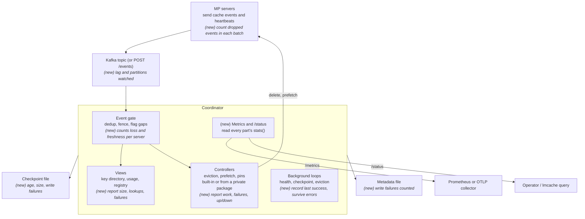

# MP Coordinator Observability

The coordinator only knows what the mp servers' events tell it. If events are
lost, late or half-applied, it keeps answering, and answers wrong.
Observability exists to catch that.

Code: `lmcache/v1/mp_coordinator/observability.py` (metric names and
registration), `http_apis/metrics_api.py` (`GET /metrics`).

## 1. Design principles, goals and non-goals

**Principles**

- **Watch the event path first.** Is the coordinator's view complete? How old
  is it? Are the loops that act on it still running? Request rates come after.
- **One source per fact.** Each component keeps a `stats()` snapshot. Metrics
  and the `/status` page both read it, so they never disagree.
- **Plain OpenTelemetry metrics.** No event bus: that was built for the GPU
  server's hot path, and it isn't running in the coordinator.
- **Few labels.** Only fixed lists of values. `instance_id` only on gauges,
  which disappear when the server leaves. Never keys or hashes.
- **Cheap to read.** A metric reads counts that are updated on every change. It
  never walks a whole index while holding its lock, so a scrape cannot stall
  ingest or lookups.

**Goals**

- See lost or late events, per mp server.
- See within minutes when a loop dies, a controller fails to start, or the
  views drift apart.
- Let an operator see why from one page, without reading logs.

**Non-goals**

- Per-key or per-request metrics.
- A health check that fails when degraded (k8s would restart the coordinator
  and wipe its state).
- A readiness check that waits for warm-up (it would block the events needed to
  warm up).
- Tracing spans, for now (section 6).
- Changing the mp server's event bus.

## 2. Architecture

No new process or pipeline: each existing part keeps counts about itself, and
one small layer exposes them. Parts marked *(new)* are what observability adds
to the fault-tolerance architecture.

- **MP servers** add their running count of dropped events to every batch, so
  the coordinator knows how much was lost, not only that something was.
- **Event gate** counts loss, duplicates and freshness per server.
- **Views and controllers** report what they hold, what they do and what fails.
- **Background loops** record when they last succeeded and no longer die on an
  error.
- **Metrics and /status** read every part's `stats()` snapshot. `/metrics`
  feeds Prometheus or an OTLP collector; `/status` is for a person or
  `lmcache query`.

## 3. Metrics

Metrics are grouped by the question they answer. Every coordinator metric
starts with `lmcache_coordinator.`, left out in the tables; mp-server metrics
start with `lmcache_mp.`.

A name says what it measures: `<part>.<what>_<unit>`.

- A counter names the thing counted (`event_batches_received`); Prometheus adds
  `_total`.
- A gauge names the current amount (`keys_tracked`).
- The unit ends the name: `_seconds`, `_bytes`, `_ratio`, `_timestamp_seconds`.
- `server_` in a name means one series per mp server (`instance_id` label).

The two existing directory gauges become `key_directory.placements` and
`key_directory.placement_bytes`; the old names stay for one release.

### Is the view complete?

| Metric | Type | Labels | Tells you |
| --- | --- | --- | --- |
| `ingest.event_batches_received` | counter | `result` = applied, duplicate, stale | Batches received from mp servers, and what the gate did with them |
| `ingest.event_batches_missing` | counter | | Batches that never arrived: every skipped `seq` counts |
| `ingest.events_dropped_by_servers` | counter | | Events the mp servers say they threw away before sending |
| `ingest.server_event_batches_missing` | gauge | `instance_id` | Missing batches for one server's current run |
| `ingest.server_events_dropped` | gauge | `instance_id` | Dropped events for one server's current run |
| `ingest.server_view_incomplete` | gauge | `instance_id` | 1 while the coordinator knows it is missing part of this server's cache |
| `ingest.batch_apply_failures` | counter | `consumer`, `op` | A view or controller failed to apply a batch, so they now disagree. Page on this |

Fleet-wide counters drive the alerts; per-server gauges show which server.
Per-server values are gauges because a counter series lives as long as the
process, while servers come and go.

Two kinds of loss, counted separately:

- **Never arrived.** A skipped `seq`. A stream's first batch after the
  coordinator starts tracking it counts nothing: earlier batches were sent
  before it was listening.
- **Thrown away by the server.** Each batch carries the server's running count
  of dropped events (`dropped_events`): a full Kafka buffer, a failed delivery,
  a failed HTTP post. The coordinator adds up the increases.

`server_view_incomplete` clears when the server's slice is rebuilt: the server
restarts (its L1 is fenced) or leaves (deregister or heartbeat timeout). A
Kafka replay cannot fill the hole: the missing batches never reached the topic,
and applying them late could apply a store after its delete. After the
coordinator starts without a checkpoint it is 1 for every server until each
one restarts, since the coordinator missed their history: it is a
view-completeness gauge, not an alert.

### How old is it?

| Metric | Type | Labels | Tells you |
| --- | --- | --- | --- |
| `lmcache_mp.coordinator_event_send_delay_seconds` (mp server) | histogram | | Time from a cache store to its event being sent |
| `ingest.event_delivery_delay_seconds` | histogram | | Time from sent to applied (uses the server's clock) |
| `ingest.server_seconds_since_last_event` | gauge | `instance_id` | Server heartbeats but has stopped sending events |
| `kafka.unread_records` | gauge | `partition` | Records waiting to be read. Kafka's own lag tools can't see this: the coordinator never commits offsets |
| `kafka.partitions_assigned` | gauge | | Fewer than the topic has means another coordinator took some |
| `kafka.records_read` | counter | `result` = applied, undecodable, failed | Bad records being skipped |

### Are the loops alive?

| Metric | Type | Labels | Tells you |
| --- | --- | --- | --- |
| `background_loop.last_success_timestamp_seconds` | gauge | `loop` = health, checkpoint, eviction | When each loop last finished a pass |
| `background_loop.interval_seconds` | gauge | `loop` | Configured period, for alerts |
| `background_loop.runs` | counter | `loop`, `result` = ok, error | Passes that failed |
| `controller.up` | gauge | `controller` | 1 up, 0 failed to start |
| `event_loop.blocked_seconds` | histogram | | How long the request thread was stuck (ingest and checkpoints can stall heartbeats) |

Today a loop that raises dies silently. P0 makes each loop catch the error, log
it and keep going; the metric alone would only report the death.

### Views: what the coordinator holds

Every view gets two generic metrics, then one row per thing it holds or serves.
A view added later gets the generic ones for free and adds its own from its
`stats()`.

| View | Metric | Type | Labels | Tells you | Phase |
| --- | --- | --- | --- | --- | --- |
| Every view | `ingest.batch_apply_duration_seconds` | histogram | `consumer` | Time to apply one batch; finds the slow view (blend hashing) | P0 |
| Every view | `ingest.batch_apply_failures` | counter | `consumer`, `op` | Failed to apply a batch (above) | P0 |
| Instance registry | `registry.servers_registered` | gauge | | Number of mp servers in the fleet | P1 |
| Instance registry | `registry.server_seconds_since_heartbeat` | gauge | `instance_id` | Time since each server's last heartbeat | P0 |
| Instance registry | `registry.server_membership_changes` | counter | `change` = registered, re_registered, deregistered, timed_out, unknown_heartbeat | Churn and flapping | P1 |
| Key directory | `key_directory.keys_tracked` | gauge | | Keys with at least one placement | P1 |
| Key directory | `key_directory.placements`, `key_directory.placement_bytes` | gauge | `tier` | Placements and their bytes per tier. A placement is one place a key is stored: L1 on one server, or one L2 backend. The two existing gauges, renamed | P0 |
| Key directory | `key_directory.server_l1_keys` | gauge | `instance_id` | L1 keys each server reported; a sudden drop to 0 is a fence | P1 |
| Blend index (if enabled) | `blend_index.chunks_indexed`, `blend_index.unique_chunk_contents`, `blend_index.namespaces` | gauge | | Size of the fragment index | P1 |
| Lookups (prefix and non-prefix) | `key_directory.lookups` | counter | `lookup_type` = prefix, non_prefix | Lookup requests served | P1 |
| Lookups (prefix and non-prefix) | `key_directory.lookup_chunks_requested`, `key_directory.lookup_chunks_found` | counter | `lookup_type` | Chunks asked for and chunks found; found ÷ requested is the hit rate | P1 |
| Lookups (prefix and non-prefix) | `key_directory.lookup_chunks_found_per_request` | histogram | `lookup_type` | How much each lookup found | P1 |
| Usage | `usage.bytes_stored` | gauge | `tier` | Fleet bytes per tier | P1 |
| Usage + server config | `usage.server_capacity_used_ratio` | gauge | `instance_id`, `tier` | Each server's usage against its declared capacity; absent when none declared | P1 |

Prefix lookups (`/directory/lookup`) and non-prefix lookups
(`/directory/blend-lookup`) share one set of lookup metrics, told apart by
`lookup_type`. Both take tokens and return the chunks the fleet holds, so a
chunk is the unit for both; a lookup by keys counts each key as one chunk.

**Requirement: keep these counts as you go (P0).** The directory gauges call
`KeyDirectory.stats()` on every scrape, and it holds the directory's and the
blend index's locks while it runs. Walking every key or the whole index there
would block ingest and lookups for a time that grows with the cache. So:

- The key directory reads its placement total from the per-tier totals it
  keeps on each add and remove.
- The blend index keeps running counts of chunks and of claims per namespace (a
  namespace drops out when its last claim goes); contents is the size of its
  table.
- `stats()` itself is therefore cheap, and gauges and `/status` both read it.

### Controllers: what the coordinator does

Controllers can be built in or loaded from a private package
(`extra_config.controller_packages`). The private `EvictionController` in
coordinator-controllers replaces the built-in `FleetEvictionController`. It
adds an L1 budget, sends each delete to the server that holds the copy, and
skips keys no server can delete. So controller metrics follow three rules:

- **Named by role, not by class.** Whichever controller enforces eviction emits
  `eviction.*`, `quota.*` and `pins.*`. A swap keeps every dashboard and alert
  working.
- **A replacement may add, never rename.** It can add label values
  (`tier="l1"`, `reason="unreachable"`) and new metrics under the same role. It
  must emit every metric the built-in one does.
- **Names are part of the versioned contract.** Upstream keeps the names,
  labels and bucket boundaries as constants in `mp_coordinator/observability.py`;
  the private package imports them. Its `vX.Y.Z` targets LMCache `vX.Y.Z`, so a
  rename is a breaking change for both.

A controller that runs its own loop reports it with the `background_loop.*`
metrics, `loop` set to its role (`eviction`).

| Role | Metric | Type | Labels | Tells you | Phase |
| --- | --- | --- | --- | --- | --- |
| Every controller | `controller.up` | gauge | `controller` (class name) | 0 if it failed to start (above) | P0 |
| Eviction | `eviction.sweeps_run` | counter | `tier`, `outcome` = idle, planned, no_target | Sweeps that found work, or found no server to send it to | P1 |
| Eviction | `eviction.keys_selected`, `eviction.bytes_selected` | counter | `tier`, `cache_salt` (explicit quotas only) | Keys and bytes picked for eviction | P1 |
| Eviction | `eviction.keys_skipped` | counter | `tier`, `reason` = pinned, unreachable, stale | Keys passed over: pinned; every copy on a server that left; or nothing holds it any more | P1 |
| Eviction | `eviction.delete_requests_sent` | counter | `tier`, `target` = any_server, owner; `result` = ok, error | Deletes sent, to any server (shared pool) or to the server holding the copy | P1 |
| Eviction | `eviction.delete_requests_skipped` | counter | `tier`, `reason` = owner_left, no_server | Deletes not sent: the owner left mid-cycle, or no server is registered | P1 |
| Eviction | `eviction.delete_requests_in_flight` | gauge | | Deletes not yet answered | P1 |
| Eviction | `eviction.lru_keys_tracked` | gauge | `tier` | Keys in each tier's eviction LRU | P1 |
| Eviction | `eviction.tenants_over_watermark` | gauge | `tier` | Tenants due for eviction now | P1 |
| Eviction | `quota.tenant_bytes_used`, `quota.tenant_bytes_limit` | gauge | `tier`, `cache_salt` (explicit quotas only; the rest roll up to one series) | Headroom per tenant | P1 |
| Eviction | `pins.keys_pinned` | gauge | | Keys that cannot be evicted from L2 | P1 |
| Prefetch | `prefetch.requests_submitted` | counter | `result` = submitted, noop, unknown_server, server_error | Prefetches asked for, and why some never started: too short to fill a chunk, server not registered, server refused or unreachable | P1 |
| Prefetch | `prefetch.chunks_requested_per_request` | histogram | | How big each prefetch is | P1 |
| Prefetch | `prefetch.submit_duration_seconds` | histogram | | Time for the mp server to accept a prefetch | P1 |
| Prefetch | `prefetch.requests_in_flight` | gauge | `instance_id` | Prefetches submitted to each server and not yet seen completed | P1 |
| Prefetch | `prefetch.completion_duration_seconds` | histogram | | Submit to the first poll that sees it completed. Includes the caller's poll interval, so it is an upper bound | P1 |
| Prefetch | `prefetch.keys_requested`, `prefetch.keys_found` | counter | | Keys asked to warm, and keys found in L2 and loaded into L1. Found ÷ requested is the prefetch hit rate | P1 |
| Prefetch | `prefetch.status_polls` | counter | `result` = pending, completed, unknown_request, server_error | Polling load. `unknown_request` means the server lost the job (restart) or it was already collected | P1 |
| Prefetch | `prefetch.requests_abandoned` | counter | | Submitted but never polled to completion within 10 minutes: the caller gave up, or the server left | P1 |

What each eviction controller emits:

| Label value | Built-in `FleetEvictionController` | Private `EvictionController` |
| --- | --- | --- |
| `tier` | `l2` | `l1`, `l2` |
| `eviction.keys_skipped` `reason` | `pinned` | `pinned`, `unreachable`, `stale` |
| `eviction.delete_requests_sent` `target` | `any_server` | `any_server` (shared pool), `owner` (local L2, L1) |
| `eviction.delete_requests_skipped` `reason` | `no_server` | `owner_left`, `no_server` |

The metadata rule applies to both: if saving a pin or quota fails, the endpoint
undoes the change and returns 503. The private controller's `/quota` and
`/cache/pins` handlers need the same change as the built-in ones.

**Prefetch tracking.** The coordinator only relays prefetches today, so it
cannot time them. To measure duration, in-flight and abandoned prefetches, it
keeps a small in-memory table: `(instance_id, request_id)` → submit time and
keys requested. An entry leaves on the first completed poll, a 404, the server
leaving, or after 10 minutes (counted as abandoned). The table is as big as the
number of prefetches in flight and is not checkpointed; a coordinator restart
forgets in-flight prefetches without counting them.

Whether prefetched keys were actually used before eviction is not visible here.
The mp server sees that, and can report it as `lmcache_mp.prefetch_keys_used`.

### Persistence (P1)

| Metric | Type | Labels | Tells you |
| --- | --- | --- | --- |
| `checkpoint_file.last_write_timestamp_seconds` | gauge | | When the last good checkpoint was written |
| `checkpoint_file.writes` | counter | `result` = ok, quiesce_timeout, error | Failed checkpoints |
| `checkpoint_file.write_duration_seconds` | histogram | `phase` = pause_ingest, copy, write | `copy` is how long ingest was paused |
| `checkpoint_file.size_bytes` | gauge | | Checkpoint size |
| `checkpoint_file.restored_on_start` | gauge | `outcome` = cold, restored, ignored | 1 for what happened at startup |
| `metadata_file.writes` | counter | `result` = ok, error | Pin and quota changes not saved |

A failed metadata write undoes the change and returns 503, so the caller knows
and can retry safely. Today it returns 200 and the change is lost on restart.

### HTTP (P2)

| Metric | Type | Labels |
| --- | --- | --- |
| `http.requests_received` | counter | `route`, `method`, `status_class` |
| `http.request_duration_seconds` | histogram | `route`, `method` |
| `http.outbound_requests_sent` | counter | `call` = eviction_delete, prefetch_submit, prefetch_status, cache_delete; `result` |
| `http.outbound_request_duration_seconds` | histogram | `call` |

`route` is the route template (`/instances/{instance_id}/heartbeat`), never the
raw path.

### Status page

`GET /status` returns one JSON snapshot: source and Kafka positions,
per-server stream state, controller state, loop ages and last errors,
checkpoint state. It always returns 200; `/healthz` stays a plain liveness
check.

## 4. Alerts

Thirteen alerts cover the three questions plus the basics. **Page** means wake
someone up: the coordinator is giving wrong answers or has stopped acting.
**Ticket** means look at it today. Thresholds are starting points; they ship as
an example Prometheus rules file. Names leave out the prefix, as in section 3.

| Alert | Fires when | Severity | Needs | First check |
| --- | --- | --- | --- | --- |
| Coordinator down | `up{job="lmcache-coordinator"} == 0` for 2 min | Page | exists | Pod status and restart logs |
| Views disagree | `increase(ingest_batch_apply_failures_total[10m]) > 0` | Page | P0 | `/status` consumers, then the traceback in logs. The views need a rebuild |
| Loop stopped | `time() - background_loop_last_success_timestamp_seconds > 3 * background_loop_interval_seconds` | Page | P0 | `/status` loops, `last_error` |
| Controller down | `controller_up == 0` | Page | P0 | Startup logs; eviction or prefetch is not running |
| Kafka partitions split | `kafka_partitions_assigned` below the topic's partition count for 5 min | Page | P0 | A second coordinator in the same consumer group |
| Events being lost | `rate(ingest_event_batches_missing_total[5m]) > 0 or rate(ingest_events_dropped_by_servers_total[5m]) > 0` for 10 min | Ticket | P0 | `ingest_server_event_batches_missing` and `ingest_server_events_dropped` show which server |
| Server silent | `ingest_server_seconds_since_last_event > 120` while `registry_server_seconds_since_heartbeat < 30` | Ticket | P0 | The server's event flush (it rides the L1 eviction tick) |
| Kafka falling behind | `kafka_unread_records` rising for 10 min and above 10,000 | Ticket | P0 | `event_loop_blocked_seconds`, `ingest_batch_apply_duration_seconds` |
| Event loop stalled | p99 of `event_loop_blocked_seconds` above 1 s for 5 min | Ticket | P0 | `checkpoint_file_write_duration_seconds`, `/events` load |
| Checkpoint stale | `time() - checkpoint_file_last_write_timestamp_seconds > 600` | Ticket | P1 | `/status` checkpoint `last_error`, disk |
| Pin or quota not saved | `increase(metadata_file_writes_total{result="error"}[1h]) > 0` | Ticket | P1 | Disk at the metadata path (callers already got a 503) |
| Evictions failing | `rate(eviction_delete_requests_sent_total{result="error"}[10m]) > 0` | Ticket | P1 | Target mp server reachable; its `DELETE /cache/objects` |
| Eviction not catching up | `eviction_tenants_over_watermark > 0` for 30 min | Ticket | P1 | `eviction_keys_skipped_total` by `reason`: `unreachable` means copies on servers that left; deletes sent to the wrong server (built-in controller on local L2) also look like this |

Right after a cold start the coordinator has missed every server's history.
`event_batches_missing` does not count a stream's first batch, so "Events being
lost" stays quiet then.

## 5. Logging

Logs say why; metrics say how often.

- Any failure that has a metric logs a WARNING the first time, then at most
  once a minute with a running count. Today a bad Kafka record or a failed
  eviction delete logs every time, which floods the log just when someone is
  reading it.
- Inside `except` blocks, use `logger.exception` so the traceback is kept.
- Keep the existing INFO lines for rare events: registration, timeouts,
  eviction plans, checkpoint restore.

## 6. Tracing

No tracing spans for now. Coordinator work is either one request in, one
response out, or a timer loop; a route latency histogram shows the same thing.

The one cross-process question, "how long until a stored entry shows up in the
directory?", is answered by two histograms:
`lmcache_mp.coordinator_event_send_delay_seconds` (store to send, on the mp
server) and `ingest.event_delivery_delay_seconds` (send to applied, on the
coordinator).

When blend lookups carry trace context (the `traceparent` work in the mp
observability design), the coordinator joins as a server span through FastAPI
instrumentation. Nothing here blocks that.

## 7. Execution plan

Three steps, each one or more small PRs. Tests read public state only:
`stats()`, `/status`, and metrics from a test-only meter.

| Step | Scope | Tests |
| --- | --- | --- |
| P0 | `lmcache_coordinator.` names and the rename of the two existing gauges; `dropped_events` on each batch, counted by the mp server; ingest counters and per-server gauges; consumer errors and apply time; running totals in the key directory and blend index so gauges never walk them; Kafka lag, partitions, bad records; loop watchdog and the catch-and-continue fix; controller up; event-loop blocked time; event send delay and delivery delay; `/status`; example alert rules | `test_event_gate.py`, `test_event_broadcaster.py`, `test_kafka_event_source.py`, `test_kafka_event_sink.py`, `test_cache_events.py`, `test_health.py`, `test_observability.py`, `test_metrics_api.py` |
| P1 | View and controller metrics (registry, directory, blend, usage, eviction, quota, pins, prefetch); checkpoint metrics; if P0 shows a blocked event loop (p99 of `event_loop.blocked_seconds` above 100 ms), move `POST /events` ingest to a worker thread; metric name constants exported for private controllers, and the private `EvictionController` emitting the same eviction metrics (in coordinator-controllers, released against the same LMCache version); metadata write failures undo the change and return 503 | `persistence/` tests, `test_eviction_controller.py`, `test_quota_api.py`, `test_registry.py` |
| P2 | HTTP server and outbound metrics; tracing once trace context exists | `test_metrics_api.py`, `test_directory_api.py`, `test_cache_api.py` |

Components take an optional `meter` argument. Production passes nothing and
gets the global one; tests pass a private meter so readings don't leak between
tests.
