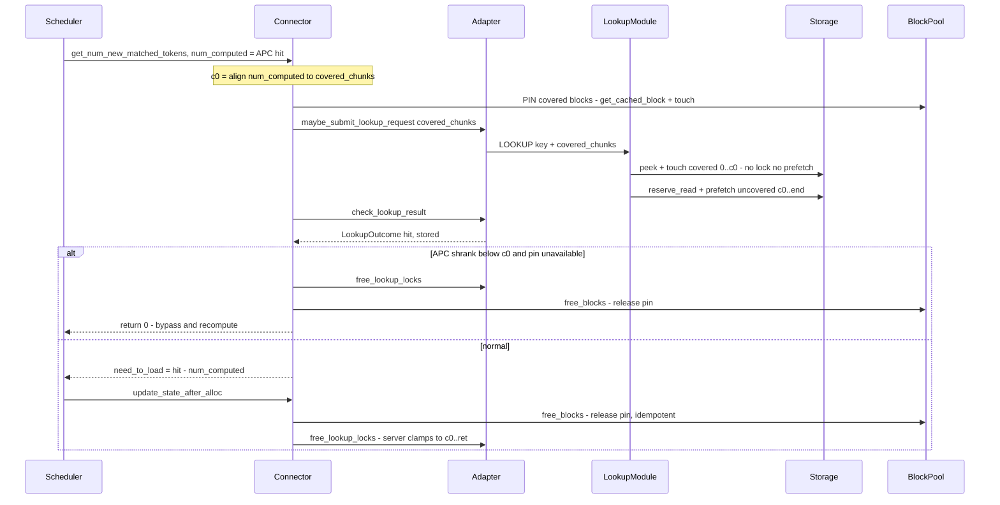

# APC-covered lookup skip

When the serving engine's prefix cache (vLLM APC) already covers the first `N`
tokens of a request, the MP-server lookup no longer read-locks or L2-prefetches
the LMCache objects for that covered prefix — it only presence-checks and
LRU-touches them (so they stay warm) and prefetches just the uncovered tail
`[N, end)`. Gated by `lmcache.mp.skip_covered_lookup` (default off ⇒ identical to
today).

The APC hit can shrink while the async lookup is in flight (a WAITING request's
matched blocks are unprotected until `allocate_slots`). Two methods handle that
race — **pin** and **non-pin (re-lookup)** — compared below.

## Pin vs. non-pin (re-lookup)

Both skip lookup of the covered prefix and touch it to avoid eviction. They
differ only in how they keep it backed if the APC hit shrinks mid-lookup.

- **Pin** — freeze `c0`, pin the covered GPU blocks for the lookup window so a
  shrink can't happen.
- **Non-pin (re-lookup)** — don't freeze or pin; touch the prefix in L1+L2, and
  if the APC shrinks `c0 -> c0'`, look up just the gap `[c0', c0)` and fetch it
  L2→L1. This is what vLLM's native offloading connector does.

| | Pin | Non-pin (re-lookup) |
| --- | --- | --- |
| **Idea** | Hold the covered GPU blocks so they can't be evicted | Let them go; re-fetch the gap from LMCache if needed |
| **Pros** | Shrink impossible; simple accounting; no extra RPC | No GPU-pool pressure; matches vLLM; handles grow and shrink |
| **Cons** | Holds blocks out of the pool (up to `mq_timeout`); couples to vLLM block-pool internals | Extra gap lookup + L2→L1 fetch on shrink (rare); gap lookup must not re-lock `[c0, ret)` |
| **Main risk** | Pool starvation under load — needs a pin budget | Soft guarantee: a gap chunk could evict before re-fetch → small local recompute |
| **Efficiency** | Best happy path; cost is pinned-block opportunity cost | Same happy path; pays only the gap delta on shrink |
| **Complexity** | Simpler server, heavier connector (pin lifecycle + budget) | Heavier server (incremental gap lookup), lighter on GPU coupling |
| **Robustness** | Eliminates the race but can starve the pool | No availability risk; degrades gracefully but leaves a tiny miss window |

**Guidance.** L1-only / small-L2: pin — short window, hard guarantee, simpler.
Large-L2 / high-concurrency: non-pin — no starvation, cheap rare gap fetch.
Likely end state: non-pin as default, pin as an opt-in (or budget-gated with
re-lookup as the fallback). Either simplifies if vLLM upstream ever pins
connector-pending matches. (A 2-model L1-only sweep found the two within ~1%,
with pin costing ~0.5% for its per-lookup block-pin work; the difference only
appears once the shrink race is actually triggered under memory pressure.)

## Workflow — module interactions

Participants: **Scheduler** (vLLM), **Connector** (`LMCacheMPConnector`),
**Adapter** (`LMCacheMPSchedulerAdapter`), **LookupModule** (server),
**Storage** (`StorageManager`/`L1Manager`), **BlockPool** (vLLM GPU block pool).

> Note: GitHub renders mermaid in the **file view**, not in the PR "Files
> changed" diff — open the rendered file to see the diagrams.

### Pin



### Non-pin (re-lookup)

```mermaid
sequenceDiagram
    participant S as Scheduler
    participant C as Connector
    participant A as Adapter
    participant L as LookupModule
    participant SM as Storage
    S->>C: get_num_new_matched_tokens, num_computed = APC hit
    Note over C: c0 = align num_computed to covered_chunks - no pin
    C->>A: maybe_submit_lookup_request covered_chunks
    A->>L: LOOKUP key + covered_chunks
    L->>SM: peek + touch covered 0..c0 - no lock no prefetch
    L->>SM: reserve_read + prefetch uncovered c0..end
    C->>A: check_lookup_result
    A-->>C: LookupOutcome hit, stored
    alt APC shrank c0 to c0prime - gap exposed
        C->>A: free stale c0..ret locks + cleanup_lookup_result
        Note over C: reset per-lookup state; re-submit gap c0prime..c0 next poll
        C-->>S: return None - re-poll
    else normal
        C-->>S: need_to_load = hit - num_computed
        S->>C: update_state_after_alloc
        C->>A: free_lookup_locks - server clamps to c0..ret
    end
```

Shared across both: the server touches (never locks/prefetches) the covered
prefix and prefetches only `c0..end`; every lock-release resolves through the
covered clamp so it never drops a lock the lookup did not take. The methods
diverge only in the pin block-pool interactions and the shrink branch.
