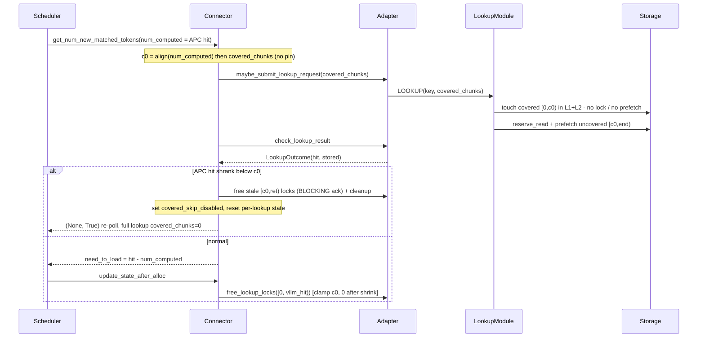

# APC-covered lookup skip (non-pin / re-lookup method)

When the serving engine's prefix cache (vLLM APC) already covers the first `N`
tokens of a request, the MP-server lookup no longer read-locks or L2-prefetches
the LMCache objects for that covered prefix — it only LRU-touches them (so they
stay warm) and prefetches just the uncovered tail `[N, end)`. Gated by
`lmcache.mp.skip_covered_lookup` (default off ⇒ identical to today).

The APC hit can shrink while the async lookup is in flight (a WAITING request's
matched blocks are unprotected until `allocate_slots`). **This branch handles that
race without pinning**: leave the covered GPU blocks unpinned and, if the APC hit
shrinks below the covered boundary `c0`, fall back to a full lookup from token 0 so
LMCache owns the whole prefix `[0, ret)` — no covered skip for the rest of that
request. An alternative *pin* method is implemented in `core/skip-apc-pin`; the two
are weighed in the standalone comparison doc (`apc_covered_lookup_comparison.md`).

## Design

Shared covered-skip mechanics:

- The server (`LookupModule.lookup`) reads `covered_chunks` from the key's
  `request_configs`, **touches** the covered prefix `[0, c0)` but does **not**
  read-lock or L2-prefetch it, and submits a prefetch for only the uncovered
  sub-range `chunk_hashes[c0:]`; hit counts are offset back to absolute at status
  time.
- The touch spans **both tiers** (`StorageManager.touch_cached_keys` → `L1Manager`
  **and** every L2 adapter). This matters: a lookup that really loads a key
  refreshes recency in L1 *and* L2, so if the skip only refreshed L1 the covered
  keys would look cold to L2 and be evicted — losing data a non-skipping lookup
  would have kept, and lowering later hit rates. The touch moves no bytes and
  promotes nothing into L1; each tier ignores keys it does not hold.
- Consequence by design: the covered prefix is no longer *promoted* into L1 on
  every lookup (that promotion was the redundant read being removed). It stays
  wherever it already lives, which frees L1 for data that is actually retrieved.
  Cache **contents** are unchanged versus the feature being off; only the tier
  placement of the covered prefix differs.
- Every lock-release resolves through `resolve_prefetched_obj_keys`, whose
  per-group range start is clamped to `c0`, so a release never drops a lock the
  lookup did not take (which would corrupt a concurrent prefix-sharing request).

Non-pin-specific handling (this branch):

- No GPU-block pinning at all, so there is no block-pool pressure (the pin method
  in `core/skip-apc-pin` adds the acquire/release-pin machinery this branch omits).
- **Full re-lookup on shrink** (`_handle_covered_shrink`): when the current aligned
  APC hit drops below the frozen `c0`, the completed lookup skipped a now-uncovered
  gap. Rather than chase the moving boundary, fall back to a full lookup from token
  0: free the stale `[c0, ret)` locks (the fresh full lookup would otherwise re-lock
  that overlap and leak one read-lock refcount — corrupting prefix-sharing
  requests), set the sticky `covered_skip_disabled` flag, and reset the per-lookup
  tracker fields. The next scheduler poll re-submits with `covered_chunks = 0`, so
  LMCache loads full coverage `[0, ret')` from the beginning (the covered prefix is
  kept retrievable by the covered-range touch). Because `lookup_covered_tokens` is
  now 0, the covered-skip release elision no longer applies, so the fresh lookup's
  read locks release through the normal `update_state_after_alloc` path. Returns
  `(None, True)` so the scheduler re-polls.
- **Blocking stale-lock release**: the stale-lock free uses
  `free_lookup_locks_blocking` (waits for every server to ack) rather than the
  fire-and-forget `free_lookup_locks`. The server's release reads live session
  state (`prefetch_hit_chunks` / `prefetch_covered_chunks`), which the fresh
  lookup's `begin_lookup` resets. Since `LOOKUP` and `FREE_LOOKUP_LOCKS` share the
  normal thread pool, a fire-and-forget release could be reordered after the next
  poll's `begin_lookup` when `max_cpu_workers > 1` — reading the reset state,
  over-releasing the covered prefix and leaking the stale locks. Blocking until the
  release is acked serializes the two, making the recovery correct for any worker
  count (not just the default `max_cpu_workers = 1`).
- Sticky by design: once a request has shrunk it stays on full lookups, so a second
  shrink cannot recur (no re-lookup churn) even across preemption/resume.
- Trade-off: soft guarantee — a prefix chunk evicted before the re-fetch just
  shortens the hit (partial local recompute) rather than corrupting; no
  availability risk from held blocks.

## Workflow — module interactions

Participants: **Scheduler** (vLLM), **Connector** (`LMCacheMPConnector`),
**Adapter** (`LMCacheMPSchedulerAdapter`), **LookupModule** (server),
**Storage** (`StorageManager`/`L1Manager`).

