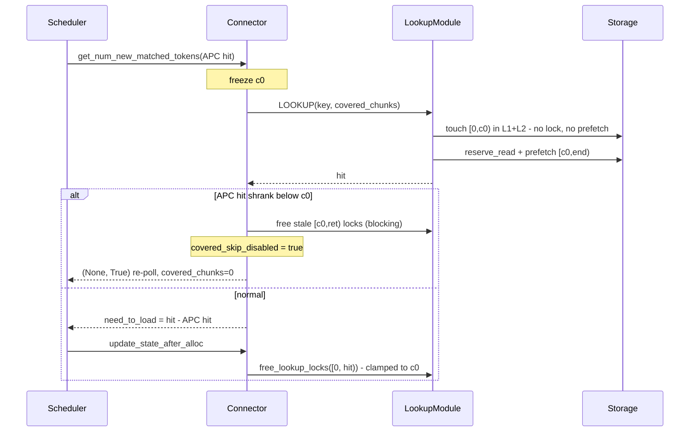

# APC-covered lookup skip (non-pin method)

vLLM's prefix cache (APC) often already holds the first `N` tokens of a
request. LMCache looked them up anyway — read-locking them and pulling them
from L2 into L1 — even though vLLM will never read them.

```
[========= APC already has this =========][==== LMCache loads ====]
0                                         c0                     end
 \__ locked + prefetched for nothing __/
```

`lmcache.mp.skip_covered_lookup` (default off ⇒ identical to today) stops
that. At concurrency 16 / 32k tokens / 75% covered: **126 → 36 keys looked up
per request, 7,872 → 1,824 L1 keys held, same hit rate.**

## What changes

`LookupModule.lookup` reads `covered_chunks` from the key's `request_configs`
(carried there to avoid a proto change). For the covered prefix `[0, c0)` it:

- **touches** it in **L1 and L2** — no bytes move, nothing is promoted. Both
  tiers matter: a real load refreshes recency in both, so touching only L1
  would leave the keys cold to L2 and get them evicted.
- **does not** lock or prefetch it. The prefetch covers `chunk_hashes[c0:]`
  only; hit counts shift back to absolute at status time.

So the prefix is no longer *promoted* into L1 on every lookup — that
promotion was the waste. Cache contents are unchanged; only placement is.

## The shrink race

A WAITING request's APC blocks are unprotected until `allocate_slots`, so the
APC hit can shrink while the lookup is in flight, leaving the frozen `c0`
covering a gap nobody owns.

**This branch does not pin** — it restarts instead: free the stale
`[c0, ret)` locks, set the sticky `covered_skip_disabled` (so the request
never skips again — one shrink each, no churn, survives preemption), reset
per-lookup state, and return `(None, True)`. The scheduler re-polls and
re-submits with `covered_chunks = 0`, loading the prefix from token 0.

That free **blocks** until every server acks. `LOOKUP` and
`FREE_LOOKUP_LOCKS` share the normal thread pool, so with
`max_cpu_workers > 1` a fire-and-forget release could land *after* the
replacement lookup's `begin_lookup` reset the session — over-releasing the
prefix and leaking the stale locks.

Pinning the covered blocks instead is implemented in `core/skip-apc-pin` and
weighed in `apc_covered_lookup_comparison.md`. Non-pin won: no block-pool
pressure, no coupling to vLLM's `BlockPool`, and a shrink costs one wasted
lookup rather than held GPU blocks.

## The invariant

Read locks are anonymous refcounts **shared across prefix-sharing requests**,
so releasing one you never took corrupts another request. Every release goes
through `resolve_prefetched_obj_keys`, whose per-group range start is clamped
to `c0` — it cannot reach into the skipped prefix.

## Flow


