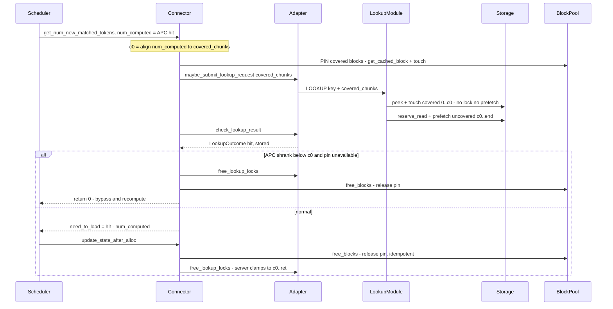

# APC-covered lookup skip (pin method)

When the serving engine's prefix cache (vLLM APC) already covers the first `N`
tokens of a request, the MP-server lookup no longer read-locks or L2-prefetches
the LMCache objects for that covered prefix — it only presence-checks and
LRU-touches them (so they stay warm) and prefetches just the uncovered tail
`[N, end)`. Gated by `lmcache.mp.skip_covered_lookup` (default off ⇒ identical to
today).

The APC hit can shrink while the async lookup is in flight (a WAITING request's
matched blocks are unprotected until `allocate_slots`). **This branch handles that
race by pinning**: freeze the covered boundary `c0` and pin the covered GPU blocks
for the lookup window so a shrink cannot happen. An alternative *non-pin
(re-lookup)* method is implemented in `core/skip-apc-nonpin`; the two are weighed
in the standalone comparison doc (`apc_covered_lookup_comparison.md`).

## Design

Shared covered-skip mechanics:

- The server (`LookupModule.lookup`) reads `covered_chunks` from the key's
  `request_configs`, **touches** the covered prefix `[0, c0)` in L1 (via
  `StorageManager`/`L1Manager`) but does **not** read-lock or L2-prefetch it, and
  submits a prefetch for only the uncovered sub-range `chunk_hashes[c0:]`; hit
  counts are offset back to absolute at status time.
- Every lock-release resolves through `resolve_prefetched_obj_keys`, whose
  per-group range start is clamped to `c0`, so a release never drops a lock the
  lookup did not take (which would corrupt a concurrent prefix-sharing request).

Pin-specific handling (this branch):

- **Acquire** (`_acquire_covered_resources`, at lookup submit): re-derive the
  covered GPU blocks from `request.block_hashes` via `BlockPool.get_cached_block`
  and `pool.touch` them. Best-effort — any missing precondition skips pinning and
  the bypass guard preserves correctness. Bounded by
  `lmcache.mp.max_pinned_apc_blocks` to avoid starving the pool.
- **Release** (`_release_covered_resources`, idempotent): `pool.free_blocks` of
  the recorded block ids on every terminal path (admitted / bypass / abort).
- **Bypass guard** (`_handle_covered_shrink`): if the APC hit shrank below `c0`
  and no pin is held (pool unbound / cache miss / budget exhausted), free the
  locks and recompute locally.

## Workflow — module interactions

Participants: **Scheduler** (vLLM), **Connector** (`LMCacheMPConnector`),
**Adapter** (`LMCacheMPSchedulerAdapter`), **LookupModule** (server),
**Storage** (`StorageManager`/`L1Manager`), **BlockPool** (vLLM GPU block pool).

> Note: GitHub renders mermaid in the **file view**, not in the PR "Files
> changed" diff — open the rendered file to see the diagram.

