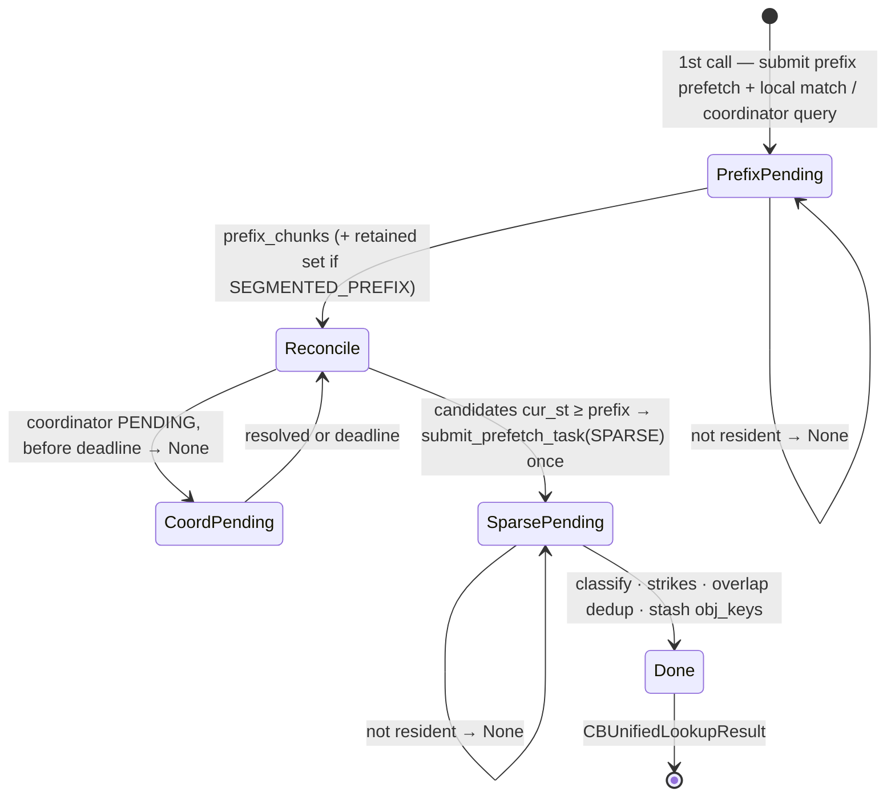

# Blend server (`lmcache/v1/multiprocess/modules/blend/`)

The blend module implements **non-prefix KV reuse** on the LMCache
multiprocess server.

## Package layout

```text
blend/
├── module.py            BlendModule: mixin composition, __init__ (all state),
│                        get_handlers, protocol handshake, liveness, close
├── lookup.py            LookupMixin — CB_UNIFIED_LOOKUP FSM: prefix leg,
│                        local fingerprint match, coordinator leg, sparse leg
├── registration.py      RegistrationMixin — CB_(UN)REGISTER_ROPE (rope
│                        state attach/detach)
├── store.py             StoreMixin — the STORE shadow: async fingerprint
│                        registration + drainers
├── retrieve.py          RetrieveMixin — CB_RETRIEVE_PRE_COMPUTED: planning
│                        section (invariant specs + flat int64 work tables)
│                        first, then the handler
├── matcher.py           pure: BlendTokenRangeMatcher (fingerprint index)
├── rope.py              pure: _CBRopeState, rope geometry rules
└── read_set.py          pure: per-leg object-group read sets and key
                         expansion
```

The pure modules have no server context, streams, or event bus — they are
CPU-testable by import. All mutable state is created in
`BlendModule.__init__`; mixin methods share it on `self`.

## Wire contract

Request ids are pinned and append-only (`protocols/base.py`); payload and
response shapes are frozen per `BLEND_PROTOCOL_VERSION`
(`protocols/blend.py`) — an incompatible shape change means a **new request
name**, never a changed one.

| RPC | Payload → Response | Semantics |
|---|---|---|
| `CB_REGISTER_ROPE` | `(instance_id, cos_sin_ipc[], head_size, is_neox, group_to_cache[], group_rot[][])` → `None` | idempotent; strips baked mscale; MLA must declare its rope window; zero caches = NoPE |
| `CB_UNREGISTER_ROPE` | `(instance_id)` → `None` | KV cache stays registered |
| `CB_UNIFIED_LOOKUP` | `(key, tp_size)` → `CBUnifiedLookupResult \| None` | submit-once / poll-on-recall; `None` = defer, client re-issues |
| `CB_RETRIEVE_PRE_COMPUTED` | `(key, matches[], gpu_block_ids[][], instance_id, event_ipc)` → `(event_ipc, scatter_ran)` | event is server-recorded; may be called more than once per request |
| `CB_PROTOCOL_HANDSHAKE` | `(client_version)` → `(server_version, compatible)` | client-gated by `cb.handshake`, default off |

`STORE` is shadowed: the blend module registers last, so its `store` wraps
`LMCacheDrivenTransfer.store` with fingerprint registration.

## Public API: inputs and outputs

The three data-plane RPCs share one key type: `IPCCacheServerKey` carries
`model_name`, the full `token_ids`, the `[start, end)` token range the call
covers, `request_id` (session tracking), and `worker_id` (TP rank).

**`cb_unified_lookup(key, tp_size) → CBUnifiedLookupResult | None`**

- In: `key` (chunk hashes are computed server-side); `tp_size` — a chunk
  counts as found only when every rank × read-group key is resident.
- Out: `None` while either leg's KV is still loading (client re-polls);
  else `prefix_coverage_tokens` (contiguous prefix coverage in tokens, what
  the standard LOOKUP would report) and `non_prefix_segments` (fingerprint
  matches beyond the prefix, `cur_st` order, each
  `(old_st, old_ed, cur_st, cur_ed, hash)`) — already sparse-prefetched,
  so the retrieve set equals this set.
- Side effects: sparse read locks taken and stashed on the session for the
  retrieve.

**`cb_retrieve_pre_computed(key, matches, gpu_block_ids, instance_id,
event_ipc) → (event_ipc, scatter_ran)`**

- In: `matches` — the lookup's `non_prefix_segments`, any order;
  `gpu_block_ids` — one block table per engine group, indexed by
  `engine_group_id`, possibly partially allocated (vLLM calls once per
  block-alloc round); `event_ipc` — the forward's CUDA event handle.
- Out: a freshly server-recorded scatter-complete event handle plus
  `scatter_ran` per the reason table below — `True` means every matched row
  the client forwards this step is backed by scattered KV, `False` means
  the client degrades the request (TP-consensus).
- Side effects: applied ranges recorded per `(request, worker)`; consumed
  read locks released stream-ordered after the scatter.

**`store(key, instance_id, gpu_block_ids, event_ipc) → (event_ipc,
success)`**

- In/out: identical to `LMCacheDrivenTransfer.store`, which it wraps.
- Side effect (worker 0 only): the stored range's chunk hashes are enqueued
  for fingerprint registration through the device host-func dispatcher
  (`submit_callback_to_stream`, kind `"cb_fingerprints"`) — stream-ordered
  after the L1 commit, so a fingerprint becomes matchable only once its
  chunk is readable. Fingerprint failures are logged, never raised.

## Unified lookup (submit-once, poll-on-recall)

The handler never holds a worker thread across L2→L1 loads: the first call
submits work and returns `None`; each later call polls, returning `None`
until every leg is resident.



The two legs trim opposite ways:

| | Prefix leg (`PREFIX` / `SEGMENTED_PREFIX`) | Non-prefix leg (`SPARSE`) |
|---|---|---|
| Keys | contiguous chunk-hash chain from 0, over `prefix_gids` (attention + recurrent) | matched chunks anywhere, over blend `gids` (attention + aux) |
| Result | leading-ones count via the window-aware fold — truncate at the first gap; `SEGMENTED_PREFIX` additionally retains fully-loaded post-gap chunks (off for recurrent registrations) | keep every chunk whose **entire (read-group × rank) key set** loaded; no contiguity |
| Why | vLLM consumes the prefix as one `num_computed_tokens`; recurrent state needs unbroken history | chunks relocate independently; the forward recomputes the holes |

A chunk missing **any** rank's or **any** read group's key is dropped whole
and takes a stale strike (evicted from the matcher at the strike threshold);
the rest of the request proceeds. The found set's object keys are stashed in
`Session.extras` for the retrieve; whatever no retrieve consumes is released
by the session-destroy listener.

## Retrieve (plan-then-execute, all-or-nothing)

`cb_retrieve_pre_computed` fills temp slots from L1 (H2D), K-only re-RoPEs
the shifted subset, and scatters **per token** into the paged KV — so
non-block-aligned matches and partial vLLM blocks shared with recomputed
tokens are written correctly. The whole request is one flat native plan
(invariant specs cached per GPU context, stamped with the request's slot
mappings; work encoded as numpy int64 tables) enqueued in a single
`cuda_ops` call. There is no fallback path: when the plan cannot be built
the retrieve fails cleanly and the client degrades that request to full
recompute.

The scatter is **all-or-nothing** — never partial. Zero-work returns are
reported with a fixed reason code on `CB_RETRIEVE_NOOP`:

| Reason | `scatter_ran` | When | Client effect |
|---|---|---|---|
| (success) | `True` | every matched range scattered | blend forward proceeds |
| `already_applied` | `True` | repeat call, same destination blocks | no-op by design |
| `matches_beyond_alloc` | `True` (no publish) | **all** matches beyond the allocated slots | defer to vLLM's full-alloc follow-up call; locks stay held |
| `matches_straddle_alloc` | `False` | **some** matches beyond the allocated slots while others are forwarded this step | client degrades the request to full recompute (TP-consensus, no raise) |
| `no_object_keys` | `True` | nothing to read | silent full recompute |
| read/scatter failure | `False` | prefetched objects unavailable, or an exception mid-scatter | client degrades the request |

Invariant: `scatter_ran=True` implies every matched row the client forwards
this step is backed by scattered KV. Every return path exports a **freshly
recorded server event** — echoing the caller's own IPC handle back makes the
worker re-import it (CUDA "invalid device context").

Repeat calls are keyed by the destination blocks each range writes into
(bounded LRU per `(request, worker)`): block-table growth keeps a range
applied, a reassigned destination re-scatters.

## Locks

Sparse-prefetch read locks follow one rule: exactly one owner releases each
reservation. The retrieve releases applied ranges stream-ordered after the
scatter, releases lookup-stash orphans it will never read, and leaves
beyond-slot-bound ranges locked for the follow-up call; anything never
consumed by a retrieve is released on session destruction.

## Observability

Every `cb.*` span/event is published from the code path it measures:
`CB_REQUEST_*`, `CB_LOOKUP_*`, `CB_PREFIX_LOOKUP_*`,
`CB_FINGERPRINT_MATCH_*`, `CB_COORDINATOR_MATCH_*`, `CB_SPARSE_PREFETCH_*`,
`CB_RETRIEVE_*`, `CB_SCATTER_*`, `CB_RETRIEVE_NOOP`,
`CB_FINGERPRINTS_REGISTERED`, `CB_CHUNKS_EVICTED`. Retrieve/scatter events
stamp `worker_id` so the metrics subscriber can pair START/END per rank at
TP>1. `cb.request` is closed by whichever path finishes the request: the
lookup when there is nothing to retrieve, otherwise the last retrieve.
