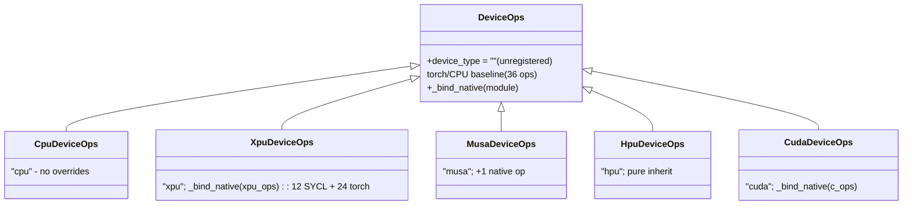

# Design: Unified Device Ops via `DeviceOps` Abstraction

---

## 1. Goal

Unify the per-device **ops** (callable ops plus shared types, currently
exposed as `lmcache.c_ops`) behind a single `DeviceOps` abstraction in
`lmcache/v1/platform/`, alongside the existing device abstractions
(`DeviceIPCWrapper`, `PinMemoryBackend`, `BaseCacheContext`).

**The torch reference implementation moves *into* `DeviceOps`.** The base class
*is* the CPU/torch backend — `python_ops_fallback.py` is
**deprecated entirely**, its logic migrated into the platform package. Every device
(CUDA, XPU, MUSA, HPU) is a `DeviceOps` subclass that overrides only what it
accelerates and inherits the torch baseline for everything else.

---

## 2. What exists today

| Concern | Mechanism | Location |
|---------|-----------|----------|
| Compiled CUDA ops | `PYBIND11_MODULE(c_ops)` — 36 ops + 3 types (+`GPUKVFormat` alias) | `csrc/pybind.cpp` |
| Compiled SYCL ops | `PYBIND11_MODULE(xpu_ops)` — 12 ops + 2 enums (+`GPUKVFormat`); **24 ops fall back to torch** | `csrc/sycl/pybind_sycl.cpp` |
| Torch/CPU reference | `python_ops_fallback.py` — 36 ops + 3 types | `lmcache/python_ops_fallback.py` |
| MUSA ops | Python adapter: import `py_ops`, override 1 fn, optional native | `lmcache/v1/platform/musa/ops.py` (**deleted**; now `musa/device_ops.py`) |
| HPU ops | None — uses torch baseline entirely | (via `DeviceOps` inheritance) |
| Runtime selection | `_install_c_ops_shim()`: resolves `DeviceOps` via `DeviceSpec.ops_cls` | `lmcache/__init__.py` |
| Build selection | `BuildProfile` subclasses auto-discovered | `setup_extensions/build_profiles/` |
| Device services registry | `DeviceIPCWrapper`/`PinMemoryBackend`/`BaseCacheContext` auto-discovered by `device_type` | `lmcache/v1/platform/` |

### 2.1 Current Problems

1. **Two parallel selection mechanisms.** The former `_get_backend()` used a hand-maintained
   `backend_candidates` list + `__dict__.update` merge — separate from the clean
   `device_type`-keyed registry `platform/` already uses for IPC, pin-memory, and
   cache-context.

2. **Fragile Module-merge** `merged.__dict__.update(backend.__dict__)`
   silently shadows symbols, copies private helpers, and has no contract. A new
   backend can accidentally override or miss a symbol with no error.

3. **`xpu_ops` covers only 12/36 ops.** The other 24 come from the Python fallback.

4. **No typed contract.** Nothing declares "these are the 36 ops every device
   provides or inherits." `test_c_ops_parity.py` checks at runtime only.

5. **The torch reference is a free-floating module**, not owned by any device
   abstraction — it's referenced by name (`python_ops_fallback`) from several
   call sites.


---

## 3. The `DeviceOps` Abstraction

### 3.1 The dispatch model

Plain methods + inheritance:

- The base defines all ops as **explicit thin methods** that delegate to
  `_torch_impl` (the migrated torch/CPU baseline). This is the composite/CPU
  fallback.
- A subclass overrides only what it accelerates with a normal method; everything
  else inherits the baseline.
- Every backend subclasses `DeviceOps` directly and binds its compiled module
  via `self._bind_native(module)` — one mechanism for all. Whole-module backends
  (CUDA) shadows all 36; partial ones (XPU) shadow the few they ship; missing
  ops keep the torch baseline. Devices may also override hot ops with Python.

The one-line base methods are intentional boilerplate: they keep the contract
visible to type-checkers, and `_bind_native` shadows them at instance level when
a native op exists. There is a single lineage with no hand-written native stubs.

### 3.2 Base class — contract + torch baseline

`lmcache/v1/platform/base_device_ops.py`:

```python
# SPDX-License-Identifier: Apache-2.0
"""Per-device ops backend: the unified ``lmcache.c_ops`` surface.

The base class owns the full 36-op contract with a device-agnostic
torch implementation (migrated from the former ``python_ops_fallback.py``)
that runs anywhere torch runs, including CPU. Accelerators bind a compiled
module via ``_bind_native`` so native ops shadow the baseline while every
unbound op keeps the torch implementation.
"""
from __future__ import annotations
from typing import Any, Callable, ClassVar

from lmcache.v1.platform import _torch_impl      # migrated impl (functions)
from lmcache.v1.platform.ops_types import (      # migrated shared types
    TransferDirection, EngineKVFormat, PageBufferShapeDesc, set_shape_desc_dtype,
)

#: The complete ops contract.
OPS: frozenset[str] = frozenset({...})         # the op names


class DeviceOps:
    """Strategy base: explicit ops + shared types for one device type.

    Concrete subclasses set :attr:`device_type` and override only the ops they
    accelerate; everything else inherits the torch baseline below. The base
    itself has no ``device_type`` (empty), so it is never registered as a
    device — it is pure baseline + contract.
    """
    device_type: ClassVar[str] = ""        # base is unregistered

    # Shared types are real class attributes (devices share identical enums).
    TransferDirection = TransferDirection
    EngineKVFormat = EngineKVFormat
    GPUKVFormat = EngineKVFormat            # back-compat alias
    PageBufferShapeDesc = PageBufferShapeDesc
    set_shape_desc_dtype = staticmethod(set_shape_desc_dtype)

    # --- explicit thin methods delegating to the torch baseline ---
    def multi_layer_kv_transfer(self, *a, **k):
        return _torch_impl.multi_layer_kv_transfer(*a, **k)
    def multi_layer_block_kv_transfer(self, *a, **k):
        return _torch_impl.multi_layer_block_kv_transfer(*a, **k)
    def lmcache_memcpy_async(self, *a, **k):
        return _torch_impl.lmcache_memcpy_async(*a, **k)
    # ...  more, one line each (mechanical, generatable from OPS) ...

    def _bind_native(self, module) -> None:
        """Bind a whole compiled module: native op shadows base method;
        missing ops keep the torch baseline."""
        for name in OPS:
            fn = getattr(module, name, None)
            if fn is not None:
                setattr(self, name, fn)
```

> `_torch_impl` holds the migrated implementation as module-level functions. It
> is **internal** to the platform package. The stubs are typed and visible to
> IDEs; `OPS` is the contract for the parity test (and `_bind_native`).

### 3.3 What gets deleted / migrated

| Old | New |
|-----|-----|
| `lmcache/python_ops_fallback.py` | **deleted** — all consumers import `_torch_impl` / `ops_types` directly |
| — its 36 public ops | → `platform/_torch_impl.py` (module functions) |
| — its private helpers (`_transfer_*`, `_tensor_from_ptr`, …) | → `platform/_torch_impl.py` (private) |
| — its types (`TransferDirection`, `EngineKVFormat`, `PageBufferShapeDesc`, `set_shape_desc_dtype`) | → `platform/ops_types.py` |
| `import lmcache.python_ops_fallback` (3 call sites) | → import from `platform.ops_types` (types) |
| back-compat shim `python_ops_fallback.py` | **removed** — every importer now targets `_torch_impl` + `ops_types` directly |

---

## 4. Per-Device `DeviceOps` Subclasses

### 4.0 Class hierarchy



**`DeviceOps` is the pure CPU/torch fallback — no GPU, no accelerator, no
compiled module required.** It runs anywhere torch runs and owns all ops.

Every accelerator extends `DeviceOps` directly and binds its compiled module
with `_bind_native`: CUDA binds a whole `.so` (all 36), XPU binds its 12, MUSA
overrides 1, HPU binds nothing. One mechanism; the torch baseline fills the rest.

### 4.1 CPU — the base (no subclass logic)

```python
# platform/cpu/device_ops.py
class CpuDeviceOps(DeviceOps):
    device_type = "cpu"            # the only registered torch-baseline device
    # No overrides. Inherited base methods -> _torch_impl ARE the CPU backend.
```

### 4.2 CUDA (& ROCm) — bulk-bind the whole module

Same shape as XPU: subclass `DeviceOps`, `_bind_native` the compiled module so
all 36 ops shadow the baseline. No native stubs.

```python
# platform/cuda/device_ops.py
class CudaDeviceOps(DeviceOps):
    device_type = "cuda"
    def __init__(self) -> None:
        import lmcache.c_ops as native
        self._bind_native(native)          # all 36 ops -> lmcache.c_ops
        type(self).TransferDirection = native.TransferDirection
        type(self).EngineKVFormat = native.EngineKVFormat
        # ... (rebind pybind types)
```

> CUDA keeps all current sources (`csrc/*.cu`, `mem_alloc.cpp`, recorders)
> **unchanged**; the module keeps the name `c_ops`.  ROCm/HIP also builds
> `lmcache.c_ops` (via hipify) and PyTorch ROCm masquerades as `torch.cuda`,
> so `CudaDeviceOps` handles ROCm automatically — no separate `hip/`
> package is needed.  The base's 36 typed stubs are the only contract;
> `_bind_native` shadows them with native ops — one mechanism shared
> with XPU/MUSA.

### 4.3 XPU — preserve existing SYCL + torch split

Migrate today's XPU exactly — `XpuDeviceOps` bulk-binds the existing
`lmcache.xpu_ops` (12 SYCL kernels in `csrc/sycl/`) via `_bind_native` and
inherits the torch baseline for the other 24. No new kernels, no behavior
change; only the merge mechanism moves to the registry.

```python
# platform/xpu/device_ops.py
from lmcache.v1.platform.base_device_ops import DeviceOps

class XpuDeviceOps(DeviceOps):
    """12 SYCL ops over the torch baseline — identical to today's xpu_ops merge."""
    device_type = "xpu"

    def __init__(self) -> None:
        try:
            import lmcache.xpu_ops as sycl
        except ImportError:
            return  # SYCL not built: stay on torch baseline, no degradation
        self._bind_native(sycl)            # 12 SYCL ops shadow base; 24 inherit
```

> Same 12 SYCL + 24 torch split as the former `_get_backend()` merge, just
> resolved through the registry instead of `__dict__.update`. The 19 host-side
> ops keep tensor-backed torch paths; if SYCL is absent it falls through to the
> baseline (no degradation vs today, where xpu_ops is also optional).
>
> **Pointer-mode caveat.** Today `_tensor_from_ptr` reconstructs raw pointers
> only for CPU and CUDA. The XPU path is tensor-backed; raw-pointer support can
> be added later if needed.

### 4.4 MUSA — existing adapter, reshaped as a subclass

```python
# platform/musa/device_ops.py
class MusaDeviceOps(DeviceOps):
    device_type = "musa"
    def multi_layer_block_kv_transfer(self, *a, **k):
        from lmcache.v1.platform.musa.native_kv_transfer import (
            try_native_multi_layer_block_kv_transfer,
        )
        if _tensor_backed(k) and try_native_multi_layer_block_kv_transfer(...):
            return
        return super().multi_layer_block_kv_transfer(*a, **k)  # torch baseline
```

Former `platform/musa/ops.py` logic moved into `MusaDeviceOps`. Zero behavior change; `musa/ops.py` deleted.

### 4.5 HPU — inherit the baseline

```python
# platform/hpu/device_ops.py
class HpuDeviceOps(DeviceOps):
    device_type = "hpu"
    # All 36 inherited from the torch baseline. This matches today's HPU path
    # when callers pass tensors; raw pointer reconstruction is not HPU-aware.
    # Add overrides later if profiling or pointer-mode callers require them.
```

No ops logic moves and there is **no behavior change**: HPU has no entry in
today's `backend_candidates`, so it already runs all 36 ops on the torch
fallback. `HpuDeviceOps` is an empty subclass that just gives the registry a
`device_type = "hpu"`. The separate `gpu_connector/hpu_connector.py` is a
cache-context concern — out of scope here.

---

## 5. Registration & Discovery

`DeviceOps` resolution now reuses the existing `DeviceSpec` discovery in
`lmcache.v1.platform._DEVICE_REGISTRY`; there is no second, dedicated ops
registry.

```python
# platform/base_device_spec.py
class DeviceSpec:
    @property
    def ops_cls(self) -> type[DeviceOps]:
        """DeviceOps subclass providing the ``lmcache.c_ops`` surface."""
        from lmcache.v1.platform.base_device_ops import DeviceOps

        return DeviceOps


# platform/cuda/__init__.py
class CudaDeviceSpec(DeviceSpec):
    @property
    def ops_cls(self) -> type[DeviceOps]:
        from lmcache.v1.platform.cuda.device_ops import CudaDeviceOps

        return CudaDeviceOps
```

The import lives inside the property body on purpose:

- It avoids reintroducing the `lmcache` / `lmcache.v1.platform` import cycle
  that would appear if `_torch_impl` or a native `.so` were pulled into the
  platform package at discovery time.
- It keeps native CUDA loading deferred until `CudaDeviceOps.populate_module()`,
  preserving the current `lmcache.c_ops` shim bootstrap ordering.

Resolution is still fail-fast for accelerators. If `_install_c_ops_shim()` is
asked for `"cuda"` / `"xpu"` / `"musa"` / `"hpu"` and no `DeviceSpec` is
registered, it raises instead of silently falling back to the torch baseline.
The normal CPU path resolves through `CpuDeviceSpec -> CpuDeviceOps`; only `""`
(and a deliberately cleared CPU registry in tests / CLI-only fallback paths)
uses the bare `DeviceSpec -> DeviceOps` baseline.

### 5.1  `platform/` tree

After the refactor (★ = new, ✗ = deleted):

```text
lmcache/v1/platform/
  __init__.py                 # bootstraps backend pkgs; lazy c_ops shim
  base_device_spec.py         # ★ DeviceSpec + lazy ops_cls default
  base_device_ops.py          # ★ DeviceOps base + OPS contract + _bind_native
  _torch_impl.py               # ★ migrated torch/CPU impl (was python_ops_fallback)
  ops_types.py                # ★ TransferDirection, EngineKVFormat, PageBufferShapeDesc
  base_cache_context.py       # (unchanged) sibling abstractions
  base_ipc_wrapper.py
  base_pin_memory.py
  cache_context.py
  device_ext.py
  event_notifier.py
  _registry.py
  cpu/
    __init__.py               # ★ CpuDeviceSpec.ops_cls -> CpuDeviceOps
    device_ops.py             # ★ CpuDeviceOps (no overrides = base)
    cache_context.py
    shm.py
    stub_cpu_device.py
  cuda/
    __init__.py               # ★ CudaDeviceSpec.ops_cls -> CudaDeviceOps
    device_ops.py             # ★ CudaDeviceOps (_bind_native c_ops; rename deferred)
    cache_context.py
    ipc_wrapper.py
    pin_memory.py
  xpu/                        # ★ new
    __init__.py               # ★ XpuDeviceSpec.ops_cls -> XpuDeviceOps
    device_ops.py             # ★ XpuDeviceOps (12 SYCL + 24 torch)
    torch_kv_transfer.py      # ★ XPU-tuned fast paths
  musa/
    __init__.py               # ★ MusaDeviceSpec.ops_cls -> MusaDeviceOps
    device_ops.py             # ★ MusaDeviceOps (moved from ops.py)
    native_kv_transfer.py
  hpu/                        # ★ new
    __init__.py               # ★ HpuDeviceSpec.ops_cls -> HpuDeviceOps
    device_ops.py             # ★ HpuDeviceOps (inherits baseline)

setup_extensions/build_profiles/
  cuda.py                     # builds lmcache.c_ops (c_ops_cuda rename deferred)
  sycl.py                     # builds lmcache.xpu_ops
  rocm.py                     # builds lmcache.c_ops (hipified)
  musa.py                     # stub
```

---

## 6. Runtime Resolution

The per-device op merge is replaced by `DeviceSpec`-based lookup. The existing
`import lmcache.c_ops` call sites keep working via a module shim built from the
resolved `DeviceOps` class.

```python
# lmcache/__init__.py
def _install_c_ops_shim() -> None:
    from lmcache.v1.platform import get_device_spec
    from lmcache.v1.platform.base_device_spec import DeviceSpec

    spec = get_device_spec(torch_device_type)
    if spec is None:
        if torch_device_type in ("", "cpu"):
            spec = DeviceSpec()
        else:
            raise RuntimeError(...)

    ops_cls = spec.ops_cls

    shim = types.ModuleType("lmcache.c_ops")
    ops_cls.populate_module(shim)
    sys.modules["lmcache.c_ops"] = shim
```

---

## 7. Native Compiled Modules (unchanged)

`DeviceOps` changes only how kernels are *selected*, not how they are built:

---

## 8. Build System

setuptools + auto-discovered `BuildProfile`s in `setup_extensions/build_profiles/`.
**No build change is required for this phase**: the CUDA extension keeps the
name `lmcache.c_ops` (the `c_ops -> c_ops_cuda` rename is deferred to a later
phase). All profiles (`cuda.py`, `sycl.py`, `rocm.py`, `musa.py`) are untouched.

---

## 9. Per-Device Effort Matrix

**Base classes** (not devices — no `device_type`, never registered):

| Base | Role | Op code |
|------|------|---------|
| `DeviceOps` | Torch/CPU baseline; owns the op contract; binds native via `_bind_native` | all torch impls |

**Per-device subclasses:**

| Device | DeviceOps subclass | Overrides | Native work | Total effort |
|--------|-------------------|-----------|-------------|--------------|
| CPU | `CpuDeviceOps(DeviceOps)` | none (base = torch) | none | migrate `python_ops_fallback` → `_torch_impl` |
| CUDA | `CudaDeviceOps(DeviceOps)` | 36 via `_bind_native(c_ops)` | none (keep `.cu`) | **low** |
| HIP/ROCm | handled by `CudaDeviceOps` | (same as CUDA; ROCm builds `c_ops` via hipify, PyTorch masquerades as `torch.cuda`) | hipify profile exists | N/A |
| XPU | `XpuDeviceOps(DeviceOps)` | 12 via `_bind_native(xpu_ops)` + 24 torch | existing SYCL build | **low** |
| MUSA | `MusaDeviceOps(DeviceOps)` | 1 native op | none | **low** (mechanical) |
| HPU | `HpuDeviceOps(DeviceOps)` | none (inherits torch) | none | **low** |

---

## 10. Adding a New Device — Scalability

To add device `foo`:

1. Create `platform/foo/device_ops.py`:
   ```python
   class FooDeviceOps(DeviceOps):
       device_type = "foo"
       # override only what you accelerate; inherit the torch baseline
   ```
   If `foo` ships a whole compiled `.so`, bind it: `_bind_native(foo_ops)` in
   `__init__` — same as CUDA/XPU.
2. Define `platform/foo/__init__.py` with a `FooDeviceSpec(DeviceSpec)` override:
   ```python
   class FooDeviceSpec(DeviceSpec):
      @property
      def ops_cls(self) -> type[DeviceOps]:
          from lmcache.v1.platform.foo.device_ops import FooDeviceOps

          return FooDeviceOps
   ```
   Keep the import inside the property body so spec discovery stays lazy and
   side-effect-free.
3. *(Optional, native kernels)* add `setup_extensions/build_profiles/foo.py`.

**Zero edits** to the resolver or any other device. A torch-only device works
immediately once its `DeviceSpec` points at a `DeviceOps` subclass.

---
