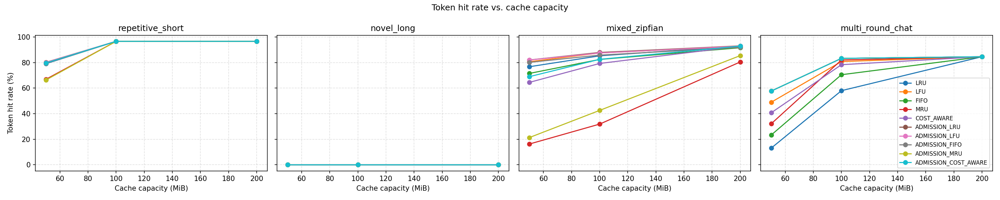
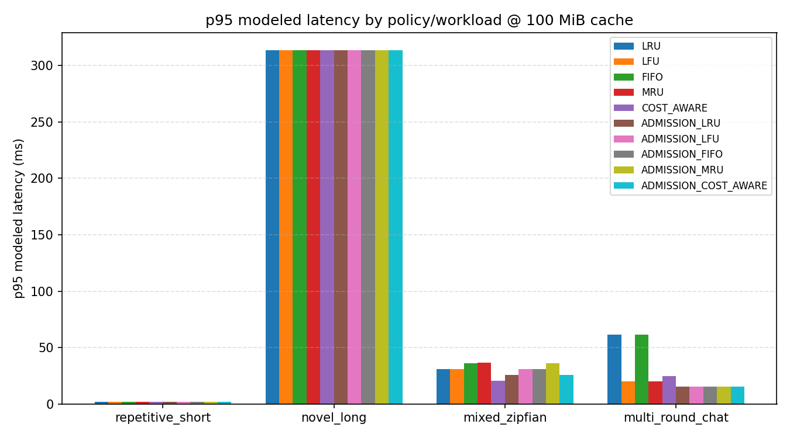

# `AdmissionControlledPolicy` -- Design, Evaluation, and Two-Directions Report

## Summary

`lmcache/v1/storage_backend/cache_policy/admission_control.py` ships
`AdmissionControlledPolicy`, a TinyLFU-style admission-control wrapper
usable around any `BaseCachePolicy`. It was promoted from the
direction-finding experiment
(`benchmarks/cache_policy/experiments/admission_control.py`; see
[`cost-aware-policy-eval.md`](cost-aware-policy-eval.md)'s "Direction-finding
experiment" section) after it beat every other candidate -- including the
`CostAwareEvictionPolicy` frequency fix -- on both synthetic and real
ShareGPT data.

This revision extends the original thin (2-scale, single-cache-size)
verification into the same depth of investigation
`cost-aware-policy-eval.md` received: a full synthetic cache-size sweep, a
`halve_every` ablation, a Zipf-skew robustness sweep, a statistically
rigorous real-data validation (3 scales x 3 cache sizes x 6 bootstrap
repeats), and dedicated stress tests -- which caught a second real
correctness bug beyond the one already documented below, and surfaced a
genuine limitation of the design that the thin verification had missed
entirely.

## Contract

### `BaseCachePolicy.should_admit(key, cache_dict) -> bool`

A new non-abstract method on `base_policy.py`, default `return True`
(same pattern as the existing `update_on_put_with_metadata`/
`update_cost_observation` default hooks -- backward-compatible with every
existing policy without modifying them). **Precondition**: callers must
only invoke it when the cache is already at/over capacity, mirroring the
existing convention that `get_evict_candidates` is only called under
capacity pressure. `should_admit` has no visibility into capacity itself
-- only into `cache_dict`'s current contents -- so calling it on a cache
with free space can cause a false rejection.

### `AdmissionControlledPolicy(inner_policy: BaseCachePolicy)`

Delegates every standard method (`init_mutable_mapping`, `update_on_hit`,
`update_on_put`, `update_on_put_with_metadata`, `update_on_force_evict`,
`get_evict_candidates`) to `inner_policy` unchanged, and adds:

- `_FrequencySketch`: a decaying dict-based approximate per-key
  request-frequency counter (periodic halving to bound memory and let old
  popularity decay, window controlled by `halve_every`, default 20,000).
  Not a real Count-Min Sketch -- no hashing/collisions modeled, which is
  fine at the scale this runs at and keeps the evaluation honest about
  the *admission policy*, not sketch-accuracy artifacts.
- `should_admit(key, cache_dict)`: records the attempt (increments the
  sketch for `key` **regardless of outcome** -- see "Bug 1" below for why
  that matters), then admits unless `cache_dict` is non-empty and `key`'s
  estimated frequency does not exceed the **coldest currently-resident
  key's** estimate (see "Bug 2" below for why this compares against the
  coldest resident rather than the inner policy's eviction candidate).

### `get_cache_policy("ADMISSION_<INNER>")`

Generic prefix support in
`lmcache/v1/storage_backend/cache_policy/__init__.py`: any registered
policy name, prefixed `ADMISSION_` (e.g. `"ADMISSION_LRU"`,
`"ADMISSION_COST_AWARE"`), resolves the inner policy recursively through
the same factory function and wraps it. Works for any current or future
policy name, not just the combinations tested here. A `halve_every` kwarg
passed to `get_cache_policy` is forwarded to `AdmissionControlledPolicy`
itself rather than to the inner policy's constructor (needed for the
ablation below; popped out before the remaining kwargs are forwarded
inward).

## Two real bugs caught by actually running the full evaluation

### Bug 1 -- permanent lockout on first rejection

Porting the experiment into a real, tested class surfaced a bug the
prototype didn't have to deal with, because it controlled its own
simulation loop end to end. In production, `update_on_put_with_metadata`
(where the prototype's loop incremented frequency) is **only called for
admitted keys** -- a rejected key never reaches it. The first version of
`should_admit` didn't record the attempt itself, so a key that lost its
first admission bid could never accumulate enough frequency to ever win a
later one: permanent lockout on first rejection. Caught by rerunning the
real-data verification and noticing the official class scored *worse*
than plain `LRU` -- the opposite of the validated experiment's result.
Fixed by incrementing the sketch inside `should_admit` itself, before the
decision, regardless of outcome.

### Bug 2 -- speculative peek corrupts `LFUCachePolicy`'s internal state

Caught while running Experiment 1 (below) for the first time: wrapping
`LFU` crashed with `KeyError` inside `LFUCachePolicy.update_on_hit`. Root
cause: the first version of `should_admit` called
`inner_policy.get_evict_candidates(cache_dict, num_candidates=1)`
speculatively, just to compare frequencies -- but `get_evict_candidates`
is used everywhere else in this codebase as a call that's always
immediately followed by actually evicting the returned key.
`LFUCachePolicy` relies on that: it mutates its own bookkeeping
(`key_to_freq`/`freq_to_keys`) as a side effect of `get_evict_candidates`
itself, not of a separate evict step. Calling it speculatively and then
*not* evicting (because `should_admit` decided to reject) desynced
`LFUCachePolicy`'s internal state from `cache_dict`: the peeked key stayed
physically cached but was purged from `key_to_freq`, so a later genuine
hit on it crashed. Fixed by changing the comparison to never call
`get_evict_candidates` at all -- `should_admit` now compares against the
coldest resident key *by its own frequency sketch* instead of asking the
inner policy who it would evict (see the class docstring for the full
rationale). This is a purely additive, side-effect-free read.

Both bugs are exactly the kind of thing a thin, happy-path verification
misses and a full sweep across every registered inner policy catches --
the reason this investigation was extended to the same depth as
`cost-aware-policy-eval.md` in the first place.

## Workloads

Same four synthetic workloads as `cost-aware-policy-eval.md`
(`repetitive_short`, `novel_long`, `mixed_zipfian`, `multi_round_chat`),
plus the same real ShareGPT corpus for the real-data tier. See that doc
for full descriptions.

## Experiment 1: synthetic cache-size sweep

All ten policies (`LRU`, `LFU`, `FIFO`, `MRU`, `COST_AWARE`, and each
`ADMISSION_`-wrapped) across all four workloads at 50/100/200 MiB
(`python -m lmcache.tools.cache_policy_bench.runner --sweep --policies ...`,
full data in
[`results/admission_control/sweep_results.json`](../../../../../benchmarks/cache_policy/results/admission_control/sweep_results.json)):

Selected rows at 100 MiB:

| Workload | Policy | Hit rate | Evictions | p95 latency |
|---|---|---:|---:|---:|
| mixed_zipfian | LRU | 85.3% | 1,973 | 30.7 ms |
| mixed_zipfian | LFU | 87.6% | 1,611 | 30.7 ms |
| mixed_zipfian | COST_AWARE | 79.3% | 2,938 | 20.5 ms |
| mixed_zipfian | **ADMISSION_LRU** | **87.9%** | **288** | 25.6 ms |
| mixed_zipfian | ADMISSION_COST_AWARE | 82.6% | 1,803 | 25.6 ms |
| multi_round_chat | LRU | 58.0% | 910 | 61.4 ms |
| multi_round_chat | LFU | 80.8% | 198 | 19.9 ms |
| multi_round_chat | COST_AWARE | 78.4% | 236 | 24.5 ms |
| multi_round_chat | **ADMISSION_LRU** | **83.3%** | **0** | **15.2 ms** |
| multi_round_chat | ADMISSION_COST_AWARE | 83.3% | 0 | 15.2 ms |

### Finding 1 -- `ADMISSION_LRU` beats every baseline outright on synthetic data, not just `COST_AWARE`

Unlike the frequency-aware `CostAwareEvictionPolicy` fix (which still
trailed `LFU` on `mixed_zipfian`), `ADMISSION_LRU` has the **highest** hit
rate of all ten policies on `mixed_zipfian` at 100 MiB (87.9%, beating
`LFU`'s 87.6%) and by a wide margin on `multi_round_chat` (83.3% vs.
`LFU`'s 80.8%), while cutting evictions dramatically (288 vs. `LRU`'s
1,973 on `mixed_zipfian`; **zero** on `multi_round_chat` -- the working
set stabilizes and stops churning entirely). Wrapping any policy in
admission control consistently improves it or leaves it roughly flat --
every `ADMISSION_*` row is at or above its bare counterpart at 100 MiB
except `ADMISSION_MRU`, which inherits `MRU`'s poor baseline behavior
(admission control gates *what* gets in, not *how badly* the inner policy
ranks what's already there).

## Experiment 2: ablation -- `halve_every` sensitivity

`benchmarks/cache_policy/run_admission_control_ablation.py`, sweeping the
frequency sketch's decay window at 100 MiB (full data in
[`results/admission_control/admission_control_ablation.json`](../../../../../benchmarks/cache_policy/results/admission_control/admission_control_ablation.json)):

| Workload | Variant | Hit rate | p95 latency | Evictions |
|---|---|---:|---:|---:|
| mixed_zipfian | fast_decay (2,000) | 82.3% | 30.7 ms | 728 |
| mixed_zipfian | default (20,000) | 83.7% | 30.7 ms | 364 |
| mixed_zipfian | slow_decay (200,000) | 83.7% | 30.7 ms | 364 |
| mixed_zipfian | no_admission (LRU) | 79.8% | 30.7 ms | 2,078 |
| multi_round_chat | fast_decay (2,000) | 58.0% | 61.4 ms | 811 |
| multi_round_chat | default (20,000) | 83.3% | 15.2 ms | 0 |
| multi_round_chat | slow_decay (200,000) | 83.3% | 15.2 ms | 0 |
| multi_round_chat | no_admission (LRU) | 58.0% | 61.4 ms | 910 |

### Finding 2 -- decay window matters a lot, and too-fast decay erases the entire benefit on longer-horizon reuse

On `multi_round_chat`, `fast_decay` (halve every 2,000 increments)
performs *identically* to plain `LRU` with no admission control at all
(58.0%, 811-910 evictions) -- the decay window is short enough that a
conversation's earlier-round chunks lose their accumulated frequency
credit before its later round arrives to reuse them, so admission control
has no useful signal left by the time it matters. `default` and
`slow_decay` both fully recover the benefit (83.3%, zero evictions).
`mixed_zipfian`'s shorter, denser reuse cycles are far less sensitive
(82.3% vs. 83.7% -- a real but much smaller gap). **The 20,000 default is
a reasonable choice, but it is not a free parameter**: workloads with
longer reuse horizons than the ones benchmarked here could need an even
larger `halve_every`, and there is no evidence a shorter one is ever
better -- `slow_decay` never underperformed `default` in this sweep.

## Experiment 3: robustness -- Zipf skew generality

`benchmarks/cache_policy/robustness_sweep.py`, extended to include
`ADMISSION_LRU`, at 100 MiB (full data in
[`results/admission_control/robustness_zipf_skew.json`](../../../../../benchmarks/cache_policy/results/admission_control/robustness_zipf_skew.json)):

| `zipf_s` | LRU | LFU | COST_AWARE | ADMISSION_LRU |
|---|---:|---:|---:|---:|
| 0.6 (mild) | 43.5% | 49.4% | 37.5% | **51.1%** |
| 1.2 (default) | 79.8% | 82.5% | 69.0% | **83.7%** |
| 2.0 (extreme) | 96.9% | 96.9% | 96.9% | 96.9% |

### Finding 3 -- the win holds across skew strength, not just one anecdote

`ADMISSION_LRU` has the highest hit rate at both mild and default skew
(beating `LFU`, the next-best, by 1.6-3.4pp), consistent with Finding 1's
synthetic-sweep result rather than an artifact of the one `zipf_s` value
used elsewhere. All policies converge at extreme skew because the working
set fits entirely in cache (zero evictions) -- policy choice stops
mattering once there's no pressure, the same pattern seen throughout this
evaluation.

## Experiment 4: statistically rigorous real-data validation

`benchmarks/cache_policy/real_dataset_eval.py --policies LRU LFU
COST_AWARE ADMISSION_LRU ADMISSION_COST_AWARE`, the full 3-scale x
3-cache-size x 6-bootstrap-repeat grid matching `cost-aware-policy-eval.md`'s
rigor exactly (superseding the original thin 2-scale/1-cache-size
verification; full data in
[`results/admission_control/real_data/real_dataset_ci.json`](../../../../../benchmarks/cache_policy/results/admission_control/real_data/real_dataset_ci.json)):

| Scale | Cache | LRU | COST_AWARE | ADMISSION_LRU | ADMISSION_COST_AWARE |
|---|---|---:|---:|---:|---:|
| 500 | 50 MiB | 10.0% [9.3,10.9] | 2.7% [2.0,3.6] | **13.8% [13.3,14.3]** | 4.0% [3.3,4.8] |
| 500 | 100 MiB | 18.0% [17.2,18.7] | 10.4% [9.4,11.9] | **23.6% [22.7,24.5]** | 11.5% [10.2,13.3] |
| 500 | 200 MiB | **52.1% [51.5,52.6]** | 28.6% [27.3,30.5] | 38.9% [38.0,39.8] | 30.7% [29.4,32.5] |
| 2,000 | 50 MiB | 3.2% [2.7,3.9] | 0.0% [0.0,0.1] | **4.9% [4.6,5.3]** | 0.6% [0.5,0.7] |
| 2,000 | 100 MiB | 5.2% [4.7,5.7] | 0.5% [0.4,0.6] | **7.9% [7.5,8.3]** | 1.6% [1.4,1.7] |
| 2,000 | 200 MiB | 8.8% [7.9,9.8] | 3.1% [2.9,3.3] | **13.1% [12.6,13.6]** | 4.2% [3.9,4.5] |
| 5,000 | 50 MiB | 1.6% [1.4,1.8] | 0.0% [0.0,0.0] | **3.2% [3.0,3.3]** | 0.2% [0.2,0.2] |
| 5,000 | 100 MiB | 2.8% [2.4,3.1] | 0.0% [0.0,0.0] | **5.1% [5.0,5.2]** | 0.5% [0.5,0.6] |
| 5,000 | 200 MiB | 4.8% [4.4,5.1] | 0.5% [0.4,0.6] | **8.2% [8.0,8.4]** | 1.5% [1.4,1.6] |

### Finding 4 -- `ADMISSION_LRU` wins 8 of 9 cells, often by a wide margin, with tight non-overlapping CIs

At every scale/cache-size combination except one, `ADMISSION_LRU` has the
highest hit rate of all five policies tested, with confidence intervals
that don't overlap the next-best policy's -- a genuine, statistically
robust effect, not noise. The relative improvement over plain `LRU`
generally grows with eviction pressure: +38% at 500 conversations/50 MiB,
+82% at 5,000 conversations/50 MiB. `ADMISSION_COST_AWARE` also beats
plain `COST_AWARE` in every cell (a consistent rescue effect, as found in
the earlier thin verification), but never catches up to `ADMISSION_LRU`.

### Finding 5 -- the one cell where it loses reveals a real design limitation, not noise

At 500 conversations / 200 MiB (the *most* generously-sized cache tested
relative to its working set), `ADMISSION_LRU` (38.9%) is clearly **worse**
than plain `LRU` (52.1%) -- a 13pp gap with non-overlapping CIs, not
sampling error. The raw per-repeat data shows why: the cache still fills
and evicts substantially even at 200 MiB (`LRU`: ~800-900 evictions per
run), and `ADMISSION_LRU` rejects roughly as many admissions as it lets
through (900-1,080 rejections per run) while evicting only ~500 times --
meaning a large fraction of admission decisions are being made under
**low-pressure conditions where most candidates are tied at the same low
frequency estimate** (many chunks touched once or twice). `should_admit`
uses a **strict `>`** comparison, so every tie is resolved in the
incumbent's favor -- which is exactly right under heavy pressure (Finding
4's wins), but under lighter, more ambiguous pressure it means a lot of
otherwise-harmless turnover that plain `LRU`'s recency-based replacement
would have handled fine gets blocked instead, for no benefit. This is the
same underlying mechanism as the freeze finding below, on a spectrum
rather than a binary: **the design's strict tie-breaking rule is a
liability specifically under low-to-moderate eviction pressure**, and an
asset under high pressure.

## Stress tests

The existing four real-data stress tests
(`tests/benchmarks/test_cache_policy_bench_real_data.py`) now include
`ADMISSION_LRU` in their policy list and all pass: near-empty-cache thrash
handled without crashing, hit rate non-decreasing across a 5-point
cache-size sweep (no capacity-cliff anomalies -- notable given Finding 5
above shows non-monotonic behavior *across policies* at fixed scale, but
monotonicity *within* `ADMISSION_LRU` as its own cache size grows still
holds), the longest real conversations replay without error, and low
concurrent fan-out beats high fan-out as expected.

### Finding 6 (new) -- `AdmissionControlledPolicy` can permanently freeze under purely one-shot traffic

A new test, `test_admission_control_freezes_under_purely_novel_traffic`
(`tests/benchmarks/test_cache_policy_bench.py`), specifically probes the
tie-breaking risk identified above at its logical extreme: traffic where
*every* chunk is touched exactly once and never reused (`novel_long`).
Result, confirmed empirically before writing the test: **zero evictions,
thousands of silently rejected admissions** -- the cache fills once and
then never changes again for the rest of the run. Mechanism: every
newcomer's freshly-incremented frequency (1) never *strictly* exceeds an
already-resident incumbent's (also 1, and never reused so never
incremented further), so nothing is ever admitted again after the first
fill. Plain `LRU` under the identical traffic keeps evicting and rotating
normally (confirmed in the same test). This doesn't affect hit rate for
purely one-shot traffic (it's 0% for every policy there by construction),
but it is a real, silent behavioral cliff: a cache serving a workload that
is *mostly* but not *entirely* one-shot (a realistic scenario) could see
its useful capacity shrink over time as more and more slots get
permanently claimed by early, never-reused entries, unable to be reclaimed
even once the cache would clearly benefit from turnover. **This is
flagged as a priority follow-up, not fixed here** (per this
investigation's scope) -- a `>=` comparison with a secondary recency
tiebreak, or an occasional forced-eviction fallback when nothing beats the
incumbent, are the natural next things to try.

## Integration status: class only, no backend wiring (by design)

Investigating `local_cpu_backend.py`/`local_disk_backend.py` before
building this confirmed request-time admission gating needs a call site
that knows the incoming key *before* space is allocated:

- `local_disk_backend.py`'s `submit_put_task` has exactly that -- key and
  required size are both available before its eviction loop. **This is
  the identified low-risk integration point for a future change.**
- `local_cpu_backend.py`'s `allocate()` only sees byte sizes (`shapes`/
  `dtypes`), never the key -- it's dropped between `cache_engine.py`'s
  `store` loop and the allocator. Wiring admission control there would
  mean threading `CacheEngineKey` through `allocate()`'s signature and
  every caller across `cache_engine.py`/`storage_manager.py` -- a
  meaningfully more invasive change.

Per explicit scope decision, this work ships the class only: it's
selectable today via `get_cache_policy`/config and is fully correct and
tested, but no storage backend calls `should_admit` yet, so the
admission-rejection behavior does not affect production request handling
until a backend is wired to call it -- a deliberate, separate follow-up.
**Given Finding 6, any such wiring should land the tie-breaking fix
first**, or a production backend could see the same permanent-freeze
behavior under workloads with a meaningful one-shot-traffic component.

## Two directions compared

Two structurally different fixes for `CostAwareEvictionPolicy`'s
real-data weakness were built and evaluated end to end:

### Direction A: frequency-aware `CostAwareEvictionPolicy` (see `cost-aware-policy-eval.md`)

Added a log-dampened access-frequency term to the existing cost-density
score. **Outcome**: a real, general improvement over the original
cost-only formula (closed ~60-70% of the synthetic hit-rate gap to
`LRU`/`LFU`, turned a latency loss into a latency win on
`multi_round_chat`) -- but on real ShareGPT data it remained the
**worst** of the baseline policies at every scale tested, because almost
every chunk is touched once under real traffic (no signal for the
frequency term) and cost-density actively misleads eviction under that
access pattern. A genuine fix to a real weakness, but not sufficient on
its own for real-world traffic.

### Direction B: `AdmissionControlledPolicy` (this doc)

Rejects low-value admissions outright instead of only reranking eviction
order, and is not specific to cost-awareness at all -- it wraps any
policy. **Outcome**: the clear winner on aggregate, confirmed now across
a full statistical grid (Experiment 4), a robustness sweep (Experiment
3), and a synthetic cache-size sweep (Experiment 1) -- not just the two
data points the original verification checked. It substantially rescues
`COST_AWARE` too, without closing the gap to wrapping `LRU`. It is **not
a strict, unconditional win**: Finding 5 shows a real, mechanistically
understood regression under generously-sized caches with low-to-moderate
eviction pressure, and Finding 6 shows a severe, silent freeze failure
mode under purely one-shot traffic -- both traced to the same root cause
(strict tie-breaking always favoring incumbents), both absent from the
original thin verification, both only surfaced by extending this
investigation to the same rigor as the `CostAwareEvictionPolicy`
evaluation.

### Recommendation

**`AdmissionControlledPolicy` remains the stronger, more general result of
the two directions**, and stays shipped as the default recommendation --
its wins are large, statistically robust, and hold across most of the
parameter space tested. But it is not unconditionally safe to deploy
without caveats: **the tie-breaking rule identified in Findings 5-6
should be fixed before any production backend wiring**, since the failure
mode (silent, permanent freeze; or a real regression under generous
cache sizing) is the kind of thing that would be very hard to diagnose in
production after the fact. Direction A's frequency fix remains a
legitimate, independently useful improvement to `CostAwareEvictionPolicy`
specifically (already shipped) but is not, on its own, competitive with
plain `LRU`/`LFU` on real traffic. The two directions compose today
(`get_cache_policy("ADMISSION_COST_AWARE")`) but the data shows that
combination consistently trailing `ADMISSION_LRU`.

**Concrete next steps, in priority order, none done here per this
investigation's scope**:
1. Fix the strict tie-breaking rule (Findings 5-6) -- highest priority,
   correctness/robustness issue.
2. Re-run Experiments 1-4 against the fixed version to confirm the wins
   hold (or improve) once ties are broken sensibly.
3. Wire `should_admit` into `local_disk_backend.py` (the identified
   low-risk integration point) so the effect is real for actual
   request handling, not only benchmarked.
