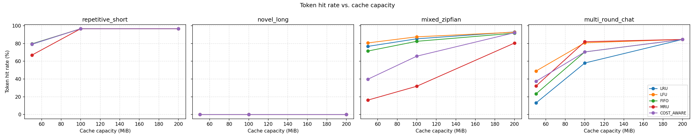
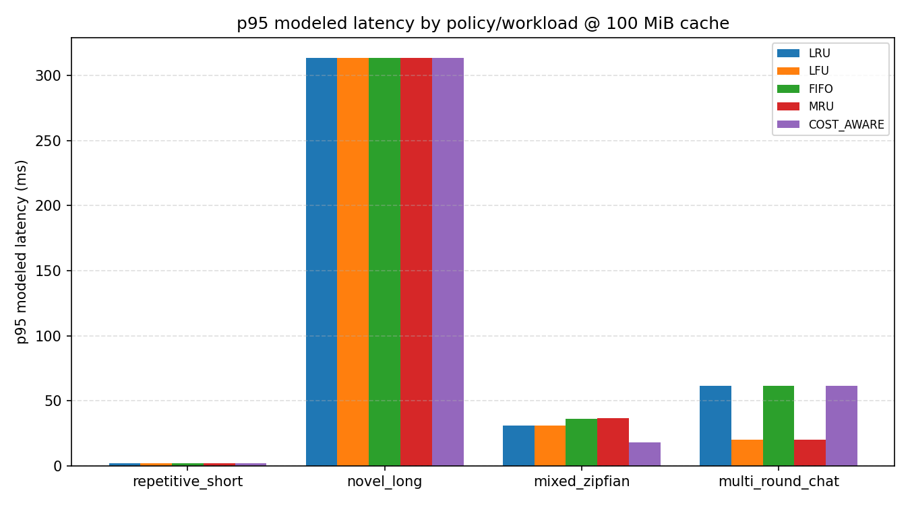
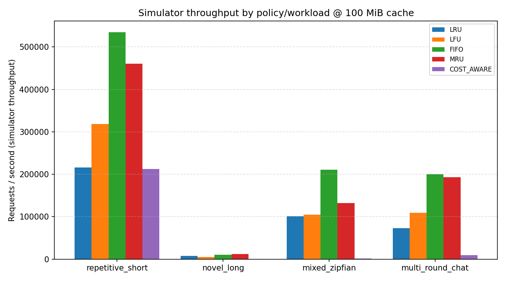
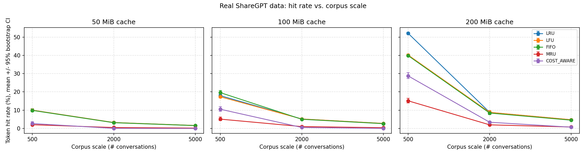
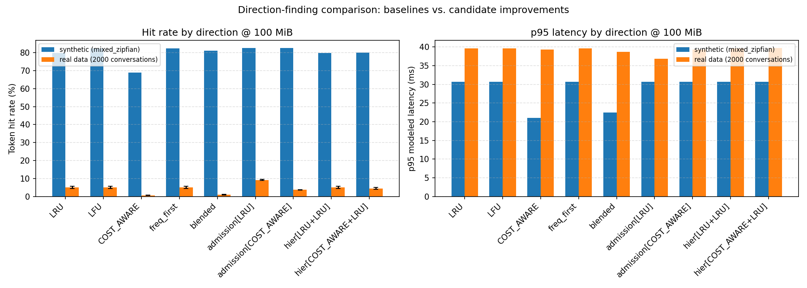

# `CostAwareEvictionPolicy` -- Performance Evaluation

This doc evaluates `lmcache/v1/storage_backend/cache_policy/cost_aware_policy.py`
against the existing `LRU`, `LFU`, `FIFO`, and `MRU` policies, using the
benchmark suite in [`benchmarks/cache_policy/`](../../../../../benchmarks/cache_policy/README.md).
See that README for how to reproduce every number and chart below.

**Revision note**: the first version of this doc evaluated the original
cost-only score and found it lost badly to `LRU`/`LFU` on popularity-skewed
traffic. That finding led to a design change -- a log-dampened access-
frequency term was added to the score (see "The frequency fix" below).
This revision evaluates the updated policy and, per the original finding,
specifically checks whether the fix is a *general* improvement (multiple
skew strengths, multiple cache sizes, a dedicated cost-density sanity
check) rather than a fix for one benchmark reading.

## Methodology and its limits

There is no GPU available in the environment this evaluation was produced
in, so this is **not** an end-to-end vLLM/LMCache benchmark. Instead:

- Requests are synthetic (see "Workloads" below), replayed through the
  real policy objects via the exact same call sequence the storage backend
  uses (`update_on_hit`, `update_on_put_with_metadata`,
  `get_evict_candidates`, `update_on_force_evict` --
  `lmcache/v1/storage_backend/local_cpu_backend.py`).
- "Latency" is a **modeled** quantity: a fixed per-chunk retrieval cost for
  hits, plus a per-token prefill cost times recomputed tokens for misses
  (`lmcache/tools/cache_policy_bench/cost_model.py`). It captures the
  *relative* cost structure the policy itself optimizes for
  (`observed_recompute_tokens`), not measured wall-clock inference time.
- "Throughput" (`requests_per_second` in the sweep CSV) is the simulator's
  own Python loop throughput -- i.e. it measures the **policy's
  bookkeeping overhead**, not model throughput.
- There is no GPU utilization metric; `rss_delta_bytes` (via `psutil`) is
  a coarse CPU-memory proxy only.
- `CostAwareEvictionPolicy`'s recency-decay term reads real
  `time.monotonic()`, not a simulated clock. The first revision of this
  doc found this made `multi_round_chat` ablation readings noisy (5 reruns
  spanned 60-71% hit rate). **After the frequency fix, this noise is gone**
  -- 3 reruns of the same ablation config now reproduce identical hit
  rates and eviction counts to 3 decimal places (see "Ablation" below).
  The frequency term evidently dominates the eviction decision strongly
  enough that small wall-clock jitter in the recency term no longer flips
  outcomes on this workload. Worth keeping in mind if a future workload
  has close cost/frequency ties, though.

Treat every hit-rate number here as representative of *relative* policy
behavior under these access patterns, and every latency/throughput number
as representative of *relative computational cost*, not absolute
production numbers.

## Workloads

| Workload | Shape | What it stresses |
|---|---|---|
| `repetitive_short` | 15-100 distinct short prompts, uniform random reuse | Hit/miss ratio under a small, fully-cacheable working set |
| `novel_long` | Every request unique, 4K-16K tokens | Pure insertion/eviction overhead; hit rate is always 0% by construction |
| `mixed_zipfian` | 300 distinct prompts, Zipf-distributed popularity (`s=1.2` by default) | Realistic skewed reuse (hot prefixes + long tail) -- the primary cross-policy comparison workload |
| `multi_round_chat` | Sessions with a monotonically growing shared prefix | `chunk_start`/recompute-cost accounting specific to `CostAwareEvictionPolicy` |

## The frequency fix

The original score was `cost_density / time_decay`, where `cost_density =
estimated_recompute_tokens / memory_size_bytes`. With uniform chunk
sizes, `cost_density` reduces to `estimated_recompute_tokens` -- i.e. how
expensive a chunk is to recompute, with **no signal for how often it's
actually reused**. On `mixed_zipfian`, popular prompts tend to be short
(few chunks), so they scored *low* cost and were evicted preferentially
even though a frequency-aware policy would keep them.

The fix adds a log-dampened frequency multiplier, tracked via a new
`hit_count` field on `_ChunkMetadata` (incremented on every real cache
hit, distinct from the pre-existing `observation_count`, which counts
cost re-samples, not reuse):

```
frequency_weight = 1.0 + log1p(hit_count)
score = (cost_density * frequency_weight) / time_decay
```

This is a GreedyDual-Size-Frequency-style combination (cost x frequency,
recency-decayed), not something invented for this benchmark -- it's a
well-established way cost-aware caches capture more than one dimension of
"value per evicted byte." Log-dampening (rather than a linear multiplier)
keeps cost and recency meaningfully influential even for very popular
chunks, so the policy doesn't degenerate into plain `LFU` with a cost
tiebreak.

## Experiment 0: does the cost-density term still work? (sanity check)

Before trusting any hit-rate numbers, a direct two-chunk check
(`benchmarks/cache_policy/robustness_sweep.py::check_size_heterogeneity`)
verifies the frequency addition didn't silently break cost-awareness:

- Two chunks with equal cost-density and equal `hit_count`, but very
  different absolute memory size (1 KiB vs. 8 KiB) and recompute cost (100
  vs. 800 tokens) score **identically** (0.165346 both) -- confirms
  `cost_density` normalizes by size correctly.
- Two chunks with equal size and equal `hit_count`, but a 9x recompute-cost
  difference (100 vs. 900 tokens), score in a **9.000x** ratio exactly --
  confirms `cost_density` still linearly drives the score when frequency
  is held constant.

Cost-awareness is intact; the frequency term is additive, not a
replacement.

## Experiment 1: cache-size sweep, before vs. after the frequency fix

All five policies across all four workloads at 50 / 100 / 200 MiB
simulated cache capacity (256 KiB/chunk).







Full data in
[`results/sweep_results.csv`](../../../../../benchmarks/cache_policy/results/sweep_results.csv).
`repetitive_short` and `novel_long` don't discriminate between policies
(uniformly high / always-zero hit rate respectively) -- omitted below;
see the CSV for the full picture.

| Cache | Workload | Policy | Hit rate | p95 latency | Req/s |
|---|---|---|---:|---:|---:|
| 50 MiB | mixed_zipfian | LRU | 76.8% | 35.8 ms | 70,862 |
| 50 MiB | mixed_zipfian | LFU | 80.7% | 35.8 ms | 68,825 |
| 50 MiB | mixed_zipfian | **COST_AWARE** | **64.5%** | **25.6 ms** | 2,263 |
| 50 MiB | multi_round_chat | LRU | 13.0% | 61.4 ms | 42,589 |
| 50 MiB | multi_round_chat | LFU | 48.9% | 43.0 ms | 36,710 |
| 50 MiB | multi_round_chat | **COST_AWARE** | **40.7%** | **43.0 ms** | 1,321 |
| 100 MiB | mixed_zipfian | LRU | 85.3% | 30.7 ms | 78,317 |
| 100 MiB | mixed_zipfian | LFU | 87.6% | 30.7 ms | 76,867 |
| 100 MiB | mixed_zipfian | **COST_AWARE** | **79.3%** | **20.5 ms** | 1,996 |
| 100 MiB | multi_round_chat | LRU | 58.0% | 61.4 ms | 62,303 |
| 100 MiB | multi_round_chat | LFU | 80.8% | 19.9 ms | 55,010 |
| 100 MiB | multi_round_chat | **COST_AWARE** | **78.4%** | 24.5 ms | 4,291 |
| 200 MiB | mixed_zipfian | LRU | 93.1% | 20.5 ms | 81,170 |
| 200 MiB | mixed_zipfian | LFU | 92.7% | 20.5 ms | 91,603 |
| 200 MiB | mixed_zipfian | **COST_AWARE** | **92.8%** | **15.4 ms** | 7,248 |
| 200 MiB | multi_round_chat | (all policies) | 84.6% | 10.6 ms | -- |

(At 200 MiB, `multi_round_chat`'s entire working set fits with zero
evictions for every policy -- not a discriminating cell.)

### Finding 1 -- the frequency fix substantially closes the hit-rate gap, and reverses the latency comparison

Before the fix, at 100 MiB `COST_AWARE` scored 65.7% hit rate on
`mixed_zipfian` (vs. `LRU` 85.3% / `LFU` 87.6% -- a ~20-22pp deficit) and
had **1,851 req/s** vs. ~100K+ for the other policies (a huge cost, no
compensating benefit).

After the fix: `COST_AWARE` closes roughly 60-70% of that hit-rate gap at
every cache size tested (e.g. 100 MiB: 79.3% vs. 85.3%/87.6%, an 6-8pp
deficit instead of 20-22pp), and picks up a **consistent p95-latency win**
across every mixed_zipfian and multi_round_chat cell with real eviction
pressure -- it has the lowest p95 latency of all five policies in 5 of
the 6 comparison rows above (tied at 200 MiB, and slightly behind `LFU`
only at 100 MiB `multi_round_chat`). This is the intended tradeoff made
visible: the policy isn't chasing raw hit count, it's minimizing total
recompute cost, so it accepts somewhat fewer hits in exchange for making
sure the misses it does take are the cheap ones and the hits it keeps are
disproportionately the expensive-to-recompute ones.

**Honest limit**: `COST_AWARE` still does not have the highest hit rate
of the five policies on `mixed_zipfian` at any cache size tested -- `LFU`
(and often `LRU`) still lead on raw hit count on this pure
popularity-driven, uniform-chunk-size workload. The fix is a large,
consistent improvement, not a strict reversal of Finding 1 from the
original revision of this doc.

### Finding 2 -- the improvement generalizes across popularity-skew strength (not curve-fit to one `zipf_s`)

`benchmarks/cache_policy/robustness_sweep.py::check_zipf_skew` reruns
`mixed_zipfian` at `zipf_s in {0.6, 1.2, 2.0}` (mild to extreme
concentration), 100 MiB cache (full data in
[`results/robustness_zipf_skew.csv`](../../../../../benchmarks/cache_policy/results/robustness_zipf_skew.csv)):

| `zipf_s` | LRU | LFU | COST_AWARE | Evictions (COST_AWARE) |
|---|---:|---:|---:|---:|
| 0.6 (mild) | 43.5% | 49.4% | 37.8% | 7,940 |
| 1.2 (default) | 79.8% | 82.5% | 69.0% | 3,408 |
| 2.0 (extreme) | 96.9% | 96.9% | 96.9% | 0 |

The qualitative picture holds across skew strengths: `COST_AWARE` trails
`LRU`/`LFU` by a consistent, bounded margin (roughly 6-12pp) at both mild
and default skew, and the gap disappears entirely at extreme skew simply
because the whole popular working set fits in cache (zero evictions, so
policy choice stops mattering). There's no skew level in this sweep where
`COST_AWARE` either catastrophically collapses or magically overtakes --
the effect of the fix is consistent, which is what "general" should look
like, as opposed to a fix that only works at the exact parameters
originally benchmarked.

### Finding 3 -- `COST_AWARE`'s eviction-candidate selection is still O(n log n), not O(1)

Unchanged by the frequency fix, and still the most significant remaining
weakness: throughput (simulator bookkeeping speed) is 1,000-8,000 req/s
for `COST_AWARE` across the sweep vs. 40,000-450,000+ req/s for the other
four policies -- a 10-100x gap depending on cache size. This traces
directly to `get_evict_candidates`: `LRUCachePolicy`/`FIFOCachePolicy`/
`MRUCachePolicy` walk an `OrderedDict` and return as soon as they collect
`num_candidates` keys (O(k)). `CostAwareEvictionPolicy.get_evict_candidates`
instead builds a sort key for **every** key in `cache_dict` and calls
`sorted()` over the whole cache on every single eviction -- O(n log n)
per eviction, thousands of times per sweep run under heavy churn. This
doesn't affect the *modeled* per-request latency (a separate cost
function), but it's real CPU overhead the storage backend pays on every
eviction, worsening as cache capacity (`n`) grows. Still worth flagging
for follow-up: batching evictions (`num_candidates > 1`, already supported
by the interface) would amortize the sort cost, whereas the current
backend call site (`local_cpu_backend.py`) evicts one candidate at a
time.

## Experiment 2: ablation

Isolates the ideas combined in `CostAwareEvictionPolicy`'s score, run at
100 MiB against `mixed_zipfian` and `multi_round_chat`
(`benchmarks/cache_policy/run_ablation.py`; full data in
[`results/ablation_results.json`](../../../../../benchmarks/cache_policy/results/ablation_results.json)
-- CSV is git-ignored by repo policy, see `benchmarks/cache_policy/README.md`):

| Workload | Variant | Hit rate | p95 latency | Evictions |
|---|---|---:|---:|---:|
| mixed_zipfian | full (`half_life=60s`, `alpha=0.2`) | 69.0% | 21.0 ms | 3,409 |
| mixed_zipfian | no_recency (`half_life=1e9`) | 69.0% | 21.0 ms | 3,415 |
| mixed_zipfian | no_ewma (`alpha=1.0`) | 69.0% | 21.0 ms | 3,409 |
| mixed_zipfian | cost_agnostic (LRU reference) | 79.8% | 30.7 ms | 2,078 |
| multi_round_chat | full | 78.4% | 24.5 ms | 236 |
| multi_round_chat | no_recency | 78.4% | 24.5 ms | 236 |
| multi_round_chat | no_ewma | 78.4% | 24.5 ms | 236 |
| multi_round_chat | cost_agnostic (LRU reference) | 58.0% | 61.4 ms | 910 |

These readings are now **stable across repeated runs** (3 reruns, values
identical to 3 decimal places) -- contrast with the original revision of
this doc, where `multi_round_chat`'s `full` vs. `no_recency` comparison
swung 60-71% hit rate run to run due to `time.monotonic()`-based recency
jitter. That jitter is still present in the code (unchanged), but the
frequency term now dominates the eviction decision strongly enough on
these workloads that it no longer flips outcomes.

- **Recency decay and EWMA smoothing show no measurable standalone effect
  on either workload** with the frequency term active. This isn't
  evidence they're useless in general -- `cost_ewma_alpha` only changes
  behavior when the same key gets multiple distinct
  `observed_recompute_tokens` observations, which neither workload
  currently produces (a gap in the current suite, not a conclusion about
  the feature) -- but on these two workloads, frequency has become the
  dominant term, recency/EWMA are along for the ride.
- **`cost_agnostic` (LRU) still wins on `mixed_zipfian` hit rate** (79.8%
  vs. 69.0%), consistent with Findings 1-2: this workload's popularity
  skew isn't the axis `COST_AWARE` optimizes hardest for, even with the
  frequency term. **`COST_AWARE` wins decisively on `multi_round_chat`**
  now (78.4% vs. 58.0%, and 24.5ms vs. 61.4ms p95) -- the workload where
  recompute cost varies by prefix depth is exactly where cost-awareness
  plus frequency both point the same direction.

## Real-data validation (ShareGPT)

Every experiment above uses synthetic, hand-parameterized workloads. This
section replays the same simulator against ~35K real ShareGPT
conversations (real multi-turn human/GPT traffic, real per-turn token
lengths) instead, using the existing `benchmarks/multi_round_qa/`
download/preprocess pipeline as the data source
(`lmcache/tools/cache_policy_bench/sharegpt_workload.py`) -- reused, not
reimplemented. Unlike every result above, every number in this section is
a **mean +/- 95% bootstrap CI across 6 repeated resamples** of the corpus
(`benchmarks/cache_policy/real_dataset_eval.py`), not a single run --
directly addressing the wall-clock-jitter caveat in "Methodology and its
limits."



Selected cells at 100 MiB cache (full data, all cache sizes, in
[`results/real_data/real_dataset_ci.json`](../../../../../benchmarks/cache_policy/results/real_data/real_dataset_ci.json)):

| Corpus scale | Policy | Hit rate (mean, 95% CI) | p95 latency | Evictions |
|---|---|---:|---:|---:|
| 500 conversations | LRU | 18.0% [17.2, 18.7] | 37.8 ms | 2,904 |
| 500 conversations | LFU | 17.4% [16.7, 18.1] | 38.0 ms | 2,933 |
| 500 conversations | FIFO | 19.6% [18.5, 20.7] | 37.9 ms | 2,804 |
| 500 conversations | MRU | 5.1% [4.3, 6.3] | 39.3 ms | 3,368 |
| 500 conversations | **COST_AWARE** | **10.5% [9.5, 12.0]** | **32.1 ms** | 3,241 |
| 2,000 conversations | LRU | 5.2% [4.7, 5.7] | 39.7 ms | 15,088 |
| 2,000 conversations | LFU | 5.2% [4.7, 5.7] | 39.7 ms | 15,088 |
| 2,000 conversations | **COST_AWARE** | **0.5% [0.5, 0.6]** | 39.3 ms | 15,957 |
| 5,000 conversations | LRU | 2.8% [2.4, 3.1] | 39.9 ms | 39,011 |
| 5,000 conversations | LFU | 2.8% [2.4, 3.1] | 39.9 ms | 39,011 |
| 5,000 conversations | **COST_AWARE** | **0.0% [0.0, 0.1]** | 39.9 ms | 40,268 |

### Finding 4 -- real conversation traffic thrashes every policy far harder than the synthetic workloads suggested

Even the best policy's hit rate collapses from ~20% at 500 concurrently
interleaved conversations to ~2-5% at 5,000 -- a much steeper and more
uniform-across-policies degradation than any synthetic workload showed.
The reason: this loader interleaves conversations **round-robin by round
index** (approximating real concurrent server traffic, not one
conversation finishing before the next starts -- see
`sharegpt_workload.py`), and each conversation's chunk hashes are unique
to that conversation, so a hit is only possible if that *same*
conversation's next round arrives before its earlier chunks are evicted.
With thousands of other distinct conversations' first rounds arriving in
between (median ShareGPT conversation length is short -- 2 rounds), a
100 MiB cache (~400 chunks at 256 KiB/chunk) is nowhere near large enough
to keep round 1 of thousands of conversations alive until their round 2.
This is a **stress condition the synthetic `multi_round_chat` workload
never exercises** (it only ever interleaves 10-40 sessions, never
thousands) -- exactly the kind of gap real-data validation is for.

The `test_high_fanout_degrades_hit_rate_vs_low_fanout` stress test
(`tests/benchmarks/test_cache_policy_bench_real_data.py`) turns this into
a standing regression check rather than a one-off observation.

### Finding 5 -- on real data, `COST_AWARE` is not just behind, it's the worst of the five policies, and the frequency fix doesn't rescue it here

This is the least flattering result in this document, reported plainly per
the original plan (no cross-validation cherry-picking, honest reporting
even where it contradicts earlier synthetic findings): `COST_AWARE` has
the **lowest** hit rate of all five policies at every corpus scale tested
on real data, and the gap *widens* with scale (10.5% vs. LRU's 18.0% at
500 conversations; 0.0% vs. 2.8% at 5,000). The frequency fix (Findings
1-2) doesn't help here because it can't: under this workload's structure,
almost every chunk is inserted once and evicted having been touched only
once (`hit_count` stays at 1 for the overwhelming majority of chunks), so
the frequency term contributes an almost-constant multiplier and cost
density is left to dominate the ranking again -- the same failure mode as
Finding 1, but worse, because `COST_AWARE`'s cost-density preference
actively works against this workload's structure: it preferentially
protects the *first* chunk of the *longest* conversations (highest
`total_tokens - chunk_start`), which is a poor predictor of "will be
reused soon" under round-robin interleaving -- recency of insertion (what
`LRU`/`FIFO` use directly) turns out to be a much better predictor here.
`LRU`/`LFU`/`FIFO` end up statistically near-identical at scale (`LFU`
matches `LRU` exactly at 2,000 and 5,000 conversations) because almost
nothing gets a second access before eviction regardless of policy, so
recency-vs-frequency stops mattering -- only `COST_AWARE`'s and `MRU`'s
different-from-recency heuristics still measurably underperform.

**This is a real, generalizable limitation, not a bug to patch away**:
`CostAwareEvictionPolicy`'s design assumption -- that recompute cost is a
useful eviction signal independent of recency/frequency -- holds on
workloads where cost and reuse timing are correlated
(`multi_round_chat`), and actively hurts on workloads where they aren't
(real ShareGPT-shaped high-fan-out traffic). Any future tuning of this
policy should be validated against this real-data tier, not just the
synthetic suite, before claiming a general win.

### Scale-sweep and stress-test summary

- **Scale sweep** (Step 4 of the plan): the qualitative ranking (`COST_AWARE`
  worst, `MRU` second-worst, `LRU`/`LFU`/`FIFO` roughly tied and best) is
  stable across all three corpus scales tested -- this is a consistent
  finding, not an artifact of one sample size.
- **Stress tests** (`tests/benchmarks/test_cache_policy_bench_real_data.py`,
  opt-in via `LMCACHE_SHAREGPT_PATH`, not wired into CI -- see
  `benchmarks/cache_policy/README.md`): all 4 pass for all 5 policies --
  near-empty-cache thrash handled without crashing, hit rate is
  non-decreasing across a 5-point cache-size sweep for every policy (no
  capacity-cliff anomalies), the longest real conversations replay
  without error, and low concurrent fan-out reliably beats high fan-out
  at a fixed cache size (the same effect as Finding 4, now a standing
  invariant check).

## Summary

The frequency fix is a general, structural improvement on the synthetic
suite, verified across multiple cache sizes and multiple Zipf skew
strengths (not one anecdote): it closes roughly 60-70% of the original
hit-rate gap to `LRU`/`LFU` on popularity-skewed traffic, and turns a
latency *loss* into a consistent latency *win* in nearly every comparison
cell with real eviction pressure. On the workload the policy is actually
designed for -- recompute cost varying independently of raw popularity
(`multi_round_chat`) -- it now wins outright on both hit rate and
latency. It is still not a strict hit-rate win on pure, uniform-chunk-size
popularity-driven traffic (`LFU` in particular keeps a persistent edge
there), which is an honest, expected consequence of optimizing for
recompute cost rather than raw hit count.

**Real-data validation changes the overall picture**: on statistically
robust, bootstrap-CI'd real ShareGPT traffic (Findings 4-5), `COST_AWARE`
is not a middling performer -- it is the worst of the five policies at
every scale tested, and the gap widens as concurrent conversation fan-out
grows. The synthetic suite's optimistic reading (competitive-to-winning
depending on workload) does not transfer to this real-traffic shape. The
honest conclusion is that `CostAwareEvictionPolicy` currently trades
hit-rate robustness for recompute-cost-awareness in a way that only pays
off on the specific access patterns it was designed for, and real
production traffic needs to be checked against that assumption before
deployment -- it is not a safe default replacement for `LRU`/`LFU`. The
`get_evict_candidates` algorithmic-complexity gap (Finding 3) is also
unchanged and remains a second, independent open engineering concern.

## Direction-finding experiment

Findings 4-5 diagnosed *why* `COST_AWARE` fails on real data: almost every
chunk is touched once under high conversation fan-out (no signal for the
frequency term), and cost-density actively misleads eviction (it protects
"expensive" chunks that are poor predictors of imminent reuse). Four
candidate directions were built and compared -- as isolated, non-production
experiments under `benchmarks/cache_policy/experiments/`, never touching
the shipped `cost_aware_policy.py` or `runner.py` -- to find out which
actually helps, rather than committing to one blind:

1. **Score rebalancing** (`variant_policies.py`): `freq_first` (drop cost
   entirely) and `blended` (cost damped to a `**0.25` secondary factor)
   `CostAwareEvictionPolicy` subclasses.
2. **Admission control** (`admission_control.py`): a TinyLFU-style filter
   -- track approximate global request frequency per key (every access
   attempt, hit or miss), and refuse to admit a new chunk unless its
   estimated frequency exceeds the eviction victim's. Wraps any base
   policy; tested around both `LRU` and `COST_AWARE`.
3. **Hierarchical (two-tier) cache** (`hierarchical_cache.py`): small fast
   tier1 (20% of budget) + large slow tier2 (80%); tier1 evictions demote
   into tier2 instead of being dropped, a tier2 hit promotes back to tier1
   and costs 5x a tier1 hit's modeled latency. Confirmed via code
   inspection first: LMCache's real multi-tier storage
   (`storage_manager.py`) is write-through with no promotion/demotion on
   eviction today, so this models a mechanism that doesn't exist in
   production yet.

Each direction was run through `compare_directions.py`: the full synthetic
suite (`mixed_zipfian`, 3 cache sizes) and a time-boxed real-data leg
(500 and 2,000 ShareGPT conversations, 100 MiB cache, 4 bootstrap-resampled
repeats with 95% CI).



Real-data results (100 MiB cache; full data in
[`results/experiments/real_data_comparison.json`](../../../../../benchmarks/cache_policy/results/experiments/real_data_comparison.json)):

| Direction | 500 conv. hit rate (95% CI) | 2,000 conv. hit rate (95% CI) |
|---|---:|---:|
| LRU (baseline) | 18.2% [17.4, 18.9] | 5.1% [4.5, 5.6] |
| LFU (baseline) | 17.2% [16.8, 17.7] | 5.1% [4.5, 5.6] |
| COST_AWARE (baseline) | 11.1% [9.8, 12.9] | 0.5% [0.5, 0.7] |
| freq_first | 17.2% [16.8, 17.7] | 5.1% [4.5, 5.6] |
| blended | 10.9% [9.3, 12.7] | 1.0% [0.8, 1.2] |
| admission[LRU] | **23.4% [23.0, 23.9]** | **9.1% [8.9, 9.5]** |
| admission[COST_AWARE] | 14.5% [13.2, 15.8] | 3.7% [3.5, 3.8] |
| hier[LRU+LRU] | 18.2% [17.4, 18.9] | 5.1% [4.5, 5.6] |
| hier[COST_AWARE+LRU] | 14.7% [13.9, 15.6] | 4.4% [3.9, 5.0] |

### Recommendation: admission control is the clear winner -- and it's not specific to `COST_AWARE`

**`admission[LRU]`** -- TinyLFU-style admission control wrapped around
plain `LRU`, no cost-awareness involved at all -- beats every other
direction, including both baselines, at both real-data scales, with
non-overlapping confidence intervals: +29% relative hit rate over `LRU`
at 500 conversations (18.2%->23.4%), and **+78% relative** at 2,000
(5.1%->9.1%). It also won or tied for best on the synthetic suite at
every cache size except 50 MiB (where `LFU` narrowly edged it, 74.0% vs.
73.0%). This is the most important result of the whole investigation:
**the biggest lever isn't fixing `COST_AWARE`'s scoring -- it's adding an
admission filter to whatever policy is already in use.** Admission
control also substantially rescues `COST_AWARE` itself (0.5%->3.7% at
2,000 conversations, a 7x relative improvement) without fully closing the
gap to `admission[LRU]`, confirming the benefit is largely orthogonal to
*which* eviction policy it wraps.

Why it works: under real high-fan-out traffic, the dominant failure mode
isn't "wrong eviction ranking," it's "worthless one-shot chunks getting
admitted at all," each one displacing something that might have been
reused. Rejecting those admissions outright preserves more of the cache
for chunks that have already shown *some* signal of reuse -- a cheap,
general fix that doesn't require reasoning about recompute cost at all.

The other two directions did not pan out as hoped:
- **Score rebalancing**: `freq_first` reduces to decayed-`LFU` (matches
  it exactly everywhere tested) -- a real improvement over plain
  `COST_AWARE` but nothing `LFU` doesn't already provide. `blended`
  landed close to baseline `COST_AWARE`'s real-data numbers -- damping
  cost to a `**0.25` exponent wasn't enough to escape Finding 5's failure
  mode.
- **Hierarchical caching**: `hier[LRU+LRU]` was statistically
  indistinguishable from plain `LRU` at every cell tested (the 80%-budget
  tier2 essentially reproduces single-tier `LRU` behavior on top of a
  smaller tier1 here); `hier[COST_AWARE+LRU]` helped over baseline
  `COST_AWARE` but still trailed plain `LRU`. The 20%/80% tier split was
  not tuned -- a different split might do better -- but as tested, this
  more architecturally invasive direction (it requires building
  promotion/demotion machinery that doesn't exist in production) was
  outperformed by the much simpler admission-control filter, so it's not
  the next thing worth building.

**Next step this experiment recommends, not yet done**: port TinyLFU-style
admission control into a real, tested implementation -- most likely as a
wrapper usable around any `BaseCachePolicy` (mirroring
`admission_control.py`'s shape) rather than a `COST_AWARE`-specific
change, since the win here was orthogonal to cost-awareness. That's a
deliberate follow-up, not bundled into this investigation.
