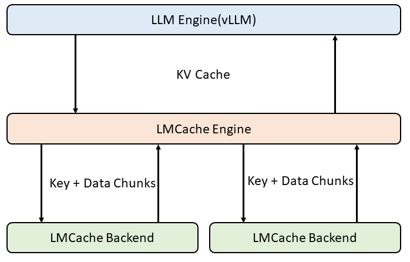
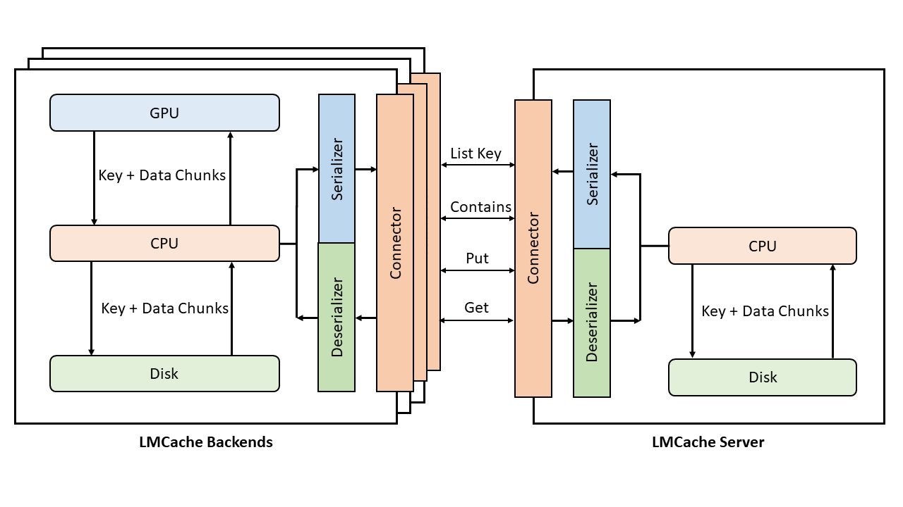

.. _dev_doc:

LMCache Overview
================================================

Instance-Level Overview
------------------------

The LMCache project consists of three main components: the LLM Engine, the LMCache Engine, and the LMCache Backend.

When a new request is received, the LLM Engine checks if the prompt's KV Cache exists. If the KV Cache is found, the LLM Engine retrieves it from the LMCache Engine. If not, the LLM Engine performs the prefill for the prompt. After completing the decoding process, the LLM Engine stores the tokens and their corresponding KV Cache in the LMCache Engine.

Whenever the KV Cache is retrieved from or stored in the LMCache Engine, it is split into chunks along the token dimension. These chunks are then fetched from or stored in the corresponding LMCache Backend.

   Currently, the LLM Engine (in the ``lmcache-vllm`` repository) is based on ``vllm`` with a customized wrapper.

Inter-Instance Overview
------------------------

Within an instance, the LMCache Backend stores KV Cache Chunks in tensor format across GPU, CPU, and Disk.

To share the KV Cache across different instances, the LMCache Backend first serializes the KV Cache Chunks, transmits them over the network, and then deserializes them. Currently, we use a centralized server that maintains the entire Chunk index dictionary. Each instance can synchronize the Chunk index and retrieve missing KV Chunks from the server.

For serializer and deserializer, we have implemented four methods: ``torch``, ``safetensor``, ``fast`` and ``cachegen``. The ``cachegen`` method is recommanded for its significant reduction in transmission size, though it may require some GPU computation. For more details, refer to the appendix of the `paper <https://dl.acm.org/doi/10.1145/3651890.3672274>`_.