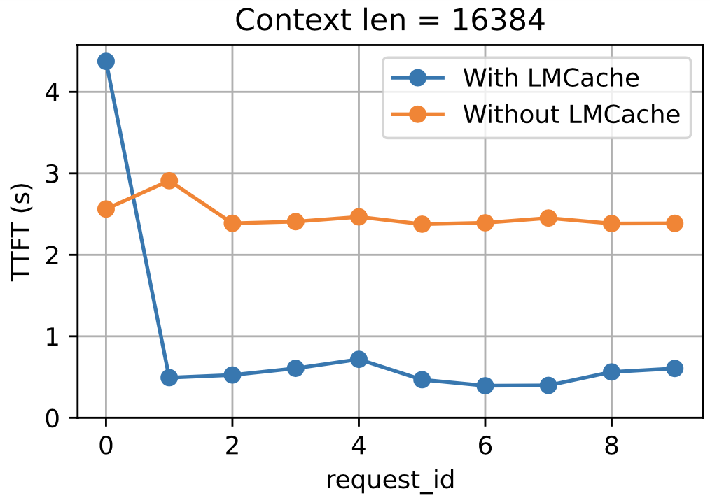

.. _measuring_improvements:

Measuring improvements
=======================

We provide a suite of end-to-end testing examples to demonstrate the performance improvements of using 
LMCache. For this we host a series of tests which can be run as follows:

.. code-block:: console

    $ # Create conda environment
    $ conda create -n lmcache python=3.10
    $ conda activate lmcache

    $ # Clone github repository
    $ git clone git@github.com:LMCache/lmcache-tests.git

Prior to running the tests, you will need to have LMCache and lmcache-vllm installed. Please
refer to our :ref:`installation guide <installation>` for more information on that.

Finally, you should have a directory structure as follows:

.. code-block:: console

    root_directory/
    ├── LMCache/
    ├── lmcache-vllm/
    └── lmcache-tests/

Once this is done, you can setup the environment to run the tests:

.. code-block:: console

    $ cd lmcache-tests

    $ # Run the installation script
    $ bash prepare_environment.sh

Running the tests
-----------------

The following command line runs the test ``test_lmcache_local_cpu`` defined in ``tests/tests.py``
and writes the output results to the output folder ``outputs/test_lmcache_local_cpu.csv``.

.. code-block:: console

    $ # This test uses local CPU as the KV storage backend
    $ python3 main.py tests/tests.py -f test_lmcache_local_cpu -o outputs/

The output file can be processed using the following command:

.. code-block:: console

    $ cd outputs/
    $ python3 process_result.py

This creates a file called ``test_lmcache_local_cpu.pdf`` which contains performance metrics plots,
comparing the improvements of using LMCache.

.. note::

    You can also monitor the following files to check the status of the bootstrapped vllm process. 
    Following commands may be helpful:

    .. code-block:: console

        $ tail -f /tmp/8000-stderr.log
        $ tail -f /tmp/8000-stderr.log

An snapshot of results from ``test_lmcache_local_cpu.pdf`` is shown below:

Here we show the improvements in Time To First Token (TTFT) using LMCache. We perform this 
on a context length of 16384 tokens and re-use the same context for 10 requests.

Performance metrics
--------------------

Currently we support measuring the following performance metrics:

- Latency measured by Time To First Token (TTFT) : Lower is better
- Throughput measured by Tokens Per Second (TPS) : Higher is better
- GPU memory usage (GB) : Lower is better

Running further tests
---------------------

Examples of some other types of tests which can be run are:

.. code-block:: console

    $ # Run all the test functions defined in 'tests/tests.py' and save the output to 'outputs/'
    $ python3 main.py tests/tests.py -o outputs/

    $ # List the tests in 'tests/tests.py'
    $ python3 main.py tests/tests.py -l

    $ # Run some specific tests that match the given pattern (e.g., containing 'cachegen')
    $ python3 main.py tests/tests.py -f cachegen

    $ # Run all the test functions defined in 'tests/tests.py' with llama
    $ python3 main.py tests/tests.py -m "meta-llama/Llama-3.1-8B-Instruct"

Please refer to our `repository <https://github.com/LMCache/lmcache-tests>`_. for more detailed information on different tests that can be run.
We also provide a detailed guide on how to write your own tests.

 

