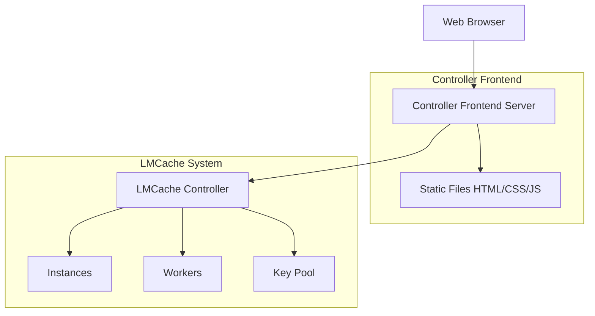

# LMCache Controller Frontend

A web-based dashboard for monitoring and managing LMCache Controller.

## Features

- **Instance Management**: View and manage LMCache instances
- **Worker Management**: Monitor worker status and heartbeats  
- **Key Pool Management**: View and manage cache keys
- **Metrics Monitoring**: View performance metrics
- **Log Level Control**: Adjust logging levels dynamically
- **Configuration Management**: Get and set controller configuration
- **Thread Information**: View thread details
- **Environment Variables**: Browse system environment
- **Script Execution**: Execute Python scripts on the controller

## Prerequisites

1. LMCache Controller must be running (typically on port 9000)
2. Python 3.8+ with required dependencies

## Installation

```bash
cd /Users/msy/projects/LMCache
pip install fastapi httpx uvicorn
```

## Quick Start

### 1. Start the LMCache Controller

First, make sure your LMCache Controller is running. If not, start it:

```bash
cd /Users/msy/projects/LMCache
python -m lmcache.v1.api_server.__main__ --host 0.0.0.0 --port 9000 --monitor-ports '{"pull": 8300, "reply": 8400}'
```

### 2. Start the Controller Frontend

In a new terminal:

```bash
cd /Users/msy/projects/LMCache/examples/controller_frontend
python controller_frontend.py
```

By default, the frontend will start on `http://localhost:8500` and connect to the controller at `http://localhost:9000`.

### 3. Access the Dashboard

Open your browser and navigate to:

```
http://localhost:8500
```

## Configuration

You can customize the frontend settings using command-line arguments or environment variables:

### Command-line Arguments

```bash
python controller_frontend.py \
  --host 0.0.0.0 \
  --port 8500 \
  --controller-host localhost \
  --controller-port 9000
```

### Environment Variables

```bash
export CONTROLLER_HOST=localhost
export CONTROLLER_PORT=9000
python controller_frontend.py
```

## URL Parameters

You can also specify connection parameters directly in the URL:

```
http://localhost:8500/?host=localhost&port=9000
```

## API Endpoints

The frontend provides the following API endpoints:

- `GET /` - Main dashboard page
- `GET /health` - Frontend health check
- `GET /api/frontend/instances` - Get instance information
- `GET /api/frontend/stats` - Get statistics

All other API requests are proxied to the LMCache Controller.

## Architecture



## Development

### Project Structure

```
examples/controller_frontend/
├── controller_frontend.py     # Main FastAPI server
├── README.md                  # This file
├── static/                    # Frontend assets
│   ├── css/
│   │   └── style.css         # Stylesheet
│   ├── js/
│   │   └── controller_app.js # Frontend JavaScript
│   ├── img/                  # Images (optional)
│   └── index.html            # Main HTML page
└── __pycache__/              # Python cache (generated)
```

### Adding New Features

1. **Frontend (HTML/JS)**: Modify files in the `static/` directory
2. **Backend API**: Add new endpoints to `controller_frontend.py`
3. **Controller Integration**: Ensure the LMCache Controller has the required API endpoints

## Troubleshooting

### Cannot connect to Controller

```
Error: Cannot connect to Controller at http://localhost:9000
```

**Solution**: Ensure the LMCache Controller is running:

```bash
# Check if controller is running
curl http://localhost:9000/health

# Start controller if not running
cd /Users/msy/projects/LMCache
python -m lmcache.v1.api_server.__main__ --port 9000
```

### Frontend server won't start

**Solution**: Check dependencies:

```bash
pip install fastapi httpx uvicorn
```

### JavaScript errors in browser console

**Solution**: Check browser console for detailed errors. Common issues:

1. CORS issues - Make sure the frontend and controller are on the same domain or CORS is configured
2. API endpoint not found - The controller might not have the requested endpoint

## API Reference

### Controller Endpoints (Proxied)

The frontend proxies these endpoints to the Controller:

- `POST /query_worker_info` - Get worker information
- `POST /health` - Health check
- `POST /lookup` - Key lookup
- `POST /clear` - Clear cache
- `POST /pin` - Pin tokens
- `POST /compress` - Compress data
- `POST /decompress` - Decompress data
- `POST /move` - Move data
- `POST /check_finish` - Check operation completion

## License

Apache 2.0 - Same as LMCache

## Contributing

Please refer to the main LMCache CONTRIBUTING.md for contribution guidelines.