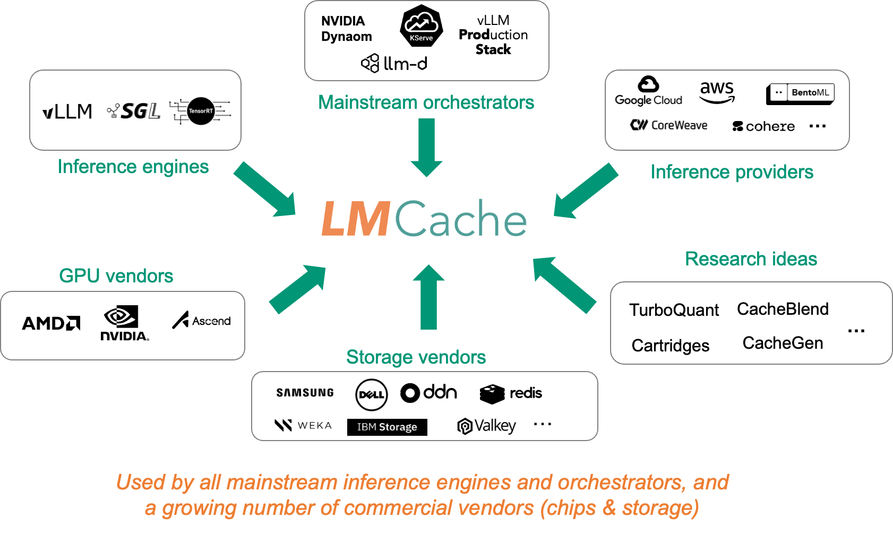
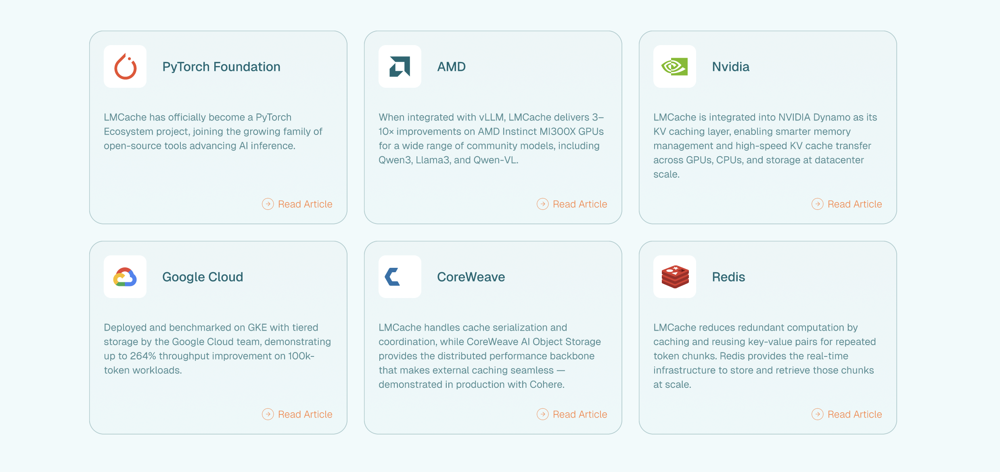
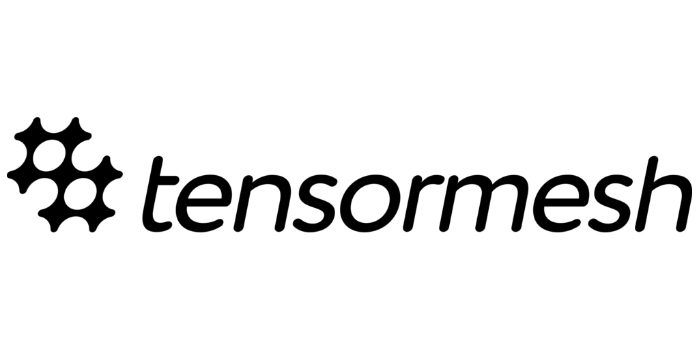

<div align="center">
  <p align="center">
      <source media="(prefers-color-scheme: dark)" srcset="asset/dark_logo.png">
      <source media="(prefers-color-scheme: light)" srcset="asset/logo.png">
    
  </p>

  [](https://pypi.org/project/lmcache/)
  [](https://pypi.org/project/lmcache/)
  [](https://github.com/LMCache/LMCache/graphs/commit-activity)
  [](https://deepwiki.com/LMCache/LMCache/)

   <br />
</div>

--------------------------------------------------------------------------------

 <p align="center">
    | <a href="https://blog.lmcache.ai/"><strong>Blog</strong></a>
    | <a href="https://docs.lmcache.ai/"><strong>Documentation</strong></a>
    | <a href="https://join.slack.com/t/lmcacheworkspace/shared_invite/zt-3g8e6xzz8-KzS_HI8bPERGFK5PTB~
  MYg"><strong>Join Slack</strong></a>
    | <a href="https://docs.lmcache.ai/community/meetings.html"><strong>Community Meeting</strong></a>
    | <a href="https://github.com/LMCache/LMCache/issues/2923"><strong>Roadmap</strong></a> |
</p>

## About

LMCache is a **KV cache management layer** for LLM inference. It turns KV cache from temporary state into reusable AI-native knowledge that can be stored, moved, transformed, and reused across different servings. LMCache is designed to work with existing inference engines to **reduce TTFT** and **improve throughput**, especially for long-context, multi-turn, and RAG workloads.

LMCache supports three deployment patterns:

- **In-process mode**: LMCache runs inside the inference engine process through connectors. This is the simplest setup for local experiments and single-process serving.

- **Multi-process mode**: LMCache runs as a standalone server, and inference engines connect to it through connectors over ZMQ. A single LMCache server can serve multiple engine instances, share cache across them, and expose management and observability endpoints.

- **Prefill and Decode (PD) Disaggregation/KV transfer**: LMCache transfers KV cache from prefill workers to decode workers, so decoding can continue without recomputing prompt KV. Transport layers such as NIXL can be used to move KV cache over NVLink, RDMA, or TCP.

In addition of LMCache's capability in storing KV cache on GPU, CPU, local storage, or remote storage tiers, it provides building blocks for KV cache management, movement, and transformation across LLM serving systems, including:

- **KV cache reuse** across requests, sessions, and inference engine instances
- **Non-prefix KV reuse**: go beyond prefix caching by reusing cached KV blocks for repeated text that may appear anywhere in the prompt.
- **KV cache transformation** through techniques such as compression, token dropping, and future optimization methods
- **Pluggable backend support** for storage and transfer backends such as NIXL, GDS, local storage, Redis, S3-compatible object storage, and more

With LMCache, developers can reduce redundant prefill computation, save GPU cycles, and improve response latency.


LMCache is used, integrated, or referenced across a growing ecosystem of LLM serving platforms, infrastructure providers, and open-source projects:



## Getting Started

To use LMCache, simply install `lmcache` from your package manager, e.g. pip:
```bash
pip install lmcache
```

For more setup options and examples, see:
- [Installation](https://docs.lmcache.ai/getting_started/installation.html)
- [Quickstart](https://docs.lmcache.ai/getting_started/quickstart.html)
- [LMCache Recipes](https://docs.lmcache.ai/recipes/index.html)
- [CLI Reference](https://docs.lmcache.ai/cli/index.html)
- [Benchmarking Guide](https://docs.lmcache.ai/getting_started/benchmarking.html)
- [Production Deployment](https://docs.lmcache.ai/production/docker_deployment.html)

## Contributing
We welcome and value any contributions and collaborations. Join us in improving LMCache. Check out the [Contributing Guide](https://docs.lmcache.ai/developer_guide/contributing.html) to get started.

## Adoption and Partnerships
LMCache is used, integrated, and referenced across the LLM inference ecosystem, including serving platforms, cloud providers, hardware vendors, storage systems, and open-source projects.



LMCache is an independent open-source project. Its continued development and community work are supported in part by [Tensormesh](https://www.tensormesh.ai/).

## Citation

LMCache builds on research in KV cache management, including cache reuse, offloading, compression, and serving optimization. If you use LMCache in your research, please cite the LMCache paper and related work.

~~~bibtex
@article{liu2025lmcache,
  title={Lmcache: An efficient KV cache layer for enterprise-scale LLM inference},
  author={Liu, Yuhan and Cheng, Yihua and Yao, Jiayi and An, Yuwei and Chen, Xiaokun and Feng, Shaoting and Huang, Yuyang and Shen, Samuel and Zhang, Rui and Du, Kuntai and others},
  journal={arXiv preprint arXiv:2510.09665},
  year={2025}
}
~~~

<details>
<summary>Related papers</summary>

~~~bibtex
@inproceedings{liu2024cachegen,
  title={Cachegen: Kv cache compression and streaming for fast large language model serving},
  author={Liu, Yuhan and Li, Hanchen and Cheng, Yihua and Ray, Siddhant and Huang, Yuyang and Zhang, Qizheng and Du, Kuntai and Yao, Jiayi and Lu, Shan and Ananthanarayanan, Ganesh and others},
  booktitle={Proceedings of the ACM SIGCOMM 2024 Conference},
  pages={38--56},
  year={2024}
}

@article{cheng2024large,
  title={Do large language models need a content delivery network?},
  author={Cheng, Yihua and Du, Kuntai and Yao, Jiayi and Jiang, Junchen},
  journal={arXiv preprint arXiv:2409.13761},
  year={2024}
}

@inproceedings{yao2025cacheblend,
  title={Cacheblend: Fast large language model serving for rag with cached knowledge fusion},
  author={Yao, Jiayi and Li, Hanchen and Liu, Yuhan and Ray, Siddhant and Cheng, Yihua and Zhang, Qizheng and Du, Kuntai and Lu, Shan and Jiang, Junchen},
  booktitle={Proceedings of the twentieth European conference on computer systems},
  pages={94--109},
  year={2025}
}
~~~

</details>

<!-- ## Socials

Follow LMCache for updates, community news, and technical content:

<p align="center">
  <a href="https://www.linkedin.com/company/lmcache-lab/">
    
  </a>
  <a href="https://x.com/lmcache">
    
  </a>
  <a href="https://www.youtube.com/@LMCacheTeam">
    
  </a>
  <a href="qrcodeforwechatinvite_placeholder">
    
  </a>
</p> -->

## License

The LMCache codebase is licensed under Apache License 2.0. See the [LICENSE](LICENSE) file for details.

<!-- <p align="center">
  <sub>Sponsored by</sub><br>
  <a href="https://www.businesswire.com/news/home/20251023590544/en/Tensormesh-Emerges-From-Stealth-to-Slash-AI-Inference-Costs-and-Latency-by-up-to-10x">
    
  </a>
</p> -->